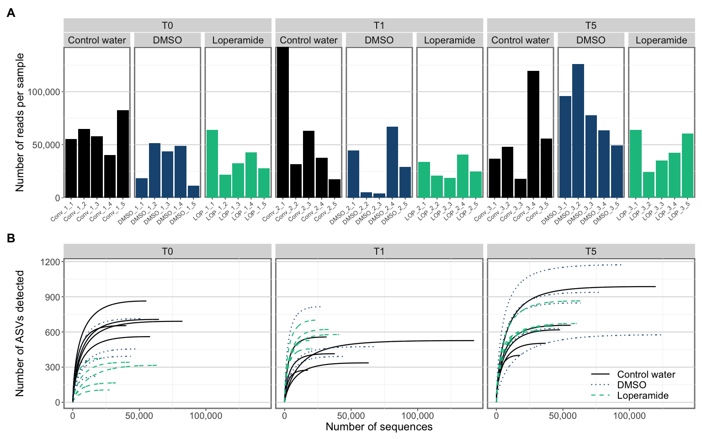
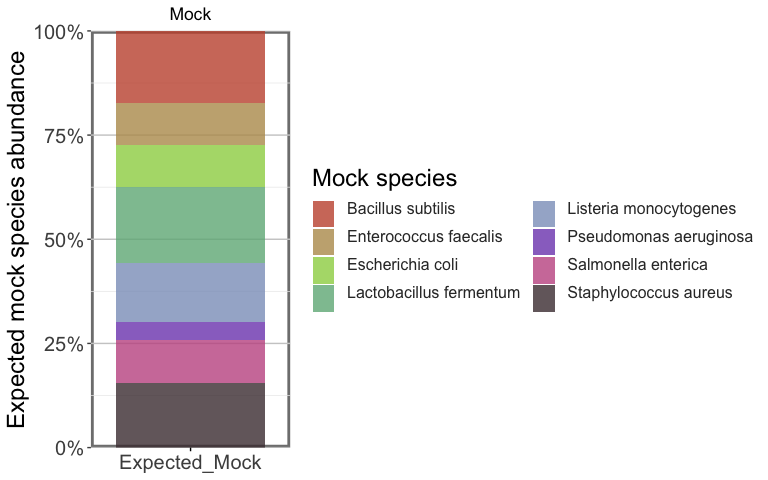
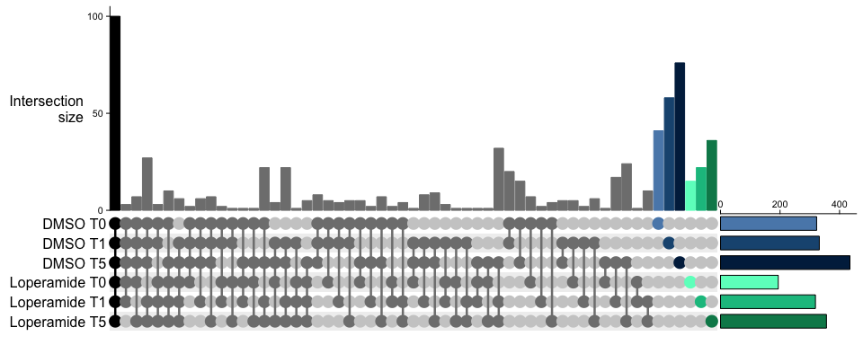
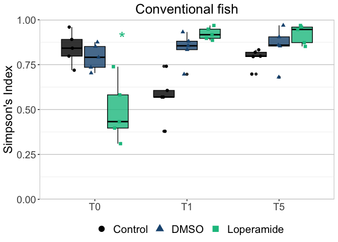
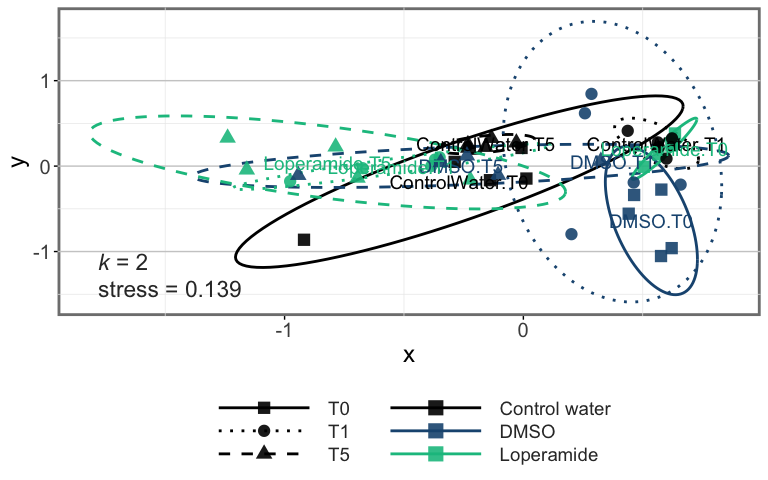
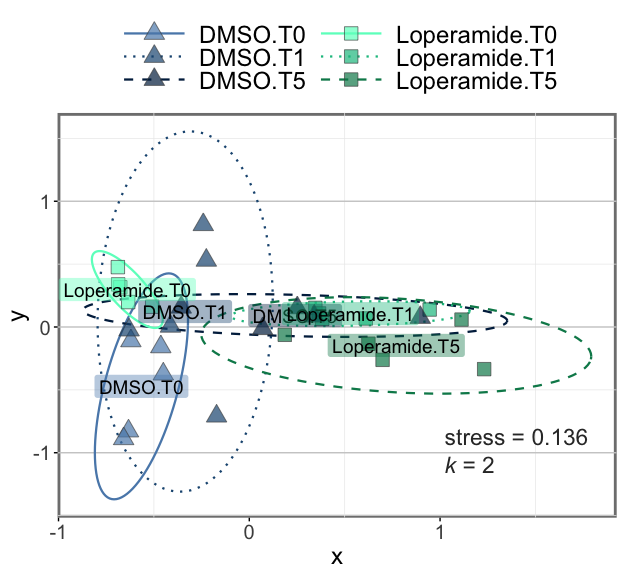

# About the Data

## Conditions

Conventional fish treated with loperamide at 5 dpf for 24 hours.

-   T0. Sample timepoint 1 at 6 dpf (24 hour treatment)
-   T1. Sample timepoint 2 at 7 dpf (24 hour treatment + 24 hour water)
-   T5. Sample timepoint 3 at 11 dpf (24 hour treatment + 5 days water)


| ID |   SeqName   | SampleName |   Project  | FishType | LoperamidePathogen | SampleRep | Timepoint | TimepointDay |
|:--:|:-----------:|:----------:|:----------:|:--------:|:------------------:|:---------:|:---------:|:------------:|
| 1  | 1_Conv_1_1  | Conv_1_1   | Loperamide | Conv     |                    | 1         | 1         | 24h          |
| 2  | 2_Conv_1_2  | Conv_1_2   | Loperamide | Conv     |                    | 2         | 1         | 24h          |
| 3  | 3_Conv_1_3  | Conv_1_3   | Loperamide | Conv     |                    | 3         | 1         | 24h          |
| 4  | 4_Conv_1_4  | Conv_1_4   | Loperamide | Conv     |                    | 4         | 1         | 24h          |
| 5  | 5_Conv_1_5  | Conv_1_5   | Loperamide | Conv     |                    | 5         | 1         | 24h          |
| 6  | 6_DMSO_1_1  | DMSO_1_1   | Loperamide | Conv     | DMSO 1:100         | 1         | 1         | 24h          |
| 7  | 7_DMSO_1_2  | DMSO_1_2   | Loperamide | Conv     | DMSO 1:100         | 2         | 1         | 24h          |
| 8  | 8_DMSO_1_3  | DMSO_1_3   | Loperamide | Conv     | DMSO 1:100         | 3         | 1         | 24h          |
| 9  | 9_DMSO_1_4  | DMSO_1_4   | Loperamide | Conv     | DMSO 1:100         | 4         | 1         | 24h          |
| 10 | 10_DMSO_1_5 | DMSO_1_5   | Loperamide | Conv     | DMSO 1:100         | 5         | 1         | 24h          |
| 11 | 11_LOP_1_1  | LOP_1_1    | Loperamide | Conv     | Loperamide 10mg/L  | 1         | 1         | 24h          |
| 12 | 12_LOP_1_2  | LOP_1_2    | Loperamide | Conv     | Loperamide 10mg/L  | 2         | 1         | 24h          |
| 13 | 13_LOP_1_3  | LOP_1_3    | Loperamide | Conv     | Loperamide 10mg/L  | 3         | 1         | 24h          |
| 14 | 14_LOP_1_4  | LOP_1_4    | Loperamide | Conv     | Loperamide 10mg/L  | 4         | 1         | 24h          |
| 15 | 15_LOP_1_5  | LOP_1_5    | Loperamide | Conv     | Loperamide 10mg/L  | 5         | 1         | 24h          |
| 16 | 16_Conv_2_1 | Conv_2_1   | Loperamide | Conv     |                    | 1         | 2         | 48h          |
| 17 | 17_Conv_2_2 | Conv_2_2   | Loperamide | Conv     |                    | 2         | 2         | 48h          |
| 18 | 18_Conv_2_3 | Conv_2_3   | Loperamide | Conv     |                    | 3         | 2         | 48h          |
| 19 | 19_Conv_2_4 | Conv_2_4   | Loperamide | Conv     |                    | 4         | 2         | 48h          |
| 20 | 20_Conv_2_5 | Conv_2_5   | Loperamide | Conv     |                    | 5         | 2         | 48h          |
| 21 | 21_DMSO_2_1 | DMSO_2_1   | Loperamide | Conv     | DMSO 1:100         | 1         | 2         | 48h          |
| 22 | 22_DMSO_2_2 | DMSO_2_2   | Loperamide | Conv     | DMSO 1:100         | 2         | 2         | 48h          |
| 23 | 23_DMSO_2_3 | DMSO_2_3   | Loperamide | Conv     | DMSO 1:100         | 3         | 2         | 48h          |
| 24 | 24_DMSO_2_4 | DMSO_2_4   | Loperamide | Conv     | DMSO 1:100         | 4         | 2         | 48h          |
| 25 | 25_DMSO_2_5 | DMSO_2_5   | Loperamide | Conv     | DMSO 1:100         | 5         | 2         | 48h          |
| 26 | 26_LOP_2_1  | LOP_2_1    | Loperamide | Conv     | Loperamide 10mg/L  | 1         | 2         | 48h          |
| 27 | 27_LOP_2_2  | LOP_2_2    | Loperamide | Conv     | Loperamide 10mg/L  | 2         | 2         | 48h          |
| 28 | 28_LOP_2_3  | LOP_2_3    | Loperamide | Conv     | Loperamide 10mg/L  | 3         | 2         | 48h          |
| 29 | 29_LOP_2_4  | LOP_2_4    | Loperamide | Conv     | Loperamide 10mg/L  | 4         | 2         | 48h          |
| 30 | 30_LOP_2_5  | LOP_2_5    | Loperamide | Conv     | Loperamide 10mg/L  | 5         | 2         | 48h          |
| 31 | 31_Conv_3_1 | Conv_3_1   | Loperamide | Conv     |                    | 1         | 3         | 6d           |
| 32 | 32_Conv_3_2 | Conv_3_2   | Loperamide | Conv     |                    | 2         | 3         | 6d           |
| 33 | 33_Conv_3_3 | Conv_3_3   | Loperamide | Conv     |                    | 3         | 3         | 6d           |
| 34 | 34_Conv_3_4 | Conv_3_4   | Loperamide | Conv     |                    | 4         | 3         | 6d           |
| 35 | 35_Conv_3_5 | Conv_3_5   | Loperamide | Conv     |                    | 5         | 3         | 6d           |
| 36 | 36_DMSO_3_1 | DMSO_3_1   | Loperamide | Conv     | DMSO 1:100         | 1         | 3         | 6d           |
| 37 | 37_DMSO_3_2 | DMSO_3_2   | Loperamide | Conv     | DMSO 1:100         | 2         | 3         | 6d           |
| 38 | 38_DMSO_3_3 | DMSO_3_3   | Loperamide | Conv     | DMSO 1:100         | 3         | 3         | 6d           |
| 39 | 39_DMSO_3_4 | DMSO_3_4   | Loperamide | Conv     | DMSO 1:100         | 4         | 3         | 6d           |
| 40 | 40_DMSO_3_5 | DMSO_3_5   | Loperamide | Conv     | DMSO 1:100         | 5         | 3         | 6d           |
| 41 | 41_LOP_3_1  | LOP_3_1    | Loperamide | Conv     | Loperamide 10mg/L  | 1         | 3         | 6d           |
| 42 | 42_LOP_3_2  | LOP_3_2    | Loperamide | Conv     | Loperamide 10mg/L  | 2         | 3         | 6d           |
| 43 | 43_LOP_3_3  | LOP_3_3    | Loperamide | Conv     | Loperamide 10mg/L  | 3         | 3         | 6d           |
| 44 | 44_LOP_3_4  | LOP_3_4    | Loperamide | Conv     | Loperamide 10mg/L  | 4         | 3         | 6d           |
| 45 | 45_LOP_3_5  | LOP_3_5    | Loperamide | Conv     | Loperamide 10mg/L  | 5         | 3         | 6d           |


## Sampling

1.  Transfer fish into a small petri dish full of sterile water (wash \#1).
2.  Wash the fish again by transferring into a new petri dish full of sterile water (wash \#2).
3.  Add 5 washed fish per tube into 5 x 2 mL tubes, with \~500 µL of water
4.  After all samples have been collected for all conditions, remove as much water as possible with a p200 pipette
5.  Put the samples at -80C

## Sequencing

16S V6 region

*Primers*  

1064R GTCTCGTGGGCTCGGAGATGTGTATAAGAGACAGCGACRRCCATGCANCACCT   
967F-A TCGTCGGCAGCGTCAGATGTGTATAAGAGACAGCTAACCGANGAACCTYACC   
967F-B TCGTCGGCAGCGTCAGATGTGTATAAGAGACAGCNACGCGAAGAACCTTANC    
967F-C TCGTCGGCAGCGTCAGATGTGTATAAGAGACAGCAACGCGMARAACCTTACC    
967F-D TCGTCGGCAGCGTCAGATGTGTATAAGAGACAGATACGCGARGAACCTTACC

2 x 250 bp paired-end Illumina sequencing

## Analysis

Initially done with QIIME2, dada2 denoising. Eukaryotic reads removed here.

# Setup

## Load libraries and settings


```r
library(tidyverse)
library(scales)
library(ggpubr)
library(qiime2R)
library(vegan)
library(gt)
library(microbiomeMarker)
library(patchwork)
library(ggh4x)
library(ggtext)

# set global theme
theme_set(theme_minimal()+
             theme(panel.grid.major.y = element_line(color="grey80"), strip.text=element_text(size=16),
                   strip.background = element_rect(color="transparent"),
                   strip.text.y = element_text(angle=0), plot.caption = element_text(size=10),
                   panel.grid.major.x = element_blank(),legend.position="top",
                   plot.background = element_rect(fill="transparent", color="transparent"),
                   axis.ticks = element_line(inherit.blank = FALSE),
                   panel.background = element_rect(color="grey50", size=2), 
                   legend.title = element_text(size=18),
                   axis.text = element_text(size=15), axis.title = element_text(size=18),
                   legend.text = element_text(size=16), plot.title = element_text(hjust=0.5)))

# set global options for code output
knitr::opts_chunk$set(warning=FALSE,message=FALSE)
```

## Import data


```r
metadatafile <- "../metadata/Loperamide16Samplicon_metadata.txt"
tablefile <- "../output/table.qza"
taxonomyfile <- "../output/taxonomy.qza"
treefile <- "../output/rooted-tree.qza"

SVs<-read_qza(tablefile)$data
head(SVs)[,1:5]
```

```
##                                  1-Conv-1-1 10-DMSO-1-5 100-Conv-Fcol-5
## cca00a58137be2c40384b70e46bda58e       2835        2386           70339
## 4de03c7aceccf0fcb66b3589366454da       1005        3057           12568
## 82fc1666a2536a3cd12196a8034595ef        363         514            1753
## 9573a7fa5cbd06bf5889768443cc18e4        581        9145           14308
## aa232c50f749cc656fab586f02d3b071         27           0              10
## 8accec78e96e26062eb54ddedc86f5a2        901        2545            5487
##                                  101-Mock-1 102-Mock-2
## cca00a58137be2c40384b70e46bda58e        197         43
## 4de03c7aceccf0fcb66b3589366454da         66         21
## 82fc1666a2536a3cd12196a8034595ef         18         16
## 9573a7fa5cbd06bf5889768443cc18e4         59         23
## aa232c50f749cc656fab586f02d3b071          0          6
## 8accec78e96e26062eb54ddedc86f5a2         19          0
```

```r
metadata<-read_q2metadata(metadatafile)  %>% 
   mutate(Loperamide=case_when(LoperamidePathogen == "DMSO 1:100" ~ "DMSO",
                                       LoperamidePathogen == "Loperamide 10mg/L" ~ "Loperamide",
                                       TRUE ~ "Control water"))
head(metadata)[,1:5]
```

```
##     SampleID SampleName    Project FishType LoperamidePathogen
## 1 1-Conv-1-1   Conv_1_1 Loperamide     Conv                   
## 2 2-Conv-1-2   Conv_1_2 Loperamide     Conv                   
## 3 3-Conv-1-3   Conv_1_3 Loperamide     Conv                   
## 4 4-Conv-1-4   Conv_1_4 Loperamide     Conv                   
## 5 5-Conv-1-5   Conv_1_5 Loperamide     Conv                   
## 6 6-DMSO-1-1   DMSO_1_1 Loperamide     Conv         DMSO 1:100
```

```r
taxonomy<-read_qza(taxonomyfile)$data %>% parse_taxonomy()
head(taxonomy)[,1:5]
```

```
##                                       Kingdom         Phylum
## cca00a58137be2c40384b70e46bda58e  d__Bacteria Proteobacteria
## 4de03c7aceccf0fcb66b3589366454da  d__Bacteria Proteobacteria
## 82fc1666a2536a3cd12196a8034595ef  d__Bacteria Proteobacteria
## 9573a7fa5cbd06bf5889768443cc18e4 d__Eukaryota     Vertebrata
## aa232c50f749cc656fab586f02d3b071  d__Bacteria Proteobacteria
## 8accec78e96e26062eb54ddedc86f5a2 d__Eukaryota     Vertebrata
##                                                Class            Order
## cca00a58137be2c40384b70e46bda58e Gammaproteobacteria    Aeromonadales
## 4de03c7aceccf0fcb66b3589366454da Gammaproteobacteria             <NA>
## 82fc1666a2536a3cd12196a8034595ef Alphaproteobacteria      Rhizobiales
## 9573a7fa5cbd06bf5889768443cc18e4      Actinopterygii        Teleostei
## aa232c50f749cc656fab586f02d3b071 Gammaproteobacteria Enterobacterales
## 8accec78e96e26062eb54ddedc86f5a2      Actinopterygii        Teleostei
##                                          Family
## cca00a58137be2c40384b70e46bda58e Aeromonadaceae
## 4de03c7aceccf0fcb66b3589366454da           <NA>
## 82fc1666a2536a3cd12196a8034595ef   Rhizobiaceae
## 9573a7fa5cbd06bf5889768443cc18e4      Teleostei
## aa232c50f749cc656fab586f02d3b071           <NA>
## 8accec78e96e26062eb54ddedc86f5a2      Teleostei
```

```r
physeq<-qza_to_phyloseq(
    features=tablefile,
    tree=treefile,
    taxonomy=taxonomyfile,
    metadata = metadatafile
    )
```

## Clean up data


```r
metadata$LoperamideTimepoint <- factor(metadata$LoperamideTimepoint, 
                          levels = c("ControlWater.24h","ControlWater.48h","ControlWater.6d",
                                     "DMSO.24h", "DMSO.48h","DMSO.6d",
                                     "Loperamide.24h","Loperamide.48h","Loperamide.6d"),
                          labels = c("ControlWater.T0","ControlWater.T1","ControlWater.T5",
                                     "DMSO.T0", "DMSO.T1","DMSO.T5",
                                     "Loperamide.T0","Loperamide.T1","Loperamide.T5"))

metadata$TimepointDay <- factor(metadata$TimepointDay, 
                          levels = c("24h","48h","6d"),
                          labels = c("T0","T1","T5"))


# select just Loperamide project data
metadataLoperamide <- filter(metadata, Project=="Loperamide" | Project=="Controls")
taxasums <- qiime2R::summarize_taxa(SVs, taxonomy) 

# vector of eukaryotic & cyanobacteria ASVs
eukASVs <- taxonomy %>% filter(Kingdom=="d__Eukaryota" | Kingdom=="d__Archaea" | Phylum=="Cyanobacteria") %>% 
   rownames_to_column("ASVs") %>% .$ASVs

# just taxa data in loperamide study, without archea/chloroplasts/eukaryotic
taxasumsclean <- select(as.data.frame(SVs), metadataLoperamide$SampleID) %>% 
   rownames_to_column("ASV") %>% 
   filter(!ASV %in% eukASVs) %>% 
   column_to_rownames(var="ASV") %>% qiime2R::summarize_taxa(taxonomy) 
```

## Make data frames per rank


```r
datafullphylum <- 
   # transpose the phylum table of taxa sums
   t(taxasumsclean$Phylum) %>% 
   # make into data frame
   as.data.frame() %>% 
   # put rownames as SampleID
   rownames_to_column("SampleID") %>% 
   # join with the metadata
   full_join(metadata) %>% 
   # convert to long format
   pivot_longer("d__Bacteria; Abditibacteriota":"Unassigned; NA")

datafullkingdom <- 
   t(taxasumsclean$Kingdom) %>%  as.data.frame() %>% rownames_to_column("SampleID") %>% 
   full_join(metadata) %>% pivot_longer("d__Bacteria":"Unassigned")

datafullclass <- 
   t(taxasumsclean$Class) %>% as.data.frame() %>% rownames_to_column("SampleID") %>% 
   full_join(metadata) %>% 
   pivot_longer("d__Bacteria; Abditibacteriota; Abditibacteria":"Unassigned; NA; NA")

datafullorder <- 
   t(taxasumsclean$Order) %>% as.data.frame() %>% rownames_to_column("SampleID") %>% 
   full_join(metadata) %>% 
   pivot_longer("d__Bacteria; Abditibacteriota; Abditibacteria; Abditibacteriales":"Unassigned; NA; NA; NA")

datafullfamily <- 
   t(taxasumsclean$Family) %>% as.data.frame() %>% rownames_to_column("SampleID") %>% 
   full_join(metadata) %>% 
   pivot_longer("d__Bacteria; Abditibacteriota; Abditibacteria; Abditibacteriales; Abditibacteriaceae":
                   "Unassigned; NA; NA; NA; NA")

datafullgenus <- 
   t(taxasumsclean$Genus) %>% as.data.frame() %>% rownames_to_column("SampleID") %>% 
   full_join(metadata) %>% 
   pivot_longer("d__Bacteria; Abditibacteriota; Abditibacteria; Abditibacteriales; Abditibacteriaceae; Abditibacterium":
                   "Unassigned; NA; NA; NA; NA; NA")

datafullASVs <- t(SVs) %>% as.data.frame() %>% rownames_to_column("SampleID") %>% 
   full_join(metadata) %>% 
   pivot_longer("cca00a58137be2c40384b70e46bda58e":"213dc85b14c8cdc3e765c92bcc6fa6a2", names_to = "ASV") %>% 
   filter(Project=="Loperamide" | Project=="Controls") %>% 
   filter(!ASV %in% eukASVs)
```


## Other formats


```r
# matrix format
metadataLoperamide <- filter(metadata, Project=="Loperamide")
matrixLoperamide <- select(as.data.frame(SVs), metadataLoperamide$SampleID) %>% 
   rownames_to_column("ASV") %>% 
   filter(!ASV %in% eukASVs) %>% 
   column_to_rownames(var="ASV") %>% t()

matrixLoperamidePercent <- select(as.data.frame(SVs), metadataLoperamide$SampleID) %>% 
   rownames_to_column("ASV") %>% 
   filter(!ASV %in% eukASVs) %>% 
   column_to_rownames(var="ASV") %>% 
   mutate_if(is.numeric, proportions) %>% t()

# physeq format
Loperamidephyseq <- phyloseq::subset_samples(physeq, Project=="Loperamide") %>% 
   phyloseq::subset_taxa((Kingdom!="d__Eukaryota") | is.na(Kingdom)) %>% 
   phyloseq::subset_taxa((Kingdom!="d__Archaea") | is.na(Kingdom)) %>% 
   phyloseq::subset_taxa((Phylum!="Cyanobacteria") | is.na(Phylum))

length(Loperamidephyseq@tax_table)
```

```
## [1] 91770
```


-----


# General QC

## Reads per sample


```r
# define some distinct palettes
palette<-c("grey50","#D95F02", "#1B9E77", "#E6AB02","#7570B3")
palettep<-c("skyblue","#D95F02", "#1B9E77", "#E6AB02","#7570B3", "#66A61E", "gray30")
palettess<-c("#A6CEE3", "#1F78B4", "#B2DF8A", "#33A02C", "#FB9A99", "#E31A1C", "#FDBF6F", "#FF7F00", "#CAB2D6", "#6A3D9A", "#FFFF99", "#B15928","gray58","grey40")

# total QCd reads
datafullkingdom %>% filter(Project=="Loperamide") %>% summarise(NumReads = sum(value))
```

```
## # A tibble: 1 × 1
##   NumReads
##      <dbl>
## 1  2161882
```

```r
# plot reads per sample
readspersampleplot <- datafullkingdom %>% filter(Project=="Loperamide") %>% 
   ggplot(aes(x=factor(SampleName,levels=unique(metadata$SampleName)), 
              y=value, fill=Loperamide))+
   facet_nested(.~TimepointDay+Loperamide, scales="free", space="free")+
   geom_col()+
   theme(legend.position = "none", axis.text.x = element_text(size=10, angle=40, hjust=1), 
         strip.background = element_rect(color="white", fill="grey85"),
         axis.ticks.y = element_line(inherit.blank=FALSE, color="grey30"))+
   scale_fill_manual(values=c('#000000', '#1c5580', '#0fc08e'))+
   scale_y_continuous(expand=c(0,0), labels=scales::label_comma())+
   labs(y="Number of reads per sample",x=NULL,fill=NULL)
readspersampleplot
```

<!-- -->


## Rarefaction curves


```r
(S <- specnumber(matrixLoperamide))
```

```
##  1-Conv-1-1  2-Conv-1-2  3-Conv-1-3  4-Conv-1-4  5-Conv-1-5  6-DMSO-1-1 
##         864         707         560         654         691         222 
##  7-DMSO-1-2  8-DMSO-1-3  9-DMSO-1-4 10-DMSO-1-5  11-LOP-1-1  12-LOP-1-2 
##         713         392         455         354         315         376 
##  13-LOP-1-3  14-LOP-1-4  15-LOP-1-5 16-Conv-2-1 17-Conv-2-2 18-Conv-2-3 
##         165         341         105         526         557         336 
## 19-Conv-2-4 20-Conv-2-5 21-DMSO-2-1 22-DMSO-2-2 23-DMSO-2-3 24-DMSO-2-4 
##         414         273         391         236         231         474 
## 25-DMSO-2-5  26-LOP-2-1  27-LOP-2-2  28-LOP-2-3  29-LOP-2-4  30-LOP-2-5 
##         816         621         456         526         578         701 
## 31-Conv-3-1 32-Conv-3-2 33-Conv-3-3 34-Conv-3-4 35-Conv-3-5 36-DMSO-3-1 
##         503         618         400         987         657        1173 
## 37-DMSO-3-2 38-DMSO-3-3 39-DMSO-3-4 40-DMSO-3-5  41-LOP-3-1  42-LOP-3-2 
##         575         938         848         631         865         600 
##  43-LOP-3-3  44-LOP-3-4  45-LOP-3-5 
##         612         648         672
```

```r
(raremax <- min(rowSums(matrixLoperamide)))
```

```
## [1] 4184
```

```r
Srare <- vegan::rarefy(matrixLoperamide, raremax)
Sslope <- vegan::rareslope(matrixLoperamide, raremax)


plot(S, Srare, xlab = "Observed No. of ASVs", ylab = "Rarefied No. of ASVs")
abline(0,1)
```

<!-- -->

```r
plot(S, Sslope, xlab = "Observed No. of ASVs", ylab = "Slope at rarefied sample size")
```

<!-- -->

```r
rarecurve_data <- rarecurve(matrixLoperamide, step = 100, sample = raremax)
```

<!-- -->

```r
map_dfr(rarecurve_data, bind_rows) %>% 
   bind_cols(SampleID = rownames(matrixLoperamide),.) %>%
   pivot_longer(-SampleID) %>%
   drop_na() %>%
   mutate(n_seqs = as.numeric(str_replace(name, "N", ""))) %>%
   select(-name) %>%
   left_join(metadata) %>% 
   ggplot(aes(x=n_seqs, y=value, group=SampleID, color=LoperamideTimepoint, lty=Loperamide)) +
   geom_line(lwd=0.8) +
   scale_color_manual(values=c("grey80","grey50","grey20","#a7a7ff","#0000ce", 
                              "#00006c","aquamarine1", "aquamarine3","aquamarine4"))+
   scale_linetype_manual(values=c("solid","dotted","dashed"))+
   scale_x_continuous(labels=label_comma())+
   theme(legend.key.width = unit(1.33,"cm"), legend.position="right",
         strip.background = element_rect(color="white", fill="grey85"))+
   labs(x = "Number of sequences", y="Number of ASVs detected", color=NULL, lty=NULL)
```

<!-- -->

```r
rareplot <- map_dfr(rarecurve_data, bind_rows) %>% 
   bind_cols(SampleID = rownames(matrixLoperamide),.) %>%
   pivot_longer(-SampleID) %>%
   drop_na() %>%
   mutate(n_seqs = as.numeric(str_replace(name, "N", ""))) %>%
   select(-name) %>%
   left_join(metadata) %>% 
   ggplot(aes(x=n_seqs, y=value, group=SampleID, color=Loperamide, lty=Loperamide)) +
   geom_line(lwd=0.8) +
   facet_grid(.~TimepointDay)+
   scale_color_manual(values=c('#000000', '#1c5580', '#0fc08e'))+
   scale_linetype_manual(values=c("solid","dotted","dashed"))+
   scale_x_continuous(labels=label_comma())+
   theme(legend.key.width = unit(1.33,"cm"), legend.position=c(0.9,0.18),
         strip.background = element_rect(color="white", fill="grey85"))+
   labs(x = "Number of sequences", y="Number of ASVs detected", color=NULL, lty=NULL)
```


```r
readspersampleplot / rareplot + plot_annotation(tag_levels = "A") &
   theme(plot.tag = element_text(face = "bold", size=20))
```

<!-- -->

```r
ggsave("../figures/FigureS1_16SLoperamideQC_rarecurve_reads.png", width=14, height=10)
ggsave("../figures/FigureS1_16SLoperamideQC_rarecurve_reads.pdf", width=14, height=10)
ggsave("../figures/FigureS1_16SLoperamideQC_rarecurve_reads.tiff", width=14, height=10)
```


## Controls

**Expected mock community**  


```r
expectedmock <- data_frame(
   SampleName="Expected_Mock",
   value=0,
   MockTaxa=factor(c("Pseudomonas aeruginosa", "Escherichia coli", 
                     "Salmonella enterica", "Enterococcus faecalis", 
                     "Lactobacillus fermentum","Staphylococcus aureus", 
                     "Listeria monocytogenes", "Bacillus subtilis")),
   percent=c(4.2,10.1,10.4,9.9,
            18.4,15.5,14.1,17.4))


mockplot<- expectedmock %>% 
   ggplot(aes(x=SampleName, y=percent, fill=MockTaxa))+
   geom_col(position="fill", alpha=0.8)+
   theme(legend.text = element_text(size=12, colour="gray20", margin = margin(b = 10, unit = "pt")),
         legend.position = "right",legend.direction = "vertical",
         axis.ticks.y = element_line(inherit.blank=FALSE, color="grey30"))+
   scale_fill_manual(values=c("#c5543a",
"#b8995a",
"#9cd250",
"#6eb386",
"#8c9fc3",
"#7e4abb",
"#c45891",
"#4b393e"))+
   scale_y_continuous(labels = scales::percent_format(), expand=c(0,0))+
   labs(y="Expected mock species abundance",x=NULL,fill="Mock species")+ 
   guides(fill = guide_legend(ncol = 2))
mockplot
```

<!-- -->


```r
conreads<- datafullkingdom %>% filter(Project=="Controls") %>% 
   ggplot(aes(x=SampleName, y=value))+
   geom_col()+
   theme(legend.text = element_text(size=12, colour="gray20"),
         axis.ticks.y = element_line(inherit.blank=FALSE, color="grey30"))+
   scale_y_continuous(expand=c(0,0), labels=scales::label_comma())+
   labs(y="Number of reads per sample",x=NULL,fill=NULL)

palettess2<-c("#A6CEE3", "#1F78B4", "#B2DF8A", "#33A02C", "#FB9A99", "#E31A1C", "#FDBF6F", "#FF7F00", 
              "#CAB2D6", "#6A3D9A", "#FFFF99", "#B15928","blue1","navy",
              "maroon2","maroon4","burlywood1","burlywood4","aquamarine3","aquamarine4","grey40")

conperc<- datafullASVs %>% filter(Project=="Controls") %>% 
   left_join(read_qza(taxonomyfile)$data, by=c("ASV"="Feature.ID")) %>% 
   unite("ASVname", c("ASV", "Taxon"), sep=": \n") %>% 
   mutate(TaxaOther=forcats::fct_lump_n(f=ASVname, w=value, other_level="Others", n=20)) %>% 
   mutate(TaxaOther=reorder(TaxaOther, -value)) %>%
   group_by(SampleName) %>% mutate(percent=value/sum(value)) %>%  
   ggplot(aes(x=SampleName, y=percent, fill=str_wrap(TaxaOther, 90)))+
   geom_col(position="fill", alpha=0.8)+
   theme(legend.text = element_text(size=12, colour="gray20", margin = margin(b = 10, unit = "pt")),
         legend.position = "right",legend.direction = "vertical",
         axis.ticks.y = element_line(inherit.blank=FALSE, color="grey30"))+
   scale_fill_manual(values=c(palettess2))+
   scale_y_continuous(labels = scales::percent_format(), expand=c(0,0))+
   labs(y="Percent ASV abundance",x=NULL,fill="ASV")


mocklegend <- get_legend(mockplot+
   guides(fill = guide_legend(ncol = 1)))
controlpercentlegend <- get_legend(conperc+
   guides(fill = guide_legend(ncol = 1)))

plot_spacer()+conreads+mockplot+conperc+
   mocklegend + controlpercentlegend + plot_layout(guides="collect", widths=c(1,5), heights=c(2,2,5)) +
   plot_annotation(tag_levels = list(c("A","B","C","",""))) &
   theme(legend.position='none', plot.tag = element_text(face = "bold", size=20))
```

<!-- -->

```r
ggsave("../figures/FigureS2_LoperamideQC_mocknegativecontrols.png", width=12, height=20)
ggsave("../figures/FigureS2_LoperamideQC_mocknegativecontrols.pdf", width=12, height=20)
ggsave("../figures/FigureS2_LoperamideQC_mocknegativecontrols.tiff", width=12, height=20)
```


# Overall barplots

## Phylum level


```r
palettep<-c("skyblue","#D95F02", "#1B9E77", "#E6AB02","#7570B3", "#66A61E","navy","maroon","gray30")

datafullphylum %>% filter(Project=="Loperamide") %>% 
   mutate(TaxaOther=forcats::fct_lump_n(f=name, w=value, other_level="Others", n=8)) %>% 
   mutate(TaxaOther=reorder(TaxaOther, -value)) %>%
   mutate(Loperamide=recode(Loperamide, "Control water"= "Control")) %>% 
   ggplot(aes(x=SampleName, y=value, fill=TaxaOther))+
   facet_nested(.~TimepointDay+Loperamide, scales="free", space="free")+
   geom_col(position="fill", alpha=0.8)+
   theme(legend.text = element_text(size=12, colour="gray20"),
         strip.background = element_rect(color="white", fill="grey85"),
         legend.position = "bottom",axis.text.x = element_blank(), 
         axis.ticks.y = element_line(inherit.blank=FALSE, color="grey30"))+
   scale_fill_manual(values=c(palettep))+
   scale_y_continuous(labels = scales::percent_format(), expand=c(0,0))+
   labs(y="Percent phyla abundance",x=NULL,fill="Phylum")+
   guides(fill = guide_legend(ncol = 3))
```

<!-- -->

```r
ggsave("../figures/FigureS3_LoperamideBarsPhylum.png", width=12, height=6, dpi=400)
ggsave("../figures/FigureS3_LoperamideBarsPhylum.pdf", width=12, height=6)
ggsave("../figures/FigureS3_LoperamideBarsPhylum.tiff", width=12, height=6)

datafullphylum  %>% 
   group_by(SampleName) %>% mutate(percent = value/sum(value)) %>% 
   group_by(name) %>% summarise(meanPhyla = mean(percent, na.rm=TRUE), sdPhyla = sd(percent, na.rm=TRUE)) %>% 
   arrange(-meanPhyla) %>% filter(meanPhyla > 0.001) %>%  gt() %>%
  fmt_percent(
    columns = c(meanPhyla, sdPhyla),
    decimals = 1
  )
```

```{=html}
<div id="ciqnxlijoc" style="overflow-x:auto;overflow-y:auto;width:auto;height:auto;">
<style>html {
  font-family: -apple-system, BlinkMacSystemFont, 'Segoe UI', Roboto, Oxygen, Ubuntu, Cantarell, 'Helvetica Neue', 'Fira Sans', 'Droid Sans', Arial, sans-serif;
}

#ciqnxlijoc .gt_table {
  display: table;
  border-collapse: collapse;
  margin-left: auto;
  margin-right: auto;
  color: #333333;
  font-size: 16px;
  font-weight: normal;
  font-style: normal;
  background-color: #FFFFFF;
  width: auto;
  border-top-style: solid;
  border-top-width: 2px;
  border-top-color: #A8A8A8;
  border-right-style: none;
  border-right-width: 2px;
  border-right-color: #D3D3D3;
  border-bottom-style: solid;
  border-bottom-width: 2px;
  border-bottom-color: #A8A8A8;
  border-left-style: none;
  border-left-width: 2px;
  border-left-color: #D3D3D3;
}

#ciqnxlijoc .gt_heading {
  background-color: #FFFFFF;
  text-align: center;
  border-bottom-color: #FFFFFF;
  border-left-style: none;
  border-left-width: 1px;
  border-left-color: #D3D3D3;
  border-right-style: none;
  border-right-width: 1px;
  border-right-color: #D3D3D3;
}

#ciqnxlijoc .gt_title {
  color: #333333;
  font-size: 125%;
  font-weight: initial;
  padding-top: 4px;
  padding-bottom: 4px;
  padding-left: 5px;
  padding-right: 5px;
  border-bottom-color: #FFFFFF;
  border-bottom-width: 0;
}

#ciqnxlijoc .gt_subtitle {
  color: #333333;
  font-size: 85%;
  font-weight: initial;
  padding-top: 0;
  padding-bottom: 6px;
  padding-left: 5px;
  padding-right: 5px;
  border-top-color: #FFFFFF;
  border-top-width: 0;
}

#ciqnxlijoc .gt_bottom_border {
  border-bottom-style: solid;
  border-bottom-width: 2px;
  border-bottom-color: #D3D3D3;
}

#ciqnxlijoc .gt_col_headings {
  border-top-style: solid;
  border-top-width: 2px;
  border-top-color: #D3D3D3;
  border-bottom-style: solid;
  border-bottom-width: 2px;
  border-bottom-color: #D3D3D3;
  border-left-style: none;
  border-left-width: 1px;
  border-left-color: #D3D3D3;
  border-right-style: none;
  border-right-width: 1px;
  border-right-color: #D3D3D3;
}

#ciqnxlijoc .gt_col_heading {
  color: #333333;
  background-color: #FFFFFF;
  font-size: 100%;
  font-weight: normal;
  text-transform: inherit;
  border-left-style: none;
  border-left-width: 1px;
  border-left-color: #D3D3D3;
  border-right-style: none;
  border-right-width: 1px;
  border-right-color: #D3D3D3;
  vertical-align: bottom;
  padding-top: 5px;
  padding-bottom: 6px;
  padding-left: 5px;
  padding-right: 5px;
  overflow-x: hidden;
}

#ciqnxlijoc .gt_column_spanner_outer {
  color: #333333;
  background-color: #FFFFFF;
  font-size: 100%;
  font-weight: normal;
  text-transform: inherit;
  padding-top: 0;
  padding-bottom: 0;
  padding-left: 4px;
  padding-right: 4px;
}

#ciqnxlijoc .gt_column_spanner_outer:first-child {
  padding-left: 0;
}

#ciqnxlijoc .gt_column_spanner_outer:last-child {
  padding-right: 0;
}

#ciqnxlijoc .gt_column_spanner {
  border-bottom-style: solid;
  border-bottom-width: 2px;
  border-bottom-color: #D3D3D3;
  vertical-align: bottom;
  padding-top: 5px;
  padding-bottom: 5px;
  overflow-x: hidden;
  display: inline-block;
  width: 100%;
}

#ciqnxlijoc .gt_group_heading {
  padding-top: 8px;
  padding-bottom: 8px;
  padding-left: 5px;
  padding-right: 5px;
  color: #333333;
  background-color: #FFFFFF;
  font-size: 100%;
  font-weight: initial;
  text-transform: inherit;
  border-top-style: solid;
  border-top-width: 2px;
  border-top-color: #D3D3D3;
  border-bottom-style: solid;
  border-bottom-width: 2px;
  border-bottom-color: #D3D3D3;
  border-left-style: none;
  border-left-width: 1px;
  border-left-color: #D3D3D3;
  border-right-style: none;
  border-right-width: 1px;
  border-right-color: #D3D3D3;
  vertical-align: middle;
}

#ciqnxlijoc .gt_empty_group_heading {
  padding: 0.5px;
  color: #333333;
  background-color: #FFFFFF;
  font-size: 100%;
  font-weight: initial;
  border-top-style: solid;
  border-top-width: 2px;
  border-top-color: #D3D3D3;
  border-bottom-style: solid;
  border-bottom-width: 2px;
  border-bottom-color: #D3D3D3;
  vertical-align: middle;
}

#ciqnxlijoc .gt_from_md > :first-child {
  margin-top: 0;
}

#ciqnxlijoc .gt_from_md > :last-child {
  margin-bottom: 0;
}

#ciqnxlijoc .gt_row {
  padding-top: 8px;
  padding-bottom: 8px;
  padding-left: 5px;
  padding-right: 5px;
  margin: 10px;
  border-top-style: solid;
  border-top-width: 1px;
  border-top-color: #D3D3D3;
  border-left-style: none;
  border-left-width: 1px;
  border-left-color: #D3D3D3;
  border-right-style: none;
  border-right-width: 1px;
  border-right-color: #D3D3D3;
  vertical-align: middle;
  overflow-x: hidden;
}

#ciqnxlijoc .gt_stub {
  color: #333333;
  background-color: #FFFFFF;
  font-size: 100%;
  font-weight: initial;
  text-transform: inherit;
  border-right-style: solid;
  border-right-width: 2px;
  border-right-color: #D3D3D3;
  padding-left: 5px;
  padding-right: 5px;
}

#ciqnxlijoc .gt_stub_row_group {
  color: #333333;
  background-color: #FFFFFF;
  font-size: 100%;
  font-weight: initial;
  text-transform: inherit;
  border-right-style: solid;
  border-right-width: 2px;
  border-right-color: #D3D3D3;
  padding-left: 5px;
  padding-right: 5px;
  vertical-align: top;
}

#ciqnxlijoc .gt_row_group_first td {
  border-top-width: 2px;
}

#ciqnxlijoc .gt_summary_row {
  color: #333333;
  background-color: #FFFFFF;
  text-transform: inherit;
  padding-top: 8px;
  padding-bottom: 8px;
  padding-left: 5px;
  padding-right: 5px;
}

#ciqnxlijoc .gt_first_summary_row {
  border-top-style: solid;
  border-top-color: #D3D3D3;
}

#ciqnxlijoc .gt_first_summary_row.thick {
  border-top-width: 2px;
}

#ciqnxlijoc .gt_last_summary_row {
  padding-top: 8px;
  padding-bottom: 8px;
  padding-left: 5px;
  padding-right: 5px;
  border-bottom-style: solid;
  border-bottom-width: 2px;
  border-bottom-color: #D3D3D3;
}

#ciqnxlijoc .gt_grand_summary_row {
  color: #333333;
  background-color: #FFFFFF;
  text-transform: inherit;
  padding-top: 8px;
  padding-bottom: 8px;
  padding-left: 5px;
  padding-right: 5px;
}

#ciqnxlijoc .gt_first_grand_summary_row {
  padding-top: 8px;
  padding-bottom: 8px;
  padding-left: 5px;
  padding-right: 5px;
  border-top-style: double;
  border-top-width: 6px;
  border-top-color: #D3D3D3;
}

#ciqnxlijoc .gt_striped {
  background-color: rgba(128, 128, 128, 0.05);
}

#ciqnxlijoc .gt_table_body {
  border-top-style: solid;
  border-top-width: 2px;
  border-top-color: #D3D3D3;
  border-bottom-style: solid;
  border-bottom-width: 2px;
  border-bottom-color: #D3D3D3;
}

#ciqnxlijoc .gt_footnotes {
  color: #333333;
  background-color: #FFFFFF;
  border-bottom-style: none;
  border-bottom-width: 2px;
  border-bottom-color: #D3D3D3;
  border-left-style: none;
  border-left-width: 2px;
  border-left-color: #D3D3D3;
  border-right-style: none;
  border-right-width: 2px;
  border-right-color: #D3D3D3;
}

#ciqnxlijoc .gt_footnote {
  margin: 0px;
  font-size: 90%;
  padding-left: 4px;
  padding-right: 4px;
  padding-left: 5px;
  padding-right: 5px;
}

#ciqnxlijoc .gt_sourcenotes {
  color: #333333;
  background-color: #FFFFFF;
  border-bottom-style: none;
  border-bottom-width: 2px;
  border-bottom-color: #D3D3D3;
  border-left-style: none;
  border-left-width: 2px;
  border-left-color: #D3D3D3;
  border-right-style: none;
  border-right-width: 2px;
  border-right-color: #D3D3D3;
}

#ciqnxlijoc .gt_sourcenote {
  font-size: 90%;
  padding-top: 4px;
  padding-bottom: 4px;
  padding-left: 5px;
  padding-right: 5px;
}

#ciqnxlijoc .gt_left {
  text-align: left;
}

#ciqnxlijoc .gt_center {
  text-align: center;
}

#ciqnxlijoc .gt_right {
  text-align: right;
  font-variant-numeric: tabular-nums;
}

#ciqnxlijoc .gt_font_normal {
  font-weight: normal;
}

#ciqnxlijoc .gt_font_bold {
  font-weight: bold;
}

#ciqnxlijoc .gt_font_italic {
  font-style: italic;
}

#ciqnxlijoc .gt_super {
  font-size: 65%;
}

#ciqnxlijoc .gt_footnote_marks {
  font-style: italic;
  font-weight: normal;
  font-size: 75%;
  vertical-align: 0.4em;
}

#ciqnxlijoc .gt_asterisk {
  font-size: 100%;
  vertical-align: 0;
}

#ciqnxlijoc .gt_slash_mark {
  font-size: 0.7em;
  line-height: 0.7em;
  vertical-align: 0.15em;
}

#ciqnxlijoc .gt_fraction_numerator {
  font-size: 0.6em;
  line-height: 0.6em;
  vertical-align: 0.45em;
}

#ciqnxlijoc .gt_fraction_denominator {
  font-size: 0.6em;
  line-height: 0.6em;
  vertical-align: -0.05em;
}
</style>
<table class="gt_table">
  
  <thead class="gt_col_headings">
    <tr>
      <th class="gt_col_heading gt_columns_bottom_border gt_left" rowspan="1" colspan="1">name</th>
      <th class="gt_col_heading gt_columns_bottom_border gt_right" rowspan="1" colspan="1">meanPhyla</th>
      <th class="gt_col_heading gt_columns_bottom_border gt_right" rowspan="1" colspan="1">sdPhyla</th>
    </tr>
  </thead>
  <tbody class="gt_table_body">
    <tr><td class="gt_row gt_left">d__Bacteria; Proteobacteria</td>
<td class="gt_row gt_right">75.0%</td>
<td class="gt_row gt_right">17.4%</td></tr>
    <tr><td class="gt_row gt_left">d__Bacteria; Bacteroidota</td>
<td class="gt_row gt_right">9.6%</td>
<td class="gt_row gt_right">9.2%</td></tr>
    <tr><td class="gt_row gt_left">d__Bacteria; Firmicutes</td>
<td class="gt_row gt_right">5.0%</td>
<td class="gt_row gt_right">13.0%</td></tr>
    <tr><td class="gt_row gt_left">d__Bacteria; Actinobacteriota</td>
<td class="gt_row gt_right">3.4%</td>
<td class="gt_row gt_right">2.9%</td></tr>
    <tr><td class="gt_row gt_left">d__Bacteria; NA</td>
<td class="gt_row gt_right">3.0%</td>
<td class="gt_row gt_right">2.1%</td></tr>
    <tr><td class="gt_row gt_left">Unassigned; NA</td>
<td class="gt_row gt_right">2.3%</td>
<td class="gt_row gt_right">1.6%</td></tr>
    <tr><td class="gt_row gt_left">d__Bacteria; Verrucomicrobiota</td>
<td class="gt_row gt_right">0.4%</td>
<td class="gt_row gt_right">0.5%</td></tr>
    <tr><td class="gt_row gt_left">d__Bacteria; Bdellovibrionota</td>
<td class="gt_row gt_right">0.3%</td>
<td class="gt_row gt_right">0.4%</td></tr>
    <tr><td class="gt_row gt_left">d__Bacteria; Planctomycetota</td>
<td class="gt_row gt_right">0.2%</td>
<td class="gt_row gt_right">0.2%</td></tr>
    <tr><td class="gt_row gt_left">d__Bacteria; Patescibacteria</td>
<td class="gt_row gt_right">0.1%</td>
<td class="gt_row gt_right">0.2%</td></tr>
    <tr><td class="gt_row gt_left">d__Bacteria; Acidobacteriota</td>
<td class="gt_row gt_right">0.1%</td>
<td class="gt_row gt_right">0.1%</td></tr>
    <tr><td class="gt_row gt_left">d__Bacteria; Myxococcota</td>
<td class="gt_row gt_right">0.1%</td>
<td class="gt_row gt_right">0.1%</td></tr>
  </tbody>
  
  
</table>
</div>
```

```r
# number of phyla and reads per phyla
datafullphylum %>% filter(Project=="Loperamide")  %>% group_by(name) %>% 
   filter(value>0) %>% 
   summarise(sumPhyla = sum(value, na.rm=TRUE),
             meanPhyla = mean(value, na.rm=TRUE))
```

```
## # A tibble: 38 × 3
##    name                          sumPhyla meanPhyla
##    <chr>                            <dbl>     <dbl>
##  1 d__Bacteria; Acidobacteriota      2862     65.0 
##  2 d__Bacteria; Actinobacteriota    64839   1441.  
##  3 d__Bacteria; Aquificota              2      2   
##  4 d__Bacteria; Armatimonadota         37      4.11
##  5 d__Bacteria; Bacteroidota       209990   4666.  
##  6 d__Bacteria; Bdellovibrionota     6484    154.  
##  7 d__Bacteria; Campilobacterota      249      8.59
##  8 d__Bacteria; Chloroflexi           675     17.8 
##  9 d__Bacteria; Cloacimonadota          8      8   
## 10 d__Bacteria; Deferribacterota       13      4.33
## # … with 28 more rows
```


## Genus level


```r
palettess2<-c("#A6CEE3", "#1F78B4", "#B2DF8A", "#33A02C", "#FB9A99", "#E31A1C", "#FDBF6F", "#FF7F00", 
              "#CAB2D6", "#6A3D9A", "#FFFF99", "#B15928","blue1","navy",
              "maroon2","maroon4","burlywood1","burlywood4","aquamarine3","aquamarine4","grey40")

genusbarplot <- datafullgenus %>% filter(Project=="Loperamide") %>% 
   mutate(name=recode(name, "Unassigned; NA; NA; NA; NA; NA"="NA; NA; NA; NA; NA")) %>% 
   mutate(TaxaOther=forcats::fct_lump_n(f=name, w=value, other_level="Others", n=13)) %>% 
   mutate(TaxaOther=str_remove(TaxaOther, ".*d__Bacteria; ")) %>% 
   mutate(TaxaOther=recode(TaxaOther, "NA; NA; NA; NA; NA"= "Unknown bacteria")) %>% 
   mutate(TaxaOther=reorder(TaxaOther, -value)) %>%
   mutate(Loperamide=recode(Loperamide, "Control water"= "Control")) %>% 
   ggplot(aes(x=SampleName, y=value, fill=TaxaOther))+
   facet_nested(.~TimepointDay+Loperamide, scales="free", space="free")+
   geom_col(position="fill", alpha=0.8)+
   theme(legend.text = element_text(size=14, colour="gray20"),
         legend.position = "bottom", legend.direction="vertical", 
         axis.text.x = element_blank(),
         strip.background = element_rect(color="white", fill="grey85"),
         axis.ticks.y = element_line(inherit.blank=FALSE, color="grey30"))+
   scale_fill_manual(values=c(palettess))+
   scale_y_continuous(labels = scales::percent_format(), expand=c(0,0))+
   labs(y="Percent genus abundance",x=NULL,fill="Genus")+ 
   guides(fill = guide_legend(ncol = 1))

genusbarplot
```

<!-- -->


# Venn Diagram

## Genus level


```r
library(UpSetR)
library(gplots)
library(ComplexHeatmap)

DMSO24hsetG <- datafullgenus %>% filter(LoperamideTimepoint=="DMSO.T0") %>% 
   filter(value >5) %>% distinct(name) %>% .$name
DMSO48hsetG <- datafullgenus %>% filter(LoperamideTimepoint=="DMSO.T1") %>% 
   filter(value >5) %>% distinct(name) %>% .$name
DMSO6dsetG <- datafullgenus %>% filter(LoperamideTimepoint=="DMSO.T5") %>% 
   filter(value >5) %>% distinct(name) %>% .$name
Loperamide24hsetG <- datafullgenus %>% filter(LoperamideTimepoint=="Loperamide.T0") %>% 
   filter(value >5) %>% distinct(name) %>% .$name
Loperamide48hsetG <- datafullgenus %>% filter(LoperamideTimepoint=="Loperamide.T1") %>% 
   filter(value >5) %>% distinct(name) %>% .$name
Loperamide6dsetG <- datafullgenus %>% filter(LoperamideTimepoint=="Loperamide.T5") %>% 
   filter(value >5) %>% distinct(name) %>% .$name

read_setsG = list("DMSO T0" = DMSO24hsetG, "DMSO T1" = DMSO48hsetG, "DMSO T5" = DMSO6dsetG, 
                 "Loperamide T0" = Loperamide24hsetG, "Loperamide T1" = Loperamide48hsetG,
                 "Loperamide T5" = Loperamide6dsetG)
mG = make_comb_mat(read_setsG)

(upsetGplot <- UpSet(mG,      
      set_order = order(c("DMSO.T0","DMSO.T1","DMSO.T5",
                          "Loperamide.T0","Loperamide.T1","Loperamide.T5")),
      pt_size = unit(.5, "cm"),lwd=2.5,
      comb_col = c("black","grey50","grey50","grey50","grey50","grey50","grey50","grey50","grey50","grey50","grey50","grey50",
                   "grey50","grey50","grey50","grey50","grey50","grey50","grey50","grey50","grey50","grey50","grey50","grey50",
                   "grey50","grey50","grey50","grey50","grey50","grey50","grey50","grey50","grey50","grey50","grey50","grey50","maroon",
                   "grey50","grey50","grey50","grey50","grey50","grey50","grey50","grey50","grey50","grey50","grey50",
                   "maroon","grey50","grey50",
                   '#5a89b8',  '#1c5580', '#00264c', '#69fcc6','#0fc08e', '#008759'),
      right_annotation = rowAnnotation(" " = anno_barplot(set_size(mG), bar_width=0.7,
                                                         axis_param = list(side = "top",labels_rot = 0),
                                                         border = FALSE, annotation_name_side = "top", 
                                                         gp = gpar(fill = c('#5a89b8',  '#1c5580', '#00264c', '#69fcc6','#0fc08e', '#008759')),
                                                         width = unit(4, "cm"))),
      row_names_side = "left",
      top_annotation = upset_top_annotation(mG,bar_width = 0.9, height = unit(6, "cm"))))
```

<!-- -->

### Summary figure with barplots


```r
genusbarplot / ggplotify::as.grob(upsetGplot)+plot_annotation(tag_levels = "A")+plot_layout(heights=c(3,2.5)) &
   theme(plot.tag = element_text(face = "bold", size=20))
```

<!-- -->

```r
ggsave("../figures/FigureS4_LoperamideBarsGenusUpset.png", width=12.5, height=14, dpi=400)
ggsave("../figures/FigureS4_LoperamideBarsGenusUpset.pdf", width=12.5, height=14)
ggsave("../figures/FigureS4_LoperamideBarsGenusUpset.tiff", width=12.5, height=14)
```


-----

# Limma Differential Abundance

At genus level - calculate differentiall abundant taxa.


```r
mm_limma_24h <- run_limma_voom(
    Loperamidephyseq, norm="RLE",
    "LoperamideTimepoint",
    pvalue_cutoff = 0.05,
    taxa_rank = "Genus",
    contrast = c("DMSO.24h", "Loperamide.24h"),
    p_adjust = "fdr"
)

mm_limma_48h <- run_limma_voom(
    Loperamidephyseq,  norm="RLE",
    "LoperamideTimepoint",
    pvalue_cutoff = 0.05,
    taxa_rank = "Genus",
    contrast = c("DMSO.48h", "Loperamide.48h"),
    p_adjust = "fdr"
)

mm_limma_6d <- run_limma_voom(
    Loperamidephyseq,  norm="RLE",
    "LoperamideTimepoint",
    pvalue_cutoff = 0.05,
    taxa_rank = "Genus",
    contrast = c("DMSO.6d", "Loperamide.6d"),
    p_adjust = "fdr"
)

limmares24h <- marker_table(mm_limma_24h) %>% data.frame() %>% add_column(comparison="T0")
limmares48h <- marker_table(mm_limma_48h) %>% data.frame()%>% add_column(comparison="T1")
limmares6d <- marker_table(mm_limma_6d) %>% data.frame() %>% add_column(comparison="T5")

alllimmaresults <- full_join(limmares24h, limmares48h)  %>% full_join(limmares6d)
```

## Plot with abundant highlighed


```r
abundGenusTopOnePercent <- datafullgenus %>% filter(Project=="Loperamide") %>% #filter(Loperamide!="Control water") %>% 
   filter(Loperamide %in% c("DMSO","Loperamide")) %>% 
   group_by(SampleName) %>% mutate(percent=(value/sum(value))) %>% 
   group_by(name) %>% mutate(meanperc=mean(percent)) %>% 
   filter(meanperc>0.01) %>% 
   mutate(GenusClean = str_replace_all(name, "; NA", "_g__"),
          GenusClean = sub(".*; ", "", GenusClean)) %>% 
   mutate(GenusClean = recode(GenusClean, "Gammaproteobacteria_g___g___g__"="Gammaproteobacteria_unknown",
                              "Unassigned_g___g___g___g___g__"="Unknown",
                              "d__Bacteria_g___g___g___g___g__"="Unknown"))

limmagenus<- alllimmaresults %>% 
   mutate(enrich_group = factor(enrich_group, 
                          levels = c("DMSO.24h", "DMSO.48h","DMSO.6d",
                                     "Loperamide.24h","Loperamide.48h","Loperamide.6d"),
                          labels = c("DMSO.T0", "DMSO.T1","DMSO.T5",
                                     "Loperamide.T0","Loperamide.T1","Loperamide.T5"))) %>% 
   mutate(feature = recode(feature, "Actinobacteriota_c___o___f___g__" = "Actinobacteriota",
                              "Lachnospiraceae_ND3007_group"="Lachnospiraceae_ND3007")) %>% 
   mutate(highlighttaxa = case_when(feature %in% abundGenusTopOnePercent$GenusClean ~ ">1% abundance",
                                    TRUE ~ "low abundance")) %>% 
   mutate(featurebold = case_when(feature %in% abundGenusTopOnePercent$GenusClean ~ 
                                     paste0("<span style='color:black'>**",feature,"**</span>"),
                                    TRUE ~ feature)) %>% 
   filter(abs(ef_logFC) > 2) %>% 
   ggplot(aes(x=ef_logFC, y=reorder(featurebold,ef_logFC), fill=enrich_group))+
   geom_col(position="dodge", aes(color=highlighttaxa), lwd=1.5, width=0.8)+
   facet_grid(comparison~., scales="free", space="free")+
   scale_fill_manual(values=c('#5a89b8',  '#1c5580', '#00264c', '#69fcc6','#0fc08e', '#008759'))+
   scale_color_manual(values=c("black", "transparent"), guide = "none") +
   theme(legend.position="top",legend.direction = "vertical",
         axis.text.y=element_markdown(color="grey40"),legend.text = element_text(size=18), 
         panel.grid.major.x = element_line(color="gray70"),panel.grid.major.y = element_line(size=0.2))+
   labs(fill="Enriched \ngroup", x="Log fold change", y=NULL)+
   guides(fill = guide_legend(ncol = 2,title.position = "left", hjust = 1))

limmagenus
```

<!-- -->


-----

# Alpha Diversity - Simpsons

See ZebrafishMixCFUs_loperamide.Rmd script to generate figure 6 with mix diversity.  


```r
# calculate diversity
diversitysimpsons<-diversity(matrixLoperamide, index="simpson")
# add into metadata variable
metadataLoperamide$Simpsons<-diversitysimpsons

# calculate stats
statsSimpsons <- compare_means(data=metadataLoperamide, 
                            Simpsons~Loperamide, 
                            group.by = c("TimepointDay")) %>% 
   filter(p.format<0.05 & group1=="DMSO")

convalpha <- metadataLoperamide %>% filter(Project=="Loperamide") %>% 
   mutate(Loperamide=factor(Loperamide, levels=c("Control water", "DMSO", "Loperamide"),
                            labels=c("Control", "DMSO", "Loperamide"))) %>% 
   ggplot(aes(x=TimepointDay, y=Simpsons, 
             fill=Loperamide, color=Loperamide, shape=Loperamide))+
   geom_boxplot(color="black", alpha=0.8, show.legend = FALSE)+
   geom_point(size=2, position=position_jitterdodge(jitter.width=0.25)) +
   geom_text(data=statsSimpsons, aes(label="*", x=TimepointDay, 
                                        y=0.9, fill=NA, shape=NA), 
             size=9, color="#0fc08e", show.legend=FALSE, nudge_x=.3)+
   scale_color_manual(values=c('#000000', '#1c5580', '#0fc08e'))+
   scale_fill_manual(values=c('#000000', '#1c5580', '#0fc08e'))+
   scale_y_continuous(limits=c(0,1.0), expand=c(0,0))+
   theme(legend.position = "none")+
   labs(x=NULL, y="Simpson's Index of Diversity",fill=NULL, shape=NULL, color=NULL,
        title="Conventional fish")+
   theme(legend.position = "bottom", plot.title = element_text(size=20),
         panel.background = element_rect(color="grey80", size=0.8))+
   guides(color=guide_legend(override.aes = list(size=4)))

convalpha
```

<!-- -->


# Beta Diversity


```r
# ellipse function
veganCovEllipse<-function (cov, center = c(0, 0), scale = 1, npoints = 100)
{
   theta <- (0:npoints) * 2 * pi/npoints
   Circle <- cbind(cos(theta), sin(theta))
   t(center + scale * t(Circle %*% chol(cov)))
}
```

## All conditions


```r
ggplot(data=NMDS,aes(x,y,colour=LoperamideTimepoint,fill=LoperamideTimepoint))+theme_bw() +
  geom_path(data=df_ell, aes(x=NMDS1, y=NMDS2, lty=LoperamideTimepoint), size=1) +
  geom_point(size=4, alpha=0.9,aes(shape=TimepointDay))+scale_shape_manual(values = c(21,22,23,24,25))+
  annotate("text",x=NMDS.mean$x,y=NMDS.mean$y,label=NMDS.mean$group,size=5, color="gray40") +
  scale_color_manual(values=c("grey80","grey50","grey20",'#5a89b8',  '#1c5580', '#00264c', '#69fcc6','#0fc08e', '#008759')) +
  scale_fill_manual(values=c("grey80","grey50","grey20",'#5a89b8',  '#1c5580', '#00264c', '#69fcc6','#0fc08e', '#008759')) +
  scale_linetype_manual(values=c("solid","solid","solid","dotted","dotted","dotted","dashed","dashed","dashed"))+
  theme(legend.text = element_text(size=14, colour="gray20"), legend.position = "right",
        legend.title = element_blank(),legend.box="horizontal")
```

<!-- -->

```r
df_ell <- df_ell %>% left_join(distinct(metadataLoperamide, 
                                        LoperamideTimepoint,TimepointDay, Loperamide))
NMDS <- NMDS %>% left_join(distinct(metadataLoperamide, 
                                        LoperamideTimepoint,TimepointDay, Loperamide))

allbetaplot <- ggplot(data=NMDS,aes(x,y))+
  geom_path(data=df_ell, aes(x=NMDS1, y=NMDS2, colour=Loperamide, lty=TimepointDay), size=1) +
  geom_point(aes(color=Loperamide, shape=TimepointDay),size=4, alpha=0.9)+
  scale_shape_manual(values=c(15,16,17))+
  annotate("text",x=NMDS.mean$x,y=NMDS.mean$y,label=NMDS.mean$group,size=5,
           color=c("#000000","#000000","#000000",'#1c5580','#1c5580',
                   '#1c5580','#0fc08e','#0fc08e','#0fc08e')) +
  annotate("richtext", label=paste0("*k* = 2<br>stress = ", round(sol$stress,3)), 
            hjust=0, x=-1.8, y=-1.3, color="grey20", label.size = NA, size = 6, fill=NA) + 
  scale_color_manual(values=c("#000000",'#1c5580','#0fc08e')) +
  scale_linetype_manual(values=c("solid","dotted","dashed","solid","dotted","dashed","solid","dotted","dashed"))+
  theme(legend.text = element_text(size=14, colour="gray20"), 
        legend.position = "bottom", legend.direction="vertical",
        legend.title = element_blank(),legend.box="horizontal",
        legend.key.width = unit(3,"cm"))+
   guides(color=guide_legend(override.aes = list(size=5, shape=15)))
allbetaplot
```

<!-- -->


## Just DMSO and loperamide


```r
betadivplot<- ggplot(data=NMDS,aes(x,y,colour=LoperamideTimepoint,fill=LoperamideTimepoint))+
   geom_path(data=df_ell, aes(x=NMDS1, y=NMDS2, lty=LoperamideTimepoint), size=0.8) +
   geom_point(size=5, alpha=0.7, aes(shape=LoperamideTimepoint), color="grey30")+
   scale_shape_manual(values=c(24,24,24,22,22,22))+
   annotate("label",x=NMDS.mean$x,y=NMDS.mean$y,label=NMDS.mean$group,size=5,
           color="black", label.size=NA,
           fill=alpha(c('#5a89b8',  '#1c5580', '#00264c', '#69fcc6','#0fc08e', '#008759'),0.4)) +
   annotate("richtext", label=paste0("stress = ", round(sol$stress,3),"<br>*k* = 2"), 
            hjust=0, x=1, y=-1, color="grey20", label.size = NA, size = 6, fill=NA) + 
   scale_color_manual(values=c('#5a89b8',  '#1c5580', '#00264c', '#69fcc6','#0fc08e', '#008759')) +
   scale_fill_manual(values=c('#5a89b8',  '#1c5580', '#00264c', '#69fcc6','#0fc08e', '#008759')) +
   scale_linetype_manual(values=c("solid","dotted","dashed","solid","dotted","dashed"))+
   theme(legend.text = element_text(size=18), legend.position="top",
        legend.title = element_blank(),legend.direction="vertical", legend.key.width = unit(2,"cm"))+ 
   guides(shape = guide_legend(ncol = 2))
betadivplot
```

<!-- -->


## Each timepoint separately


```r
library(patchwork)

betaindiv<- loperamide1 +loperamide2 + loperamide3 + plot_layout(guides = "collect") & 
   theme(legend.position = "right",legend.key.width = unit(2,"cm"),
         plot.title=element_text(size=24),
         plot.background = element_blank(), legend.background = element_blank())
```


## Within group beta-diversity


```r
braycurtisdistances<-
  # calculate the dissimilarity matrix between each sample
  vegdist(matrixLoperamidePercent, method="bray", k=2) %>% as.matrix() %>% as.data.frame() %>% 
  # Add in the sites based on the rows (paired sample)
  rownames_to_column(var="PairedID")  %>% mutate(PairedCondition=metadataLoperamide$LoperamideTimepoint) %>% 
  # Make into longform based on the columns (OG SampleID)
  pivot_longer(cols="1-Conv-1-1":"45-LOP-3-5", names_to="SampleID") %>% 
  # Add in sites based on the columns (OG SampleID)
  left_join(metadataLoperamide) %>% 
  # Remove rows where a sample is paired with a sample from another condition
  filter(PairedCondition==LoperamideTimepoint) %>% 
  # Remove the diagonal rows, where each sample was compared to itself
  filter(value!=0)

# stats
compare_means(data=braycurtisdistances, value~LoperamideTimepoint, method="wilcox", p.adjust.method = "BH")
```

```
## # A tibble: 36 × 8
##    .y.   group1          group2                p  p.adj p.format p.signif method
##    <chr> <chr>           <chr>             <dbl>  <dbl> <chr>    <chr>    <chr> 
##  1 value ControlWater.T0 ControlWater.T1 2.54e-3 4.6e-3 0.00254  **       Wilco…
##  2 value ControlWater.T0 ControlWater.T5 1.57e-5 4.3e-5 1.6e-05  ****     Wilco…
##  3 value ControlWater.T0 DMSO.T0         7.56e-1 8.5e-1 0.75552  ns       Wilco…
##  4 value ControlWater.T0 DMSO.T1         2.85e-1 3.5e-1 0.28485  ns       Wilco…
##  5 value ControlWater.T0 DMSO.T5         8.39e-1 8.9e-1 0.83908  ns       Wilco…
##  6 value ControlWater.T0 Loperamide.T0   5.56e-4 1.1e-3 0.00056  ***      Wilco…
##  7 value ControlWater.T0 Loperamide.T1   1.32e-2 2.1e-2 0.01323  *        Wilco…
##  8 value ControlWater.T0 Loperamide.T5   4.57e-1 5.3e-1 0.45653  ns       Wilco…
##  9 value ControlWater.T1 ControlWater.T5 3.70e-4 7.8e-4 0.00037  ***      Wilco…
## 10 value ControlWater.T1 DMSO.T0         5.76e-6 1.9e-5 5.8e-06  ****     Wilco…
## # … with 26 more rows
```

```r
compare_means(data=braycurtisdistances, value~LoperamideTimepoint, method="kruskal")
```

```
## # A tibble: 1 × 6
##   .y.          p   p.adj p.format p.signif method        
##   <chr>    <dbl>   <dbl> <chr>    <chr>    <chr>         
## 1 value 9.90e-18 9.9e-18 <2e-16   ****     Kruskal-Wallis
```

```r
# plot within condition variation
withindiss <- ggplot(braycurtisdistances, aes(x=Loperamide, y=value, fill=Loperamide, shape=Loperamide))+
   geom_jitter(width=0.15, size=2, alpha=0.7)+geom_boxplot(alpha=0.8)+
   labs(x=NULL,y="within condition dissimilarity index",fill="Condition")+
   facet_grid(.~TimepointDay, space="free", scales="free")+
   stat_compare_means(ref.group="DMSO", label="p.signif")+
   scale_fill_manual(values=c('#000000','#1c5580', '#0fc08e'))+
   scale_shape_manual(values=c(21,24,22))+
   scale_y_continuous(limits=c(0,0.8), labels=c("0.00","0.25","0.50","0.75","1.00"))+
   theme(legend.position = "none", strip.background = element_rect("grey85", color="transparent"))


braycurtisdistancessub <-
  # calculate the dissimilarity matrix between each sample
  vegdist(SVsLoperamidesub, method="bray", k=2) %>% as.matrix() %>% as.data.frame() %>% 
  # Add in the sites based on the rows (paired sample)
  rownames_to_column(var="PairedID")  %>% mutate(PairedCondition=metadataLoperamidesub$LoperamideTimepoint) %>% 
  # Make into longform based on the columns (OG SampleID)
  pivot_longer(cols="6-DMSO-1-1":"45-LOP-3-5", names_to="SampleID") %>% 
  # Add in sites based on the columns (OG SampleID)
  left_join(metadataLoperamidesub) %>% 
  # Remove rows where a sample is paired with a sample from another condition
  filter(PairedCondition==LoperamideTimepoint) %>% 
  # Remove the diagonal rows, where each sample was compared to itself
  filter(value!=0)

# plot just DMSO & loperamide
withindissdmsolop <- braycurtisdistancessub %>% filter(Loperamide!="Control water") %>% 
   ggplot(aes(x=Loperamide, y=value, shape=Loperamide))+
   geom_jitter(width=0.15, size=2, alpha=0.7, aes(fill=LoperamideTimepoint))+
   geom_boxplot(alpha=0.8, aes(fill=LoperamideTimepoint))+
   labs(x=NULL,y="within-condition dissimilarity index",fill="Condition")+
   facet_grid(.~TimepointDay, space="free", scales="free")+
   stat_compare_means(ref.group="DMSO", label="p.signif", label.y=0.85)+
   scale_fill_manual(values=c('#5a89b8',  '#1c5580', '#00264c', '#69fcc6','#0fc08e', '#008759'))+
   scale_shape_manual(values=c(24,22))+
   scale_y_continuous(limits=c(0,1), labels=c("0.00","0.25","0.50","0.75","1.00"))+
   theme(legend.position = "none", strip.background = element_blank())
```


## Summary plot DMSO & Loperamide - Beta diversity and limma results


```r
((betadivplot/withindissdmsolop + plot_layout(heights=c(3,2))) | limmagenus)+
   plot_annotation(tag_levels = list(c("A","C","B")), 
                   theme = theme(plot.title = element_text(size = 20)))+
   plot_layout(widths=c(4,3)) &
   theme(plot.tag = element_text(face = "bold", size=20))
```

<!-- -->

```r
ggsave("../figures/Figure2_LoperamideBetaAll_LimmaGenus.png", bg="transparent", width = 15.5, height = 12.5)
ggsave("../figures/Figure2_LoperamideBetaAll_LimmaGenus.pdf", bg="transparent", width = 15.5, height = 12.5)
ggsave("../figures/Figure2_LoperamideBetaAll_LimmaGenus.tiff", bg="transparent", width = 15.5, height = 12.5)
```


## Summary plot all groups Beta diversity


```r
(allbetaplot  & theme(legend.position=c(0.25,0.86))) /
   (betaindiv  & theme(legend.position="bottom"))/
   (withindiss & theme()) +plot_annotation(tag_levels = c('A','B'))+
   plot_layout(heights=c(3.5,2,2.5)) &
   theme(plot.tag = element_text(face = "bold", size=20))
```

<!-- -->

```r
ggsave("../figures/FigureS5_16Sloperamide_BetaDaysAndWithinDiv.png", bg="transparent", width=11, height=16)
ggsave("../figures/FigureS5_16Sloperamide_BetaDaysAndWithinDiv.pdf", bg="transparent", width=11, height=16)
ggsave("../figures/FigureS5_16Sloperamide_BetaDaysAndWithinDiv.tiff", bg="transparent", width=11, height=16)
```


# Session Info


```r
sessionInfo()
```

```
## R version 4.1.3 (2022-03-10)
## Platform: x86_64-apple-darwin17.0 (64-bit)
## Running under: macOS Big Sur/Monterey 10.16
## 
## Matrix products: default
## BLAS:   /Library/Frameworks/R.framework/Versions/4.1/Resources/lib/libRblas.0.dylib
## LAPACK: /Library/Frameworks/R.framework/Versions/4.1/Resources/lib/libRlapack.dylib
## 
## locale:
## [1] en_US.UTF-8/en_US.UTF-8/en_US.UTF-8/C/en_US.UTF-8/en_US.UTF-8
## 
## attached base packages:
## [1] grid      stats     graphics  grDevices utils     datasets  methods  
## [8] base     
## 
## other attached packages:
##  [1] ComplexHeatmap_2.10.0  gplots_3.1.1           UpSetR_1.4.0          
##  [4] ggtext_0.1.1           ggh4x_0.2.1            patchwork_1.1.1       
##  [7] microbiomeMarker_1.3.2 gt_0.4.0               vegan_2.5-7           
## [10] lattice_0.20-45        permute_0.9-7          qiime2R_0.99.6        
## [13] ggpubr_0.4.0           scales_1.1.1           forcats_0.5.1         
## [16] stringr_1.4.0          dplyr_1.0.8            purrr_0.3.4           
## [19] readr_2.1.2            tidyr_1.2.0            tibble_3.1.6          
## [22] ggplot2_3.3.5          tidyverse_1.3.1       
## 
## loaded via a namespace (and not attached):
##   [1] utf8_1.2.2                  tidyselect_1.1.2           
##   [3] RSQLite_2.2.11              AnnotationDbi_1.56.2       
##   [5] htmlwidgets_1.5.4           BiocParallel_1.28.3        
##   [7] Rtsne_0.15                  munsell_0.5.0              
##   [9] codetools_0.2-18            DT_0.22                    
##  [11] withr_2.5.0                 colorspace_2.0-3           
##  [13] Biobase_2.54.0              phyloseq_1.38.0            
##  [15] highr_0.9                   knitr_1.38                 
##  [17] rstudioapi_0.13             stats4_4.1.3               
##  [19] ggsignif_0.6.3              labeling_0.4.2             
##  [21] MatrixGenerics_1.6.0        Rdpack_2.3                 
##  [23] GenomeInfoDbData_1.2.7      plotROC_2.2.1              
##  [25] farver_2.1.0                bit64_4.0.5                
##  [27] rhdf5_2.38.1                treeio_1.18.1              
##  [29] vctrs_0.4.0                 generics_0.1.2             
##  [31] xfun_0.30                   markdown_1.1               
##  [33] R6_2.5.1                    doParallel_1.0.17          
##  [35] GenomeInfoDb_1.30.1         clue_0.3-60                
##  [37] locfit_1.5-9.5              bitops_1.0-7               
##  [39] rhdf5filters_1.6.0          microbiome_1.16.0          
##  [41] cachem_1.0.6                gridGraphics_0.5-1         
##  [43] DelayedArray_0.20.0         assertthat_0.2.1           
##  [45] nnet_7.3-17                 gtable_0.3.0               
##  [47] rlang_1.0.2                 genefilter_1.76.0          
##  [49] GlobalOptions_0.1.2         splines_4.1.3              
##  [51] rstatix_0.7.0               lazyeval_0.2.2             
##  [53] broom_0.7.12                checkmate_2.0.0            
##  [55] yaml_2.3.5                  reshape2_1.4.4             
##  [57] abind_1.4-5                 modelr_0.1.8               
##  [59] backports_1.4.1             Hmisc_4.6-0                
##  [61] gridtext_0.1.4              tools_4.1.3                
##  [63] zCompositions_1.4.0-1       ggplotify_0.1.0            
##  [65] ellipsis_0.3.2              jquerylib_0.1.4            
##  [67] biomformat_1.22.0           RColorBrewer_1.1-2         
##  [69] BiocGenerics_0.40.0         Rcpp_1.0.8.3               
##  [71] plyr_1.8.7                  base64enc_0.1-3            
##  [73] zlibbioc_1.40.0             RCurl_1.98-1.6             
##  [75] Wrench_1.12.0               rpart_4.1.16               
##  [77] GetoptLong_1.0.5            S4Vectors_0.32.4           
##  [79] SummarizedExperiment_1.24.0 haven_2.4.3                
##  [81] cluster_2.1.3               fs_1.5.2                   
##  [83] magrittr_2.0.3              data.table_1.14.2          
##  [85] circlize_0.4.14             reprex_2.0.1               
##  [87] truncnorm_1.0-8             matrixStats_0.61.0         
##  [89] hms_1.1.1                   evaluate_0.15              
##  [91] xtable_1.8-4                XML_3.99-0.9               
##  [93] jpeg_0.1-9                  readxl_1.4.0               
##  [95] IRanges_2.28.0              gridExtra_2.3              
##  [97] shape_1.4.6                 compiler_4.1.3             
##  [99] KernSmooth_2.23-20          crayon_1.5.1               
## [101] htmltools_0.5.2             ggfun_0.0.5                
## [103] mgcv_1.8-39                 tzdb_0.3.0                 
## [105] Formula_1.2-4               geneplotter_1.72.0         
## [107] aplot_0.1.2                 ANCOMBC_1.4.0              
## [109] lubridate_1.8.0             DBI_1.1.2                  
## [111] dbplyr_2.1.1                MASS_7.3-56                
## [113] Matrix_1.4-1                ade4_1.7-18                
## [115] car_3.0-12                  cli_3.2.0                  
## [117] rbibutils_2.2.7             parallel_4.1.3             
## [119] igraph_1.2.11               GenomicRanges_1.46.1       
## [121] pkgconfig_2.0.3             foreign_0.8-82             
## [123] xml2_1.3.3                  foreach_1.5.2              
## [125] ggtree_3.2.1                annotate_1.72.0            
## [127] bslib_0.3.1                 multtest_2.50.0            
## [129] XVector_0.34.0              rvest_1.0.2                
## [131] NADA_1.6-1.1                yulab.utils_0.0.4          
## [133] digest_0.6.29               Biostrings_2.62.0          
## [135] rmarkdown_2.13              cellranger_1.1.0           
## [137] tidytree_0.3.9              htmlTable_2.4.0            
## [139] gtools_3.9.2                rjson_0.2.21               
## [141] nloptr_2.0.0                lifecycle_1.0.1            
## [143] nlme_3.1-157                jsonlite_1.8.0             
## [145] Rhdf5lib_1.16.0             carData_3.0-5              
## [147] limma_3.50.1                fansi_1.0.3                
## [149] pillar_1.7.0                KEGGREST_1.34.0            
## [151] fastmap_1.1.0               httr_1.4.2                 
## [153] survival_3.3-1              glue_1.6.2                 
## [155] png_0.1-7                   iterators_1.0.14           
## [157] glmnet_4.1-3                bit_4.0.4                  
## [159] metagenomeSeq_1.36.0        stringi_1.7.6              
## [161] sass_0.4.1                  blob_1.2.2                 
## [163] DESeq2_1.34.0               caTools_1.18.2             
## [165] latticeExtra_0.6-29         memoise_2.0.1              
## [167] ape_5.6-2
```


