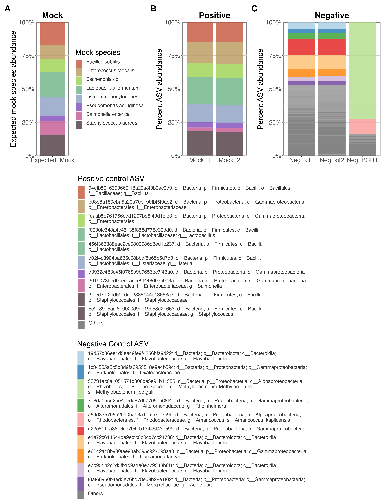
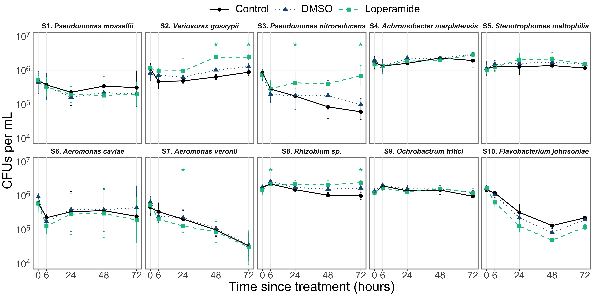
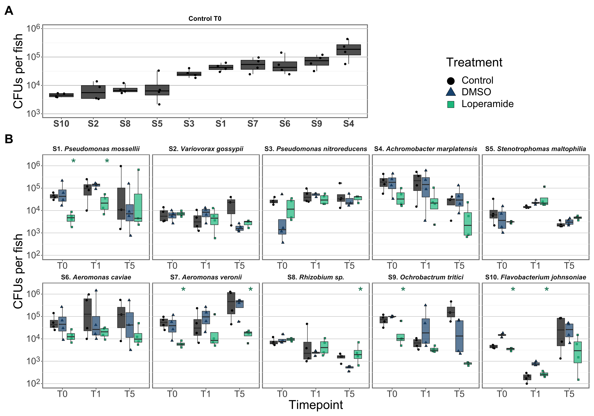
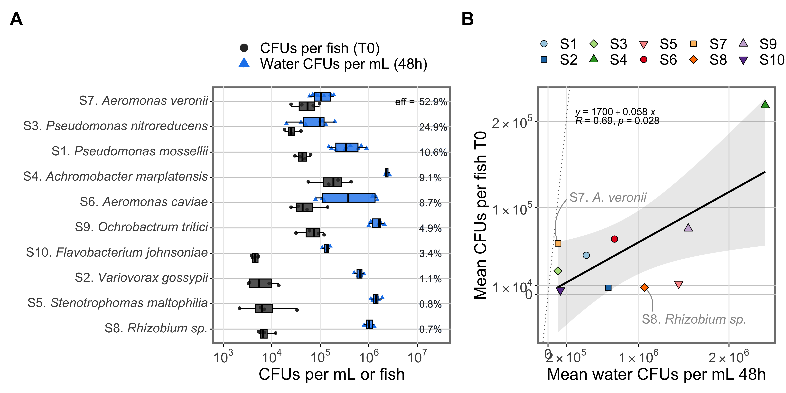
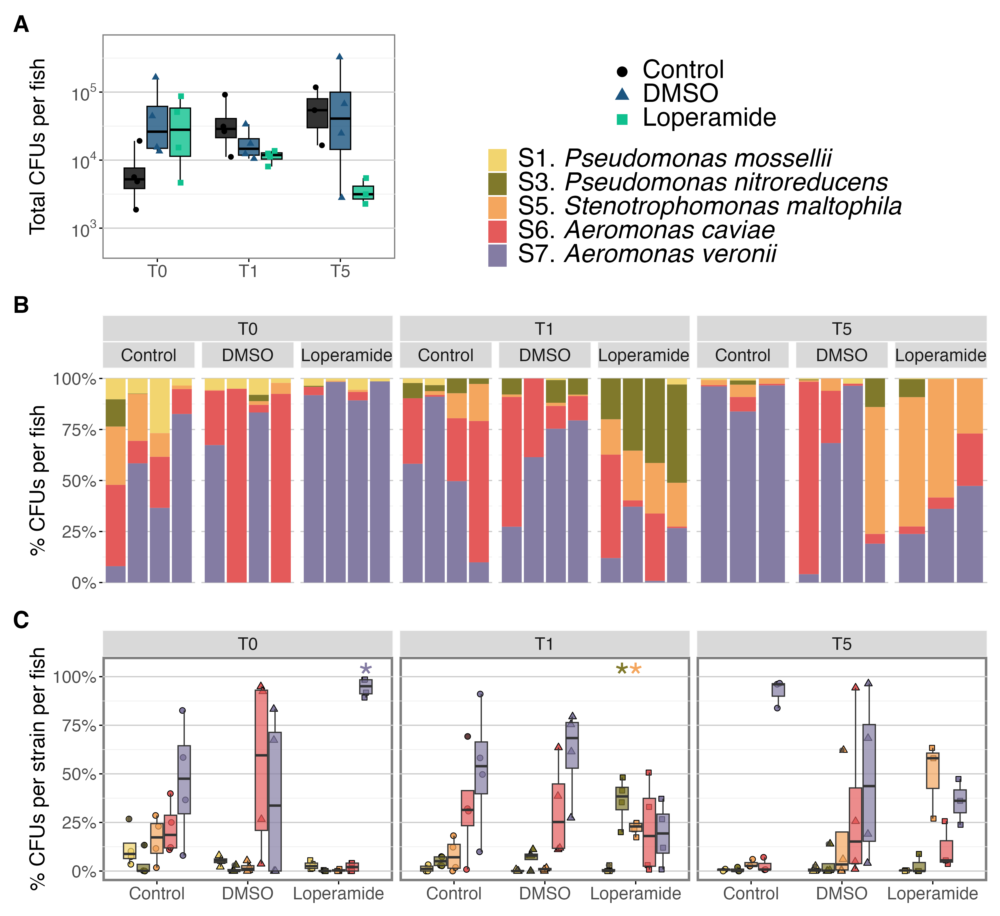

# Raw data, processed data, and scripts for *Anti-diarrheal drug loperamide induces microbial dysbiosis in larval zebrafish via targeted bacterial inhibition*

This repository contains the scripts, processed sequencing artifacts, and the Rmd script files to reproduce the figures in the manuscript. The raw sequences generated for this study can be found in the NCBI Short Read Archive under BioProject no. PRJNA908751. The corresponding accession numbers for each 16S rRNA amplicon sample are detailed in [`PRJNA908751_NCBI_info.xlsx`](16SampliconAnalysis/metadata/PRJNA908751_NCBI_info.xlsx).

### To cite this work:
Stevick, R.J., Ghigo, J-M. & Pérez-Pascual, D. ....

### This repository has been archived on Zenodo. Access or cite the most recent release:  

----------------------------------------------------------------------  

# Contents

- [LoperamideStraininfo.xlsx](LoperamideStrainInfo.xlsx) - metadata for the strains used in the study
- [figures/](figures/) - general figures

## [16SampliconAnalysis](/16SampliconAnalysis)
This folder contains scripts used to perform QIIME2 analysis on the 16S rRNA amplicon data, the QIIME2 output artifacts, and the Rmd script to reproduce the figures in the manuscript.  
- [scripts/](16SampliconAnalysis/scripts) - QIIME2 bash script and Rmd files
- [output/](16SampliconAnalysis/output) - QIIME2 artifacts and processed files
- [metadata/](16SampliconAnalysis/metadata)
- [figures/](16SampliconAnalysis/figures)

## [inVitroAnalysis](/inVitroAnalysis)
This folder contains all the raw data files and the scripts to reproduce the figures and statistics in the manuscript.  
- [Growth curves](inVitroAnalysis/GrowthCurves)
- [Survival in water](inVitroAnalysis/WaterSurvival)  

## [inVivoAnalysis](/inVivoAnalysis)
This folder contains all the raw data files and the scripts to reproduce the figures and statistics in the manuscript.  
- [Mono-reconv CFUs](inVivoAnalysis/Mono)
- [Mix-reconv CFUs](inVivoAnalysis/Mix)
- [Fish growth and development](inVivoAnalysis/Growth_Development)

-------------------------------------------------------------------------

# Figure index

Fig 1. Experimental schematic: Made using BioRender  

Fig 2. Conventional microbiota changes: [Loperamide16Samplicon_analysis.Rmd](16SampliconAnalysis/scripts/Loperamide16Samplicon_analysis.Rmd)

- Fig S1. QC and rarefaction curves  

- Fig S2. Sequencing controls  

- Fig S3. Phylum barplot  

- Fig S4. Genus barplot and venn diagram  

- Fig S5. All samples beta-diversity  

Fig S6. Zebrafish growth: [LoperamideFishMeasurents.Rmd](inVivoAnalysis/Growth_Development/LoperamideFishMeasurents.Rmd)  

Fig 3. Bacterial survival: [WaterSurvivalCFUs_loperamide.Rmd](inVitroAnalysis/WaterSurvival/WaterSurvivalCFUs_loperamide_figure3.Rmd)  

- Fig S7. Bacterial growth: [LoperamideGrowthCurves.Rmd](inVitroAnalysis/GrowthCurves/LoperamideGrowthCurves_S10.Rmd)  

Fig 4. Mono-colonization: [ZebrafishMonoCFUs_loperamide.Rmd](inVivoAnalysis/Mono/ZebrafishMonoCFUs_loperamide.Rmd)  

- Fig S8. Compare Mono vs Water  

Fig 5. Mix-colonization: [ZebrafishMixCFUs_loperamide.Rmd](inVivoAnalysis/Mix/ZebrafishMixCFUs_loperamide.Rmd)  

- Fig S9. Compare Mix vs Water  

Fig 6. Alpha-diversity comparison: [ZebrafishMixCFUs_loperamide.Rmd](inVivoAnalysis/Mix/ZebrafishMixCFUs_loperamide.Rmd)  

-------------------------------------------------------------------------

