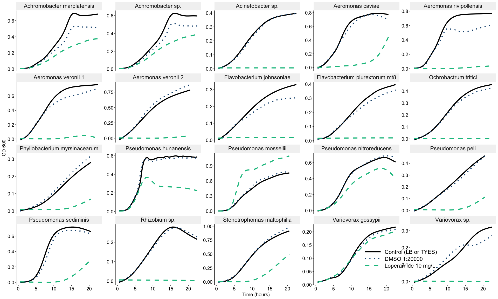
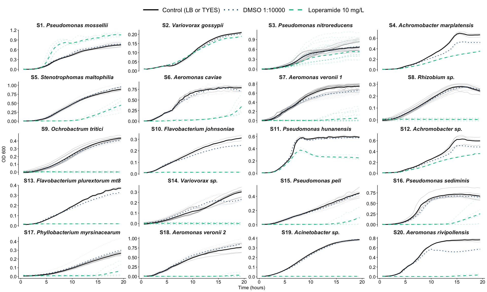
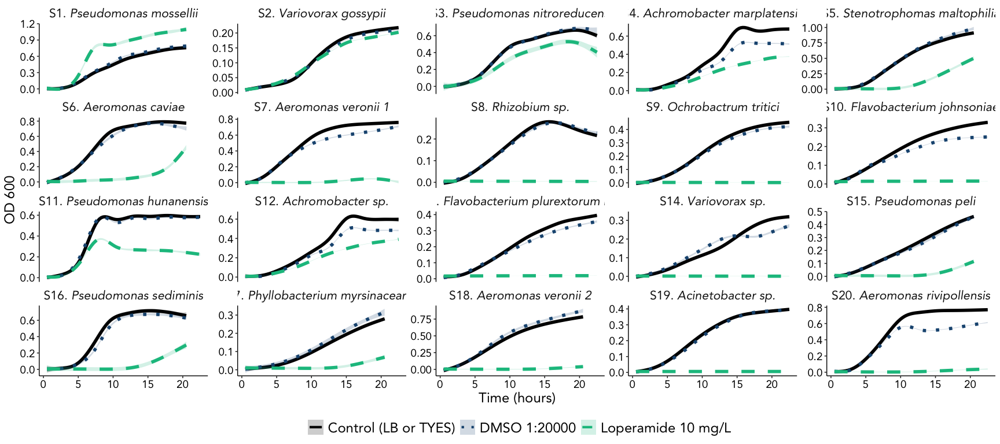
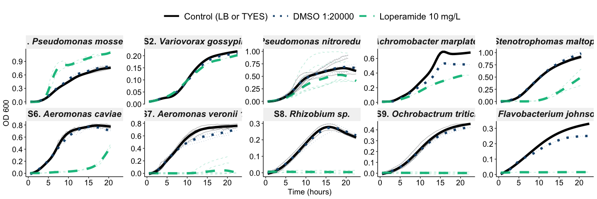
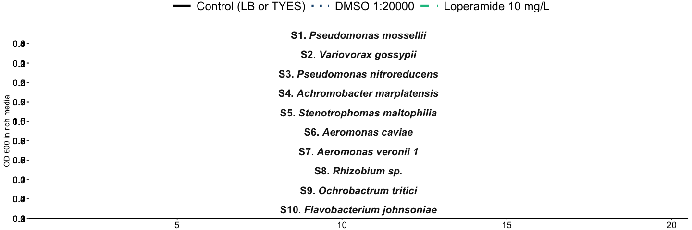

Growth curves of Mix9 and Flavo with Loperamide


## Load Libraries


```r
library("tidyverse")
library("janitor")
library("lubridate")
library("ggpubr")
library("ggtext")
library("patchwork")

theme_set(theme_pubr())
```


## Read in files and data


```r
# second experiment with flavo too. note there are TYES blanks here.
platedata2 <- readxl::read_xlsx("20210407_LoperamideMix9Flavo_GrowthCurves.xlsx", 
                                range="A34:AP132", sheet = "data", col_names = FALSE) %>% 
   t(.) %>% as.data.frame() %>% setNames(.[1,]) %>% slice(-1) %>% 
   gather(key="well", value="value", A1:H12) %>% add_column(Assay = "2")

platemap2 <- readxl::read_xlsx("20210407_LoperamideMix9Flavo_GrowthCurves.xlsx", sheet = "map") %>% 
   gather(key="column", value="Sample", `1`:`12`) %>% unite(row, column, col="well", sep="") %>% 
   separate(Sample, into=c("Treatment","Strain"), sep="-", remove = FALSE) %>% drop_na(Treatment) %>% 
   filter(Strain!="Flavo" | is.na(Strain))

# third experiment with flavo too. note there are TYES blanks here.
platedata3 <- readxl::read_xlsx("20210416_LoperamideMix9Flavo_GrowthCurvesRep.xlsx", 
                                range="A34:AP132", sheet = "data", col_names = FALSE) %>% 
   t(.) %>% as.data.frame() %>% setNames(.[1,]) %>% slice(-1) %>% 
   gather(key="well", value="value", A1:H12) %>% add_column(Assay = "3")

platemap3 <- readxl::read_xlsx("20210416_LoperamideMix9Flavo_GrowthCurvesRep.xlsx", sheet = "map") %>% 
   gather(key="column", value="Sample", `1`:`12`) %>% unite(row, column, col="well", sep="") %>% 
   separate(Sample, into=c("Treatment","Strain"), sep="-", remove = FALSE) %>% drop_na(Treatment)


# fourth experiment with new strains.
platedata4 <- readxl::read_xlsx("LoperamideGrowthCurves_20220426.xlsx", 
                                range="A34:AT132", sheet="data", col_names = FALSE) %>% 
   t(.) %>% as.data.frame() %>% setNames(.[1,]) %>% slice(-1) %>% 
   pivot_longer(names_to="well", values_to="value", A1:H12) %>% add_column(Assay = "4") %>% 
   filter(!well %in% c("E5","E6","E7","E8","E9","F5","F6","F7","F8","F9"))

platemap4 <- readxl::read_xlsx("LoperamideGrowthCurves_20220426.xlsx", sheet = "map") %>% 
   gather(key="column", value="Sample", `1`:`12`) %>% unite(row, column, col="well", sep="") %>% 
   separate(Sample, into=c("Treatment","Strain"), sep="-", remove = FALSE) %>% drop_na(Treatment) %>% 
   filter(!well %in% c("E5","E6","E7","E8","E9","F5","F6","F7","F8","F9")) %>% 
      filter(!Strain %in% c("Fjohn","Fplur"))


# fifth experiment with new strains.
platedata5 <- readxl::read_xlsx("LoperamideGrowthCurves_20220505.xlsx", 
                                range="A34:AT132", sheet="data", col_names = FALSE) %>% 
   t(.) %>% as.data.frame() %>% setNames(.[1,]) %>% slice(-1) %>% 
   pivot_longer(names_to="well", values_to="value", A1:H12) %>% add_column(Assay = "5") %>% 
   filter(!well %in% c("F6","F7","F8","F9"))

platemap5 <- readxl::read_xlsx("LoperamideGrowthCurves_20220505.xlsx", sheet = "map") %>% 
   gather(key="column", value="Sample", `1`:`12`) %>% unite(row, column, col="well", sep="") %>% 
   separate(Sample, into=c("Treatment","Strain"), sep="-", remove = FALSE) %>% drop_na(Treatment) %>% 
   filter(!well %in% c("F6","F7","F8","F9")) %>% 
   filter(!Strain %in% c("Fjohn","Fplur"))


# sixth experiment with new strains.
platedata6 <- readxl::read_xlsx("LoperamideGrowthCurves_20220518.xlsx", 
                                range="A34:AT132", sheet="data", col_names = FALSE) %>% 
   t(.) %>% as.data.frame() %>% setNames(.[1,]) %>% slice(-1) %>% 
   pivot_longer(names_to="well", values_to="value", A1:H12) %>% add_column(Assay = "6") %>% 
   filter(!well %in% c("E6","E7","E8","E9","F7","F8","F9","F10","F11"))

platemap6 <- readxl::read_xlsx("LoperamideGrowthCurves_20220518.xlsx", sheet = "map") %>% 
   gather(key="column", value="Sample", `1`:`12`) %>% unite(row, column, col="well", sep="") %>% 
   separate(Sample, into=c("Treatment","Strain"), sep="-", remove = FALSE) %>% drop_na(Treatment) %>% 
   filter(!well %in% c("E6","E7","E8","E9","F7","F8","F9","F10","F11")) %>% 
   filter(!Strain %in% c("Fjohn","Fplur"))

# even more new strains
platedata7 <- readxl::read_xlsx("LoperamideGrowthCurves_20220523.xlsx", 
                                range="A34:AT132", sheet="data", col_names = FALSE) %>% 
   t(.) %>% as.data.frame() %>% setNames(.[1,]) %>% slice(-1) %>% 
   pivot_longer(names_to="well", values_to="value", A1:H12) %>% add_column(Assay = "7")

platemap7 <- readxl::read_xlsx("LoperamideGrowthCurves_20220523.xlsx", sheet = "map") %>% 
   gather(key="column", value="Sample", `1`:`12`) %>% unite(row, column, col="well", sep="") %>% 
   separate(Sample, into=c("Treatment","Strain"), sep="-", remove = FALSE) %>% drop_na(Treatment)

straininfo <- readxl::read_xlsx("../LoperamideStrainInfo.xlsx")
```


## Data formatting and cleaning


```r
# join data together
alldata23 <- full_join(platedata2, platemap2) %>% 
   full_join(full_join(platedata3, platemap3)) %>% 
   rename("Time" = `Time [s]`, "Cycle" = `Cycle Nr.`)%>% 
   mutate(value = as.numeric(value)) %>% 
    mutate(Media = case_when(Strain == "Flavo" ~ "TYES", TRUE ~ "LB"))

alldata4567 <- full_join(platedata4, platemap4) %>% 
   full_join(full_join(platedata5, platemap5)) %>% 
   full_join(full_join(platedata6, platemap6)) %>%
   full_join(full_join(platedata7, platemap7)) %>%
   rename("Time" = `Time [s]`, "Cycle" = `Cycle Nr.`) %>% 
   mutate(value = as.numeric(value))
```

### Check the blanks 1,2,3


```r
# extract blank data
meanblanks23 <- alldata23 %>% filter(is.na(Strain)) %>% 
   mutate(blankvalue = as.numeric(value)) %>% 
   select(blankvalue, Treatment, Assay) %>% 
   separate(Treatment, into=c("Treatment","Media"), sep="_", remove=FALSE) %>% 
   group_by(Assay, Treatment, Media) %>% 
   summarise(meanblank = mean(blankvalue, rm.na=TRUE)) %>% 
   mutate(Media = replace_na(Media, "LB"))
```

```
## Warning: Expected 2 pieces. Missing pieces filled with `NA` in 246 rows [370,
## 371, 372, 373, 374, 375, 376, 377, 378, 379, 380, 381, 382, 383, 384, 385, 386,
## 387, 388, 389, ...].
```

```
## `summarise()` has grouped output by 'Assay', 'Treatment'. You can override
## using the `.groups` argument.
```

```r
# add blank data in and subtract based on Treatment and Assay
alldatanorm23 <- alldata23 %>% 
   # fix the TYES labels
   mutate(Treatment = case_when(Treatment == "Con_TYES" ~ "Con", Treatment == "DMSO_TYES" ~ "DMSO",
                                Treatment == "Lop10_TYES" ~ "Lop10", TRUE ~ Treatment)) %>% 
   full_join(meanblanks23) %>% 
   mutate(valuenorm = as.numeric(value) - meanblank) %>% 
   mutate(Treatment = factor(Treatment, labels = c("Control (LB or TYES)", 
                                                   "DMSO 1:20000", "Loperamide 10 mg/L")))
```

```
## Joining, by = c("Assay", "Treatment", "Media")
```


### Blanks 4,5,6,7

```r
# extract blank data
blanksclean4567 <- alldata4567 %>% filter(is.na(Strain)) %>% 
   select(Time, value, Treatment, well, Assay) %>% 
   separate(Treatment, into=c("Treatment","Media"), sep="_") %>%
   select(-c(well)) %>% 
   group_by(Treatment, Media, Assay) %>% drop_na() %>% 
   summarise(meanblank = mean(value, rm.na=TRUE))
```

```
## `summarise()` has grouped output by 'Treatment', 'Media'. You can override
## using the `.groups` argument.
```

```r
alldatanorm4567 <- alldata4567 %>% left_join(blanksclean4567) %>% 
   mutate(valuenorm = as.numeric(value) - as.numeric(meanblank)) %>% 
   drop_na(Strain) %>% 
   mutate(Treatment = factor(Treatment, 
                             labels = c("Control (LB or TYES)", "DMSO 1:20000", "Loperamide 10 mg/L"))) 
```

```
## Joining, by = c("Assay", "Treatment")
```

### All together


```r
alldatanorm <- full_join(alldatanorm23, alldatanorm4567) %>% 
   filter(Strain!="W6" & Strain !="W6l")  %>% 
   inner_join(straininfo, by=c("Strain"="Strain"
                               )) %>% 
   drop_na(Strain) %>% 
   mutate(CodeName=factor(CodeName, levels=unique(straininfo$CodeName)))
```

```
## Joining, by = c("Cycle", "Time", "Temp. [°C]", "well", "value", "Assay",
## "Sample", "Treatment", "Strain", "Media", "meanblank", "valuenorm")
```

```r
alldatanorm %>% 
   distinct(Assay, Strain)
```

```
##    Assay Strain
## 1      2    Bc1
## 2      2   Bc10
## 3      2    Bc2
## 4      2    Bc3
## 5      2    Bc4
## 6      2    Bc5
## 7      2    Bc6
## 8      2    Bc8
## 9      2    Bc9
## 10     3    Bc1
## 11     3   Bc10
## 12     3    Bc2
## 13     3    Bc3
## 14     3    Bc4
## 15     3    Bc5
## 16     3    Bc6
## 17     3    Bc8
## 18     3    Bc9
## 19     4    Bc1
## 20     4     W8
## 21     4    W15
## 22     4    Mz8
## 23     4   Bc10
## 24     5    Bc1
## 25     5     W8
## 26     5    W15
## 27     5    Mz8
## 28     5   Bc10
## 29     6     W8
## 30     6    W15
## 31     6    Mz8
## 32     6    Bc1
## 33     6   Bc10
## 34     7   Mz14
## 35     7   Mz10
## 36     7    Mz1
## 37     7   Mz12
## 38     7    Mz4
## 39     7  Fplur
## 40     7  Fjohn
## 41     7    W6t
```


# All assays together


```r
alldatanorm %>% 
   ggplot(aes(x=as.numeric(Cycle)*30/60, y=valuenorm, color=Treatment, lty=Treatment))+
   growthcurve::stat_growthcurve(model="spline", lwd=1.5) +  
   facet_wrap(.~PaperName, scales = "free_y")+
   scale_color_manual(values=c('#000000', '#1c5580', '#0fc08e'))+
   scale_linetype_manual(values = c("solid","dotted","dashed"))+
   guides(color = guide_legend(keywidth = unit(20, units = "mm"), 
                               override.aes = list(lwd = 1.5)))+
   theme(strip.text = element_markdown(size = 16), axis.text = element_text(size=14), 
         axis.title = element_text(size=14), 
         legend.position = c(0.8, 0.1), legend.background = element_blank(),
         legend.text = element_text(size=16), legend.key.size = unit(0.7, "cm"),
         panel.grid = element_blank(), panel.grid.major.y = element_blank(),
         plot.background = element_blank(),
         strip.background = element_rect(color="transparent"),
         panel.background = element_rect(size=1, fill="white"))+
   labs(x="Time (hours)", y="OD 600", lty = NULL, color=NULL)
```

```
## Warning: Removed 360 rows containing non-finite values (stat_growth_curve).
```

<!-- -->

```r
#ggsave("GrowthCurvesLoperamide_allStrains.png", bg = "transparent", width = 18, height=10)


alldatanorm %>% unite("AssayTreat", c(Assay, Treatment,well), remove=FALSE) %>% 
   mutate(Time = as.numeric(Cycle)*30/60) %>% filter(Time < 20) %>% 
   mutate(Treatment = factor(Treatment, levels=c("Control (LB or TYES)","DMSO 1:20000", "Loperamide 10 mg/L"),
                             labels = c("Control (LB or TYES)","DMSO 1:10000", "Loperamide 10 mg/L"))) %>% 
   ggplot(aes(x=Time, y=valuenorm, color=Treatment))+
   stat_summary(aes(lty=Treatment, group=AssayTreat), geom="line", fun="mean", lwd=0.5, alpha=0.2) +
   stat_summary(aes(lty=Treatment), geom="line", fun="mean", lwd=1) +
   facet_wrap(.~CodeName, scales = "free_y", ncol=4)+
   scale_color_manual(values=c('#000000', '#1c5580', '#0fc08e'))+
   scale_linetype_manual(values = c("solid","dotted","dashed"))+
   guides(color = guide_legend(keywidth = unit(20, units = "mm"), 
                               override.aes = list(lwd = 1.5)))+
   theme(strip.text = element_markdown(size = 16, face="bold"), axis.text = element_text(size=14), 
         axis.title = element_text(size=14), 
         legend.position = "top", legend.background = element_blank(),
         legend.text = element_text(size=18), legend.key.size = unit(1.2, "cm"),
         panel.grid = element_blank(), panel.grid.major.y = element_blank(),
         plot.background = element_blank(),
         strip.background = element_blank(),
         panel.background = element_rect(size=1, fill="white"))+
   labs(x="Time (hours)", y="OD 600", lty = NULL, color=NULL)
```

<!-- -->

```r
ggsave("GrowthCurvesLoperamide_allStrains_all.png", bg = "transparent", width = 18, height=15)
```

## plots used for presentation


```r
alldatanorm %>% drop_na(Strain) %>% 
   ggplot(aes(x=as.numeric(Cycle)*30/60, y=valuenorm, color=Treatment, fill=Treatment, lty=Treatment))+
 #  growthcurve::stat_growthcurve(model="spline", lwd=1.5) +  
 #  stat_summary(geom="errorbar", fun.data="mean_sd", width=0.2, show.legend = FALSE)+
 #  stat_summary(geom="line", fun="mean", lwd=1.5) +
   geom_smooth(lwd=2, alpha=0.2)+
   facet_wrap(.~CodeName, scales = "free_y", ncol=5)+
   scale_color_manual(values=c('#000000', '#1c5580', '#0fc08e'))+
   scale_fill_manual(values=c('#000000', '#1c5580', '#0fc08e'))+
   scale_linetype_manual(values = c("solid","dotted","dashed"))+
   guides(fill = guide_legend(keywidth = unit(20, units = "mm"), 
                               override.aes = list(lwd = 1.5)))+
   theme(text=element_text(family="Avenir"), strip.text = element_markdown(size = 16), axis.text = element_text(size=14), 
         axis.title = element_text(size=18), 
         legend.position = "bottom", legend.background = element_blank(),
         legend.text = element_text(size=18), legend.key.size = unit(0.7, "cm"),
         panel.grid = element_blank(), panel.grid.major.y = element_blank(),
         plot.background = element_blank(),
         strip.background = element_blank(),
         panel.background = element_rect(size=1, fill="white"))+
   labs(x="Time (hours)", y="OD 600", lty = NULL, color=NULL, fill=NULL)
```

```
## Warning: Removed 360 rows containing non-finite values (stat_smooth).
```

<!-- -->

```r
#ggsave("GrowthCurvesLoperamide_allStrains_wide.png", bg = "transparent", width = 25, height=10)
```


```r
alldatanorm %>% drop_na(Strain) %>% 
   filter(Strain %in% c("Bc1","Bc2","Bc3","Bc4","Bc10")) %>% 
   ggplot(aes(x=as.numeric(Cycle)*30/60, y=valuenorm, color=Treatment, fill=Treatment, lty=Treatment))+
 #  growthcurve::stat_growthcurve(model="spline", lwd=1.5) +  
 #  stat_summary(geom="errorbar", fun.data="mean_sd", width=0.2, show.legend = FALSE)+
 #  stat_summary(geom="line", fun="mean", lwd=1.5) +
   geom_smooth(lwd=2, alpha=0.2)+
   facet_wrap(.~StrainNameFull, scales = "free_y", ncol=6)+
   scale_color_manual(values=c('#000000', '#1c5580', '#0fc08e'))+
   scale_fill_manual(values=c('#000000', '#1c5580', '#0fc08e'))+
   scale_linetype_manual(values = c("solid","dotted","dashed"))+
   guides(fill = guide_legend(keywidth = unit(20, units = "mm"), 
                               override.aes = list(lwd = 1.5)))+
   theme(text=element_text(family="Avenir"), strip.text = element_markdown(size = 16), axis.text = element_text(size=14), 
         axis.title = element_text(size=18), 
         legend.position = "none", legend.background = element_blank(),
         legend.text = element_text(size=18), legend.key.size = unit(0.7, "cm"),
         panel.grid = element_blank(), panel.grid.major.y = element_blank(),
         plot.background = element_blank(),
         strip.background = element_blank(),
         panel.background = element_rect(size=1, fill="white"))+
   labs(x="Time (hours)", y="OD 600", lty = NULL, color=NULL, fill=NULL)

#ggsave("GrowthCurvesLoperamide_allStrains_widesubset.png", bg = "transparent", width = 20, height=3)
```


```r
growsub<-alldatanorm %>% drop_na(Strain) %>% unite("AssayTreat", c(Assay, Treatment), remove=FALSE)%>% 
   filter(Strain %in% c("Bc2","Bc10","Bc3","Bc4","Bc1","W6t","W8","Mz8","Fjohn","Mz1")) %>% 
   ggplot(aes(x=as.numeric(Cycle)*30/60, y=valuenorm, color=Treatment, fill=Treatment, lty=Treatment))+
   growthcurve::stat_growthcurve(model="spline", lwd=2, na.rm=TRUE) +  
   stat_summary(aes(lty=Treatment, group=AssayTreat), geom="line", fun="mean", lwd=0.5, alpha=0.3) +
#  stat_summary(geom="errorbar", fun.data="mean_sd", width=0.2, show.legend = FALSE)+
 #  stat_summary(geom="line", fun="mean", lwd=1.5) +
 #  geom_smooth(lwd=2, alpha=0.2)+
   facet_wrap(.~CodeName, scales = "free_y", ncol=5)+
   scale_color_manual(values=c('#000000', '#1c5580', '#0fc08e'))+
   scale_fill_manual(values=c('#000000', '#1c5580', '#0fc08e'))+
   scale_linetype_manual(values = c("solid","dotted","dashed"))+
   guides(fill = guide_legend(keywidth = unit(20, units = "mm"), 
                               override.aes = list(lwd = 1.5)))+
   theme(strip.text = element_markdown(size = 16, face="bold"), axis.text = element_text(size=14), 
         axis.title = element_text(size=14), 
         legend.position = "top", legend.background = element_blank(),
         legend.text = element_text(size=16), legend.key.size = unit(1.2, "cm"),
         panel.grid = element_blank(), panel.grid.major.y = element_blank(),
         plot.background = element_blank(),
         strip.background = element_rect(color="transparent"),
         panel.background = element_rect(size=1, fill="white"))+
   labs(x="Time (hours)", y="OD 600", lty = NULL, color=NULL, fill=NULL)
growsub 
```

```
## Warning: Removed 288 rows containing non-finite values (stat_summary).
```

<!-- -->

```r
ggsave("GrowthCurvesLoperamide_widesubset.png", bg = "transparent", width = 22, height=8)
```

```
## Warning: Removed 288 rows containing non-finite values (stat_summary).
```

```r
growsublong<-alldatanorm %>% drop_na(Strain) %>% unite("AssayTreat", c(Assay, Treatment), remove=FALSE)%>%
   filter(as.numeric(Cycle) < 42) %>% 
   filter(Strain %in% c("Bc2","Bc10","Bc3","Bc4","Bc1","W6t","W8","Mz8","Fjohn","Mz1")) %>% 
   ggplot(aes(x=as.numeric(Cycle)*30/60, y=valuenorm, color=Treatment, fill=Treatment, lty=Treatment))+
   growthcurve::stat_growthcurve(model="spline", lwd=1, na.rm=TRUE) +  
   facet_wrap(.~CodeName, scales = "free_y", ncol=1)+
   scale_color_manual(values=c('#000000', '#1c5580', '#0fc08e'))+
   scale_fill_manual(values=c('#000000', '#1c5580', '#0fc08e'))+
   scale_linetype_manual(values = c("solid","dotted","dashed"))+
   guides(fill = guide_legend(keywidth = unit(20, units = "mm"), 
                               override.aes = list(lwd = 1.5)))+
   scale_x_continuous(expand=c(0,0))+
   scale_y_continuous(labels=scales::label_number(accuracy=0.1),
                      breaks = scales::breaks_extended(n=4))+ #  breaks=c(0, 0.2, 0.4, 0.6, 0.8)
   theme(strip.text = element_markdown(size = 16, face="bold"), axis.text = element_text(size=14), 
         legend.position = "top", legend.background = element_blank(),
         legend.text = element_text(size=18), legend.key.size = unit(1.2, "cm"),
         panel.grid = element_blank(), panel.grid.major.y = element_blank(),
         plot.background = element_blank(),
         strip.background = element_blank(),
         panel.background = element_rect(size=1, fill="transparent"))+
   labs(x="Time (hours)", y="OD 600 in rich media", lty = NULL, color=NULL, fill=NULL)
growsublong
```

<!-- -->


```r
library(patchwork)
(growsub+theme(legend.position="none"))/survivalsub+ #theme(strip.text = element_blank())+
   plot_layout(heights=c(1,1), guides="collect")+plot_annotation(tag_levels = "A")

survivalsub + annotation_custom(grob=ggplotGrob(growsub), 
                      ymin = 1e4, ymax=1e6, xmin=15, xmax=20)

ggsave("GrowthCurvesLoperamide_allStrains_widesubsetwithsurvival.png", bg = "transparent", width = 20, height=5)
```


```r
(growsublong+theme(legend.position="none", axis.title.y = element_text(hjust = 0, size=16), strip.text=element_blank()))+
   (survivalsublong+theme( axis.title.y = element_text(hjust = 0, size=16), strip.text=element_blank()))+
   (monoboxalllong+theme(legend.position="none",axis.title.y = element_text(hjust = 0, size=16), strip.text=element_blank()))+ #theme(strip.text = element_blank())+
   plot_layout(guides="collect", widths=c(1.7,1,2.2))

ggsave("../Loperamide_GrowthCurves_Survival_MonoColonize_allStrains_posterplot2.png", bg = "transparent", width = 9.8, height=16)
```
