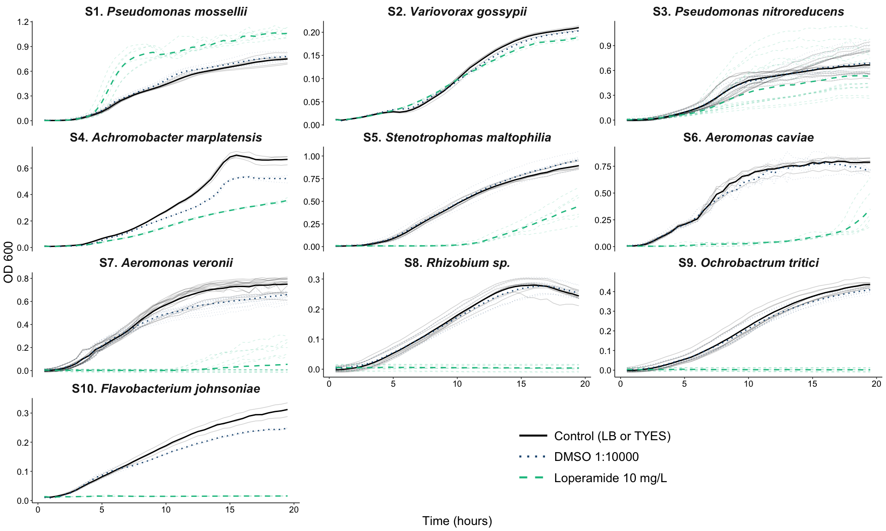

Growth curves of bacteria in rich media with Loperamide


## Load Libraries


```r
library("tidyverse")
library("janitor")
library("lubridate")
library("ggpubr")
library("ggtext")
library("patchwork")

theme_set(theme_pubr())
```


## Read in files and data


```r
# second experiment with flavo too. note there are TYES blanks here.
platedata2 <- readxl::read_xlsx("LoperamideGrowthCurves_20210407.xlsx", 
                                range="A34:AP132", sheet = "data", col_names = FALSE) %>% 
   t(.) %>% as.data.frame() %>% setNames(.[1,]) %>% slice(-1) %>% 
   gather(key="well", value="value", A1:H12) %>% add_column(Assay = "2")

platemap2 <- readxl::read_xlsx("LoperamideGrowthCurves_20210407.xlsx", sheet = "map") %>% 
   gather(key="column", value="Sample", `1`:`12`) %>% unite(row, column, col="well", sep="") %>% 
   separate(Sample, into=c("Treatment","Strain"), sep="-", remove = FALSE) %>% drop_na(Treatment) %>% 
   filter(Strain!="Flavo" | is.na(Strain))

# third experiment with flavo too. note there are TYES blanks here.
platedata3 <- readxl::read_xlsx("LoperamideGrowthCurves_20210416.xlsx", 
                                range="A34:AP132", sheet = "data", col_names = FALSE) %>% 
   t(.) %>% as.data.frame() %>% setNames(.[1,]) %>% slice(-1) %>% 
   gather(key="well", value="value", A1:H12) %>% add_column(Assay = "3")

platemap3 <- readxl::read_xlsx("LoperamideGrowthCurves_20210416.xlsx", sheet = "map") %>% 
   gather(key="column", value="Sample", `1`:`12`) %>% unite(row, column, col="well", sep="") %>% 
   separate(Sample, into=c("Treatment","Strain"), sep="-", remove = FALSE) %>% drop_na(Treatment)


# fourth experiment with new strains.
platedata4 <- readxl::read_xlsx("LoperamideGrowthCurves_20220426.xlsx", 
                                range="A34:AT132", sheet="data", col_names = FALSE) %>% 
   t(.) %>% as.data.frame() %>% setNames(.[1,]) %>% slice(-1) %>% 
   pivot_longer(names_to="well", values_to="value", A1:H12) %>% add_column(Assay = "4") %>% 
   filter(!well %in% c("E5","E6","E7","E8","E9","F5","F6","F7","F8","F9"))

platemap4 <- readxl::read_xlsx("LoperamideGrowthCurves_20220426.xlsx", sheet = "map") %>% 
   gather(key="column", value="Sample", `1`:`12`) %>% unite(row, column, col="well", sep="") %>% 
   separate(Sample, into=c("Treatment","Strain"), sep="-", remove = FALSE) %>% drop_na(Treatment) %>% 
   filter(!well %in% c("E5","E6","E7","E8","E9","F5","F6","F7","F8","F9")) %>% 
      filter(!Strain %in% c("Fjohn","Fplur"))


# fifth experiment with new strains.
platedata5 <- readxl::read_xlsx("LoperamideGrowthCurves_20220505.xlsx", 
                                range="A34:AT132", sheet="data", col_names = FALSE) %>% 
   t(.) %>% as.data.frame() %>% setNames(.[1,]) %>% slice(-1) %>% 
   pivot_longer(names_to="well", values_to="value", A1:H12) %>% add_column(Assay = "5") %>% 
   filter(!well %in% c("F6","F7","F8","F9"))

platemap5 <- readxl::read_xlsx("LoperamideGrowthCurves_20220505.xlsx", sheet = "map") %>% 
   gather(key="column", value="Sample", `1`:`12`) %>% unite(row, column, col="well", sep="") %>% 
   separate(Sample, into=c("Treatment","Strain"), sep="-", remove = FALSE) %>% drop_na(Treatment) %>% 
   filter(!well %in% c("F6","F7","F8","F9")) %>% 
   filter(!Strain %in% c("Fjohn","Fplur"))


# sixth experiment with new strains.
platedata6 <- readxl::read_xlsx("LoperamideGrowthCurves_20220518.xlsx", 
                                range="A34:AT132", sheet="data", col_names = FALSE) %>% 
   t(.) %>% as.data.frame() %>% setNames(.[1,]) %>% slice(-1) %>% 
   pivot_longer(names_to="well", values_to="value", A1:H12) %>% add_column(Assay = "6") %>% 
   filter(!well %in% c("E6","E7","E8","E9","F7","F8","F9","F10","F11"))

platemap6 <- readxl::read_xlsx("LoperamideGrowthCurves_20220518.xlsx", sheet = "map") %>% 
   gather(key="column", value="Sample", `1`:`12`) %>% unite(row, column, col="well", sep="") %>% 
   separate(Sample, into=c("Treatment","Strain"), sep="-", remove = FALSE) %>% drop_na(Treatment) %>% 
   filter(!well %in% c("E6","E7","E8","E9","F7","F8","F9","F10","F11")) %>% 
   filter(!Strain %in% c("Fjohn","Fplur"))

# even more new strains
platedata7 <- readxl::read_xlsx("LoperamideGrowthCurves_20220523.xlsx", 
                                range="A34:AT132", sheet="data", col_names = FALSE) %>% 
   t(.) %>% as.data.frame() %>% setNames(.[1,]) %>% slice(-1) %>% 
   pivot_longer(names_to="well", values_to="value", A1:H12) %>% add_column(Assay = "7")

platemap7 <- readxl::read_xlsx("LoperamideGrowthCurves_20220523.xlsx", sheet = "map") %>% 
   gather(key="column", value="Sample", `1`:`12`) %>% unite(row, column, col="well", sep="") %>% 
   separate(Sample, into=c("Treatment","Strain"), sep="-", remove = FALSE) %>% drop_na(Treatment)

straininfo <- readxl::read_xlsx("../../LoperamideStrainInfo.xlsx")
```


## Data formatting and cleaning


```r
# join data together
alldata23 <- full_join(platedata2, platemap2) %>% 
   full_join(full_join(platedata3, platemap3)) %>% 
   rename("Time" = `Time [s]`, "Cycle" = `Cycle Nr.`)%>% 
   mutate(value = as.numeric(value)) %>% 
    mutate(Media = case_when(Strain == "Flavo" ~ "TYES", TRUE ~ "LB"))

alldata4567 <- full_join(platedata4, platemap4) %>% 
   full_join(full_join(platedata5, platemap5)) %>% 
   full_join(full_join(platedata6, platemap6)) %>%
   full_join(full_join(platedata7, platemap7)) %>%
   rename("Time" = `Time [s]`, "Cycle" = `Cycle Nr.`) %>% 
   mutate(value = as.numeric(value))
```

### Check the blanks 1,2,3


```r
# extract blank data
meanblanks23 <- alldata23 %>% filter(is.na(Strain)) %>% 
   mutate(blankvalue = as.numeric(value)) %>% 
   select(blankvalue, Treatment, Assay) %>% 
   separate(Treatment, into=c("Treatment","Media"), sep="_", remove=FALSE) %>% 
   group_by(Assay, Treatment, Media) %>% 
   summarise(meanblank = mean(blankvalue, rm.na=TRUE)) %>% 
   mutate(Media = replace_na(Media, "LB"))
```

```
## Warning: Expected 2 pieces. Missing pieces filled with `NA` in 246 rows [370,
## 371, 372, 373, 374, 375, 376, 377, 378, 379, 380, 381, 382, 383, 384, 385, 386,
## 387, 388, 389, ...].
```

```
## `summarise()` has grouped output by 'Assay', 'Treatment'. You can override
## using the `.groups` argument.
```

```r
# add blank data in and subtract based on Treatment and Assay
alldatanorm23 <- alldata23 %>% 
   # fix the TYES labels
   mutate(Treatment = case_when(Treatment == "Con_TYES" ~ "Con", Treatment == "DMSO_TYES" ~ "DMSO",
                                Treatment == "Lop10_TYES" ~ "Lop10", TRUE ~ Treatment)) %>% 
   full_join(meanblanks23) %>% 
   mutate(valuenorm = as.numeric(value) - meanblank) %>% 
   mutate(Treatment = factor(Treatment, labels = c("Control (LB or TYES)", 
                                                   "DMSO 1:20000", "Loperamide 10 mg/L")))
```

```
## Joining, by = c("Assay", "Treatment", "Media")
```


### Blanks 4,5,6,7

```r
# extract blank data
blanksclean4567 <- alldata4567 %>% filter(is.na(Strain)) %>% 
   select(Time, value, Treatment, well, Assay) %>% 
   separate(Treatment, into=c("Treatment","Media"), sep="_") %>%
   select(-c(well)) %>% 
   group_by(Treatment, Media, Assay) %>% drop_na() %>% 
   summarise(meanblank = mean(value, rm.na=TRUE))
```

```
## `summarise()` has grouped output by 'Treatment', 'Media'. You can override
## using the `.groups` argument.
```

```r
alldatanorm4567 <- alldata4567 %>% left_join(blanksclean4567) %>% 
   mutate(valuenorm = as.numeric(value) - as.numeric(meanblank)) %>% 
   drop_na(Strain) %>% 
   mutate(Treatment = factor(Treatment, 
                             labels = c("Control (LB or TYES)", "DMSO 1:20000", "Loperamide 10 mg/L"))) 
```

```
## Joining, by = c("Assay", "Treatment")
```

### All together


```r
alldatanorm <- full_join(alldatanorm23, alldatanorm4567) %>% 
   filter(Strain!="W6" & Strain !="W6l")  %>% 
   inner_join(straininfo, by=c("Strain"="Strain")) %>% 
   drop_na(Strain) %>% 
   mutate(CodeName=factor(CodeName, levels=unique(straininfo$CodeName)))
```

```
## Joining, by = c("Cycle", "Time", "Temp. [°C]", "well", "value", "Assay",
## "Sample", "Treatment", "Strain", "Media", "meanblank", "valuenorm")
```

```r
alldatanorm %>% 
   distinct(Assay, Strain)
```

```
##    Assay Strain
## 1      2    Bc1
## 2      2   Bc10
## 3      2    Bc2
## 4      2    Bc3
## 5      2    Bc4
## 6      3    Bc1
## 7      3   Bc10
## 8      3    Bc2
## 9      3    Bc3
## 10     3    Bc4
## 11     4    Bc1
## 12     4     W8
## 13     4    Mz8
## 14     4   Bc10
## 15     5    Bc1
## 16     5     W8
## 17     5    Mz8
## 18     5   Bc10
## 19     6     W8
## 20     6    Mz8
## 21     6    Bc1
## 22     6   Bc10
## 23     7    Mz1
## 24     7  Fjohn
## 25     7    W6t
```


```r
alldatanorm %>% unite("AssayTreat", c(Assay, Treatment,well), remove=FALSE) %>% 
   mutate(Time = as.numeric(Cycle)*30/60) %>% filter(Time < 20) %>% 
   mutate(Treatment = factor(Treatment, levels=c("Control (LB or TYES)","DMSO 1:20000", "Loperamide 10 mg/L"),
                             labels = c("Control (LB or TYES)","DMSO 1:10000", "Loperamide 10 mg/L"))) %>% 
   filter(PaperCode %in% c("S1","S3","S4","S5","S6","S7","S8","S9","S10","S2")) %>% 
   mutate(CodeName=recode(CodeName, "S7. *Aeromonas veronii 1*" = "S7. *Aeromonas veronii*")) %>% 
   ggplot(aes(x=Time, y=valuenorm, color=Treatment))+
   stat_summary(aes(lty=Treatment, group=AssayTreat), geom="line", fun="mean", lwd=0.5, alpha=0.2) +
   stat_summary(aes(lty=Treatment), geom="line", fun="mean", lwd=1) +
   facet_wrap(.~CodeName, scales = "free_y", ncol=3)+
   scale_color_manual(values=c('#000000', '#1c5580', '#0fc08e'))+
   scale_linetype_manual(values = c("solid","dotted","dashed"))+
   guides(color = guide_legend(keywidth = unit(20, units = "mm"), 
                               override.aes = list(lwd = 1.5)))+
   theme(strip.text = element_markdown(size = 20, face="bold"), axis.text = element_text(size=14), 
         axis.title = element_text(size=20), 
         legend.position = c(0.66,0.1), legend.background = element_blank(),
         legend.text = element_text(size=20), legend.key.size = unit(1.2, "cm"),
         panel.grid = element_blank(), panel.grid.major.y = element_blank(),
         plot.background = element_blank(),
         strip.background = element_blank(),
         panel.background = element_rect(size=1, fill="white"))+
   labs(x="Time (hours)", y="OD 600", lty = NULL, color=NULL)
```

<!-- -->

```r
ggsave("FigureS7_GrowthCurvesLoperamide.png", bg = "transparent", width = 15, height=10)
ggsave("FigureS7_GrowthCurvesLoperamide.pdf", bg = "transparent", width = 15, height=10)
ggsave("FigureS7_GrowthCurvesLoperamide.tiff", bg = "transparent", width = 15, height=10)
```


```r
sessionInfo()
```

```
## R version 4.1.3 (2022-03-10)
## Platform: x86_64-apple-darwin17.0 (64-bit)
## Running under: macOS Big Sur/Monterey 10.16
## 
## Matrix products: default
## BLAS:   /Library/Frameworks/R.framework/Versions/4.1/Resources/lib/libRblas.0.dylib
## LAPACK: /Library/Frameworks/R.framework/Versions/4.1/Resources/lib/libRlapack.dylib
## 
## locale:
## [1] en_US.UTF-8/en_US.UTF-8/en_US.UTF-8/C/en_US.UTF-8/en_US.UTF-8
## 
## attached base packages:
## [1] stats     graphics  grDevices utils     datasets  methods   base     
## 
## other attached packages:
##  [1] patchwork_1.1.1 ggtext_0.1.1    ggpubr_0.4.0    lubridate_1.8.0
##  [5] janitor_2.1.0   forcats_0.5.1   stringr_1.4.0   dplyr_1.0.8    
##  [9] purrr_0.3.4     readr_2.1.2     tidyr_1.2.0     tibble_3.1.6   
## [13] ggplot2_3.3.5   tidyverse_1.3.1
## 
## loaded via a namespace (and not attached):
##  [1] Rcpp_1.0.8.3     assertthat_0.2.1 digest_0.6.29    utf8_1.2.2      
##  [5] R6_2.5.1         cellranger_1.1.0 backports_1.4.1  reprex_2.0.1    
##  [9] evaluate_0.15    highr_0.9        httr_1.4.2       pillar_1.7.0    
## [13] rlang_1.0.2      rematch_1.0.1    readxl_1.4.0     rstudioapi_0.13 
## [17] car_3.0-12       jquerylib_0.1.4  rmarkdown_2.13   labeling_0.4.2  
## [21] gridtext_0.1.4   munsell_0.5.0    broom_0.7.12     compiler_4.1.3  
## [25] modelr_0.1.8     xfun_0.30        pkgconfig_2.0.3  htmltools_0.5.2 
## [29] tidyselect_1.1.2 fansi_1.0.3      crayon_1.5.1     tzdb_0.3.0      
## [33] dbplyr_2.1.1     withr_2.5.0      grid_4.1.3       jsonlite_1.8.0  
## [37] gtable_0.3.0     lifecycle_1.0.1  DBI_1.1.2        magrittr_2.0.3  
## [41] scales_1.1.1     cli_3.2.0        stringi_1.7.6    carData_3.0-5   
## [45] farver_2.1.0     ggsignif_0.6.3   fs_1.5.2         snakecase_0.11.0
## [49] xml2_1.3.3       bslib_0.3.1      ellipsis_0.3.2   generics_0.1.2  
## [53] vctrs_0.4.0      tools_4.1.3      glue_1.6.2       markdown_1.1    
## [57] hms_1.1.1        abind_1.4-5      fastmap_1.1.0    yaml_2.3.5      
## [61] colorspace_2.0-3 rstatix_0.7.0    rvest_1.0.2      knitr_1.38      
## [65] haven_2.4.3      sass_0.4.1
```
