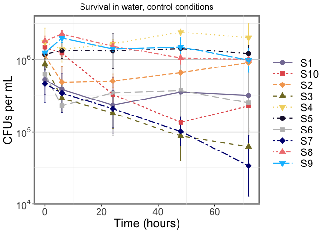
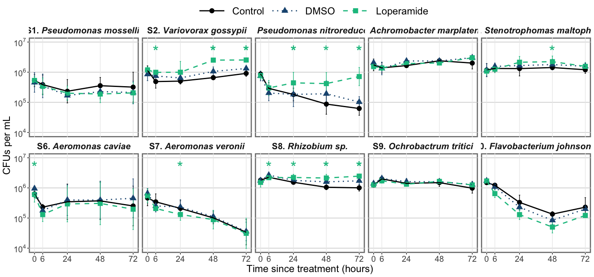

## About the Data

Individual strains survival in water.

20 mL of volvic water with each strain at final OD=0.001 (~10^6^ CFU/mL)\
DMSO at 1:10000, Loperamide at 10 mg/L

### Timepoints

Add loperamide and strains to water.
Sample water at 0 h, 3 h, 6 hours on day 1.
Then, daily until 3 days post inoculation. 24 h, 48 h, 72 h.


### Sample collection & plating

At each timepoint:

Make 0 to -3 dilutions in 96-well plates, in triplicate\
Plate 10 µL microdrops on big square plates.\
2 square plates total per timepoint


Put plates at 28C for 2 days, then count colonies.

### Conditions

**Treatment (Strain)**: Bc1, Bc2, Bc3, Bc4, Bc10, W6, W8, Mz1, Mz8, Fjohn

**Loperamide Treatment**: Control (water only), DMSO, Loperamide 10 mg/L


## Setup

### Load libraries and settings


```r
library(tidyverse)
library(scales)
library(ggpubr)
library(ungeviz)
library(ggtext)
library(rmdformats)

# set global theme
theme_set(theme_minimal()+
theme(panel.grid.major.y = element_line(color="grey80"), strip.text=element_text(size=16),
        strip.text.y = element_text(angle=0), plot.caption = element_text(size=10),
        panel.grid.major.x = element_blank(),legend.position="top",
        plot.background = element_rect(fill="transparent", color="transparent"),
        axis.ticks = element_line(inherit.blank = FALSE),
        panel.background = element_rect(color="grey50", size=2), 
        legend.title = element_text(size=18),
        axis.text = element_text(size=15), axis.title = element_text(size=18),
        legend.text = element_text(size=16), plot.title = element_text(hjust=0.5)))

# set global options for code output
knitr::opts_chunk$set(echo=TRUE, warning=FALSE,message=FALSE)
```

### Import data


```r
# import individual strain data from exp 1
datacfus1 <-
   readxl::read_xlsx("LoperamideWaterSurvivalCFUs_sub.xlsx", sheet="Round1") %>%
   drop_na(DF) %>%
   mutate(LoperamideTreatment=factor(LoperamideTreatment, 
                                    levels=c("None", "DMSO", "Loperamide 10 mg/L"),
                                    labels=c("Control","DMSO", "Loperamide")),
         Treatment = factor(Treatment, levels=c("Bc1","Bc2","Bc3","Bc4","Bc10"))) %>% 
   add_column(Assay=1)

# import individual strain data from exp 2
datacfus2 <-
   readxl::read_xlsx("LoperamideWaterSurvivalCFUs_sub.xlsx", sheet="Round2") %>%
   drop_na(DF) %>%
   mutate(LoperamideTreatment=factor(LoperamideTreatment, 
                                    levels=c("None", "DMSO", "Loperamide 10 mg/L"),
                                    labels=c("Control","DMSO", "Loperamide")),
         Treatment = factor(Treatment, levels=c("Bc1","Bc2","Bc3","Bc4","Bc10"))) %>% 
   add_column(Assay=2)

# import individual strain data from exp 3
datacfus3 <-
   readxl::read_xlsx("LoperamideWaterSurvivalCFUs_sub.xlsx", sheet="Round3") %>%
   drop_na(DF) %>%
   mutate(LoperamideTreatment=factor(LoperamideTreatment, 
                                    levels=c("None", "DMSO", "Loperamide 10 mg/L"),
                                    labels=c("Control","DMSO", "Loperamide")),
         Treatment = factor(Treatment, levels=c("Bc1","Bc2","Bc3","Bc4","Bc10"))) %>% 
   add_column(Assay=3)


# import individual strain data from exp 4
datacfus4 <-
   readxl::read_xlsx("LoperamideWaterSurvivalCFUs_sub.xlsx", sheet="Round4") %>%
   drop_na(DF) %>%
   mutate(LoperamideTreatment=factor(LoperamideTreatment, 
                                    levels=c("None", "DMSO", "Loperamide 10 mg/L"),
                                    labels=c("Control","DMSO", "Loperamide")),
         Treatment = factor(Treatment, levels=c("W6","W8","Mz8")))

datacfus5 <-
   readxl::read_xlsx("LoperamideWaterSurvivalCFUs_sub.xlsx", sheet="Round5") %>%
   drop_na(DF) %>%
   mutate(LoperamideTreatment=factor(LoperamideTreatment, 
                                    levels=c("None", "DMSO", "Loperamide 10 mg/L"),
                                    labels=c("Control","DMSO", "Loperamide")),
         Treatment = factor(Treatment, levels=c("W6","W8","Mz8","Fjohn","Mz1")))


straininfo <- readxl::read_xlsx("../../LoperamideStrainInfo.xlsx") %>% 
   mutate(Strain=recode(Strain, "W6t"="W6"))


dataallCFUs <- full_join(datacfus1, datacfus2) %>% 
   full_join(datacfus3) %>% 
   full_join(datacfus4) %>% full_join(datacfus5) %>% 
   left_join(straininfo, by=c("Treatment"="Strain")) %>% 
   mutate(CodeName=factor(CodeName, levels=unique(straininfo$CodeName)))
```

------------------------------------------------------------------------


## Stats of all significant comparisons


```r
longdata <- dataallCFUs %>% 
  pivot_longer(Rep1:Rep3) %>% 
  mutate(RepCFUs=(1000/VolPlated_ul)*DF*value) %>% 
  select(Treatment, LoperamideTreatment, Timepoint_hrs, RepCFUs)

statsbydayCFUs <- compare_means(data=longdata, 
                            RepCFUs~LoperamideTreatment, 
                            group.by = c("Treatment","Timepoint_hrs")) %>% 
   left_join(straininfo, by=c("Treatment"="Strain")) %>% 
   mutate(CodeName=factor(CodeName, levels=unique(straininfo$CodeName)))
gt::gt(statsbydayCFUs %>% filter(p.format<0.05 & group1=="DMSO"))
```

```{=html}
<div id="ehudbuussj" style="overflow-x:auto;overflow-y:auto;width:auto;height:auto;">
<style>html {
  font-family: -apple-system, BlinkMacSystemFont, 'Segoe UI', Roboto, Oxygen, Ubuntu, Cantarell, 'Helvetica Neue', 'Fira Sans', 'Droid Sans', Arial, sans-serif;
}

#ehudbuussj .gt_table {
  display: table;
  border-collapse: collapse;
  margin-left: auto;
  margin-right: auto;
  color: #333333;
  font-size: 16px;
  font-weight: normal;
  font-style: normal;
  background-color: #FFFFFF;
  width: auto;
  border-top-style: solid;
  border-top-width: 2px;
  border-top-color: #A8A8A8;
  border-right-style: none;
  border-right-width: 2px;
  border-right-color: #D3D3D3;
  border-bottom-style: solid;
  border-bottom-width: 2px;
  border-bottom-color: #A8A8A8;
  border-left-style: none;
  border-left-width: 2px;
  border-left-color: #D3D3D3;
}

#ehudbuussj .gt_heading {
  background-color: #FFFFFF;
  text-align: center;
  border-bottom-color: #FFFFFF;
  border-left-style: none;
  border-left-width: 1px;
  border-left-color: #D3D3D3;
  border-right-style: none;
  border-right-width: 1px;
  border-right-color: #D3D3D3;
}

#ehudbuussj .gt_title {
  color: #333333;
  font-size: 125%;
  font-weight: initial;
  padding-top: 4px;
  padding-bottom: 4px;
  padding-left: 5px;
  padding-right: 5px;
  border-bottom-color: #FFFFFF;
  border-bottom-width: 0;
}

#ehudbuussj .gt_subtitle {
  color: #333333;
  font-size: 85%;
  font-weight: initial;
  padding-top: 0;
  padding-bottom: 6px;
  padding-left: 5px;
  padding-right: 5px;
  border-top-color: #FFFFFF;
  border-top-width: 0;
}

#ehudbuussj .gt_bottom_border {
  border-bottom-style: solid;
  border-bottom-width: 2px;
  border-bottom-color: #D3D3D3;
}

#ehudbuussj .gt_col_headings {
  border-top-style: solid;
  border-top-width: 2px;
  border-top-color: #D3D3D3;
  border-bottom-style: solid;
  border-bottom-width: 2px;
  border-bottom-color: #D3D3D3;
  border-left-style: none;
  border-left-width: 1px;
  border-left-color: #D3D3D3;
  border-right-style: none;
  border-right-width: 1px;
  border-right-color: #D3D3D3;
}

#ehudbuussj .gt_col_heading {
  color: #333333;
  background-color: #FFFFFF;
  font-size: 100%;
  font-weight: normal;
  text-transform: inherit;
  border-left-style: none;
  border-left-width: 1px;
  border-left-color: #D3D3D3;
  border-right-style: none;
  border-right-width: 1px;
  border-right-color: #D3D3D3;
  vertical-align: bottom;
  padding-top: 5px;
  padding-bottom: 6px;
  padding-left: 5px;
  padding-right: 5px;
  overflow-x: hidden;
}

#ehudbuussj .gt_column_spanner_outer {
  color: #333333;
  background-color: #FFFFFF;
  font-size: 100%;
  font-weight: normal;
  text-transform: inherit;
  padding-top: 0;
  padding-bottom: 0;
  padding-left: 4px;
  padding-right: 4px;
}

#ehudbuussj .gt_column_spanner_outer:first-child {
  padding-left: 0;
}

#ehudbuussj .gt_column_spanner_outer:last-child {
  padding-right: 0;
}

#ehudbuussj .gt_column_spanner {
  border-bottom-style: solid;
  border-bottom-width: 2px;
  border-bottom-color: #D3D3D3;
  vertical-align: bottom;
  padding-top: 5px;
  padding-bottom: 5px;
  overflow-x: hidden;
  display: inline-block;
  width: 100%;
}

#ehudbuussj .gt_group_heading {
  padding-top: 8px;
  padding-bottom: 8px;
  padding-left: 5px;
  padding-right: 5px;
  color: #333333;
  background-color: #FFFFFF;
  font-size: 100%;
  font-weight: initial;
  text-transform: inherit;
  border-top-style: solid;
  border-top-width: 2px;
  border-top-color: #D3D3D3;
  border-bottom-style: solid;
  border-bottom-width: 2px;
  border-bottom-color: #D3D3D3;
  border-left-style: none;
  border-left-width: 1px;
  border-left-color: #D3D3D3;
  border-right-style: none;
  border-right-width: 1px;
  border-right-color: #D3D3D3;
  vertical-align: middle;
}

#ehudbuussj .gt_empty_group_heading {
  padding: 0.5px;
  color: #333333;
  background-color: #FFFFFF;
  font-size: 100%;
  font-weight: initial;
  border-top-style: solid;
  border-top-width: 2px;
  border-top-color: #D3D3D3;
  border-bottom-style: solid;
  border-bottom-width: 2px;
  border-bottom-color: #D3D3D3;
  vertical-align: middle;
}

#ehudbuussj .gt_from_md > :first-child {
  margin-top: 0;
}

#ehudbuussj .gt_from_md > :last-child {
  margin-bottom: 0;
}

#ehudbuussj .gt_row {
  padding-top: 8px;
  padding-bottom: 8px;
  padding-left: 5px;
  padding-right: 5px;
  margin: 10px;
  border-top-style: solid;
  border-top-width: 1px;
  border-top-color: #D3D3D3;
  border-left-style: none;
  border-left-width: 1px;
  border-left-color: #D3D3D3;
  border-right-style: none;
  border-right-width: 1px;
  border-right-color: #D3D3D3;
  vertical-align: middle;
  overflow-x: hidden;
}

#ehudbuussj .gt_stub {
  color: #333333;
  background-color: #FFFFFF;
  font-size: 100%;
  font-weight: initial;
  text-transform: inherit;
  border-right-style: solid;
  border-right-width: 2px;
  border-right-color: #D3D3D3;
  padding-left: 5px;
  padding-right: 5px;
}

#ehudbuussj .gt_stub_row_group {
  color: #333333;
  background-color: #FFFFFF;
  font-size: 100%;
  font-weight: initial;
  text-transform: inherit;
  border-right-style: solid;
  border-right-width: 2px;
  border-right-color: #D3D3D3;
  padding-left: 5px;
  padding-right: 5px;
  vertical-align: top;
}

#ehudbuussj .gt_row_group_first td {
  border-top-width: 2px;
}

#ehudbuussj .gt_summary_row {
  color: #333333;
  background-color: #FFFFFF;
  text-transform: inherit;
  padding-top: 8px;
  padding-bottom: 8px;
  padding-left: 5px;
  padding-right: 5px;
}

#ehudbuussj .gt_first_summary_row {
  border-top-style: solid;
  border-top-color: #D3D3D3;
}

#ehudbuussj .gt_first_summary_row.thick {
  border-top-width: 2px;
}

#ehudbuussj .gt_last_summary_row {
  padding-top: 8px;
  padding-bottom: 8px;
  padding-left: 5px;
  padding-right: 5px;
  border-bottom-style: solid;
  border-bottom-width: 2px;
  border-bottom-color: #D3D3D3;
}

#ehudbuussj .gt_grand_summary_row {
  color: #333333;
  background-color: #FFFFFF;
  text-transform: inherit;
  padding-top: 8px;
  padding-bottom: 8px;
  padding-left: 5px;
  padding-right: 5px;
}

#ehudbuussj .gt_first_grand_summary_row {
  padding-top: 8px;
  padding-bottom: 8px;
  padding-left: 5px;
  padding-right: 5px;
  border-top-style: double;
  border-top-width: 6px;
  border-top-color: #D3D3D3;
}

#ehudbuussj .gt_striped {
  background-color: rgba(128, 128, 128, 0.05);
}

#ehudbuussj .gt_table_body {
  border-top-style: solid;
  border-top-width: 2px;
  border-top-color: #D3D3D3;
  border-bottom-style: solid;
  border-bottom-width: 2px;
  border-bottom-color: #D3D3D3;
}

#ehudbuussj .gt_footnotes {
  color: #333333;
  background-color: #FFFFFF;
  border-bottom-style: none;
  border-bottom-width: 2px;
  border-bottom-color: #D3D3D3;
  border-left-style: none;
  border-left-width: 2px;
  border-left-color: #D3D3D3;
  border-right-style: none;
  border-right-width: 2px;
  border-right-color: #D3D3D3;
}

#ehudbuussj .gt_footnote {
  margin: 0px;
  font-size: 90%;
  padding-left: 4px;
  padding-right: 4px;
  padding-left: 5px;
  padding-right: 5px;
}

#ehudbuussj .gt_sourcenotes {
  color: #333333;
  background-color: #FFFFFF;
  border-bottom-style: none;
  border-bottom-width: 2px;
  border-bottom-color: #D3D3D3;
  border-left-style: none;
  border-left-width: 2px;
  border-left-color: #D3D3D3;
  border-right-style: none;
  border-right-width: 2px;
  border-right-color: #D3D3D3;
}

#ehudbuussj .gt_sourcenote {
  font-size: 90%;
  padding-top: 4px;
  padding-bottom: 4px;
  padding-left: 5px;
  padding-right: 5px;
}

#ehudbuussj .gt_left {
  text-align: left;
}

#ehudbuussj .gt_center {
  text-align: center;
}

#ehudbuussj .gt_right {
  text-align: right;
  font-variant-numeric: tabular-nums;
}

#ehudbuussj .gt_font_normal {
  font-weight: normal;
}

#ehudbuussj .gt_font_bold {
  font-weight: bold;
}

#ehudbuussj .gt_font_italic {
  font-style: italic;
}

#ehudbuussj .gt_super {
  font-size: 65%;
}

#ehudbuussj .gt_footnote_marks {
  font-style: italic;
  font-weight: normal;
  font-size: 75%;
  vertical-align: 0.4em;
}

#ehudbuussj .gt_asterisk {
  font-size: 100%;
  vertical-align: 0;
}

#ehudbuussj .gt_slash_mark {
  font-size: 0.7em;
  line-height: 0.7em;
  vertical-align: 0.15em;
}

#ehudbuussj .gt_fraction_numerator {
  font-size: 0.6em;
  line-height: 0.6em;
  vertical-align: 0.45em;
}

#ehudbuussj .gt_fraction_denominator {
  font-size: 0.6em;
  line-height: 0.6em;
  vertical-align: -0.05em;
}
</style>
<table class="gt_table">
  
  <thead class="gt_col_headings">
    <tr>
      <th class="gt_col_heading gt_columns_bottom_border gt_left" rowspan="1" colspan="1">Treatment</th>
      <th class="gt_col_heading gt_columns_bottom_border gt_right" rowspan="1" colspan="1">Timepoint_hrs</th>
      <th class="gt_col_heading gt_columns_bottom_border gt_left" rowspan="1" colspan="1">.y.</th>
      <th class="gt_col_heading gt_columns_bottom_border gt_left" rowspan="1" colspan="1">group1</th>
      <th class="gt_col_heading gt_columns_bottom_border gt_left" rowspan="1" colspan="1">group2</th>
      <th class="gt_col_heading gt_columns_bottom_border gt_right" rowspan="1" colspan="1">p</th>
      <th class="gt_col_heading gt_columns_bottom_border gt_right" rowspan="1" colspan="1">p.adj</th>
      <th class="gt_col_heading gt_columns_bottom_border gt_left" rowspan="1" colspan="1">p.format</th>
      <th class="gt_col_heading gt_columns_bottom_border gt_left" rowspan="1" colspan="1">p.signif</th>
      <th class="gt_col_heading gt_columns_bottom_border gt_left" rowspan="1" colspan="1">method</th>
      <th class="gt_col_heading gt_columns_bottom_border gt_left" rowspan="1" colspan="1">Stock</th>
      <th class="gt_col_heading gt_columns_bottom_border gt_left" rowspan="1" colspan="1">Media</th>
      <th class="gt_col_heading gt_columns_bottom_border gt_left" rowspan="1" colspan="1">PaperCode</th>
      <th class="gt_col_heading gt_columns_bottom_border gt_left" rowspan="1" colspan="1">PaperName</th>
      <th class="gt_col_heading gt_columns_bottom_border gt_center" rowspan="1" colspan="1">CodeName</th>
      <th class="gt_col_heading gt_columns_bottom_border gt_left" rowspan="1" colspan="1">Isolation source</th>
    </tr>
  </thead>
  <tbody class="gt_table_body">
    <tr><td class="gt_row gt_left">Bc1</td>
<td class="gt_row gt_right">24</td>
<td class="gt_row gt_left">RepCFUs</td>
<td class="gt_row gt_left">DMSO</td>
<td class="gt_row gt_left">Loperamide</td>
<td class="gt_row gt_right">0.033700303</td>
<td class="gt_row gt_right">1.00</td>
<td class="gt_row gt_left">0.0337</td>
<td class="gt_row gt_left">*</td>
<td class="gt_row gt_left">Wilcoxon</td>
<td class="gt_row gt_left">RS1</td>
<td class="gt_row gt_left">LB</td>
<td class="gt_row gt_left">S7</td>
<td class="gt_row gt_left">Aeromonas veronii</td>
<td class="gt_row gt_center">S7. *Aeromonas veronii*</td>
<td class="gt_row gt_left">Conventional zebrafish</td></tr>
    <tr><td class="gt_row gt_left">Bc10</td>
<td class="gt_row gt_right">24</td>
<td class="gt_row gt_left">RepCFUs</td>
<td class="gt_row gt_left">DMSO</td>
<td class="gt_row gt_left">Loperamide</td>
<td class="gt_row gt_right">0.041835331</td>
<td class="gt_row gt_right">1.00</td>
<td class="gt_row gt_left">0.0418</td>
<td class="gt_row gt_left">*</td>
<td class="gt_row gt_left">Wilcoxon</td>
<td class="gt_row gt_left">RS10</td>
<td class="gt_row gt_left">LB</td>
<td class="gt_row gt_left">S3</td>
<td class="gt_row gt_left">Pseudomonas nitroreducens</td>
<td class="gt_row gt_center">S3. *Pseudomonas nitroreducens*</td>
<td class="gt_row gt_left">Conventional zebrafish</td></tr>
    <tr><td class="gt_row gt_left">Bc10</td>
<td class="gt_row gt_right">72</td>
<td class="gt_row gt_left">RepCFUs</td>
<td class="gt_row gt_left">DMSO</td>
<td class="gt_row gt_left">Loperamide</td>
<td class="gt_row gt_right">0.000401039</td>
<td class="gt_row gt_right">0.06</td>
<td class="gt_row gt_left">0.0004</td>
<td class="gt_row gt_left">***</td>
<td class="gt_row gt_left">Wilcoxon</td>
<td class="gt_row gt_left">RS10</td>
<td class="gt_row gt_left">LB</td>
<td class="gt_row gt_left">S3</td>
<td class="gt_row gt_left">Pseudomonas nitroreducens</td>
<td class="gt_row gt_center">S3. *Pseudomonas nitroreducens*</td>
<td class="gt_row gt_left">Conventional zebrafish</td></tr>
    <tr><td class="gt_row gt_left">W8</td>
<td class="gt_row gt_right">6</td>
<td class="gt_row gt_left">RepCFUs</td>
<td class="gt_row gt_left">DMSO</td>
<td class="gt_row gt_left">Loperamide</td>
<td class="gt_row gt_right">0.023968274</td>
<td class="gt_row gt_right">1.00</td>
<td class="gt_row gt_left">0.0240</td>
<td class="gt_row gt_left">*</td>
<td class="gt_row gt_left">Wilcoxon</td>
<td class="gt_row gt_left">RS17</td>
<td class="gt_row gt_left">LB</td>
<td class="gt_row gt_left">S8</td>
<td class="gt_row gt_left">Rhizobium sp.</td>
<td class="gt_row gt_center">S8. *Rhizobium sp.*</td>
<td class="gt_row gt_left">Conventional zebrafish</td></tr>
    <tr><td class="gt_row gt_left">W6</td>
<td class="gt_row gt_right">48</td>
<td class="gt_row gt_left">RepCFUs</td>
<td class="gt_row gt_left">DMSO</td>
<td class="gt_row gt_left">Loperamide</td>
<td class="gt_row gt_right">0.004922036</td>
<td class="gt_row gt_right">0.71</td>
<td class="gt_row gt_left">0.0049</td>
<td class="gt_row gt_left">**</td>
<td class="gt_row gt_left">Wilcoxon</td>
<td class="gt_row gt_left">RS15</td>
<td class="gt_row gt_left">TYES</td>
<td class="gt_row gt_left">S2</td>
<td class="gt_row gt_left">Variovorax gossypii</td>
<td class="gt_row gt_center">S2. *Variovorax gossypii*</td>
<td class="gt_row gt_left">Conventional zebrafish</td></tr>
    <tr><td class="gt_row gt_left">W6</td>
<td class="gt_row gt_right">72</td>
<td class="gt_row gt_left">RepCFUs</td>
<td class="gt_row gt_left">DMSO</td>
<td class="gt_row gt_left">Loperamide</td>
<td class="gt_row gt_right">0.004922036</td>
<td class="gt_row gt_right">0.71</td>
<td class="gt_row gt_left">0.0049</td>
<td class="gt_row gt_left">**</td>
<td class="gt_row gt_left">Wilcoxon</td>
<td class="gt_row gt_left">RS15</td>
<td class="gt_row gt_left">TYES</td>
<td class="gt_row gt_left">S2</td>
<td class="gt_row gt_left">Variovorax gossypii</td>
<td class="gt_row gt_center">S2. *Variovorax gossypii*</td>
<td class="gt_row gt_left">Conventional zebrafish</td></tr>
    <tr><td class="gt_row gt_left">W8</td>
<td class="gt_row gt_right">72</td>
<td class="gt_row gt_left">RepCFUs</td>
<td class="gt_row gt_left">DMSO</td>
<td class="gt_row gt_left">Loperamide</td>
<td class="gt_row gt_right">0.044200634</td>
<td class="gt_row gt_right">1.00</td>
<td class="gt_row gt_left">0.0442</td>
<td class="gt_row gt_left">*</td>
<td class="gt_row gt_left">Wilcoxon</td>
<td class="gt_row gt_left">RS17</td>
<td class="gt_row gt_left">LB</td>
<td class="gt_row gt_left">S8</td>
<td class="gt_row gt_left">Rhizobium sp.</td>
<td class="gt_row gt_center">S8. *Rhizobium sp.*</td>
<td class="gt_row gt_left">Conventional zebrafish</td></tr>
  </tbody>
  
  
</table>
</div>
```


## All together now

### Timeline for control conditions


```r
dataallCFUs %>% filter(LoperamideTreatment=="Control") %>%
  pivot_longer(Rep1:Rep3) %>% 
  mutate(RepCFUs=(1000/VolPlated_ul)*DF*value) %>% 
  ggplot(aes(x=Timepoint_hrs, y=RepCFUs, 
             color=PaperCode, fill=PaperCode, shape=PaperCode))+
  stat_summary(geom="errorbar", fun.data="mean_sd", width=0.5, show.legend = FALSE)+
  stat_summary(geom="point", fun="mean", size=3) +
  stat_summary(aes(lty=PaperCode), geom="line", fun="mean", lwd=0.8) +
  scale_y_continuous(trans = 'log10', labels = trans_format('log10', math_format(10^.x)))+
  scale_shape_manual(values=c(21,22,23,24,25,21,22,23,24,25))+
  scale_fill_manual(values=c(nationalparkcolors::park_palette("Saguaro", n=6),
                             "grey","navy","lightcoral","deepskyblue"))+
  scale_color_manual(values=c(nationalparkcolors::park_palette("Saguaro", n=6),
                              "grey","navy","lightcoral","deepskyblue"))+
  labs(y="CFUs per mL", x="Time (hours)", color=NULL, shape=NULL, fill=NULL, lty=NULL,
       title="Survival in water, control conditions")+
  theme(legend.key.width = unit(1.33,"cm"), legend.position = "right")
```

<!-- -->


### Timeline for each strain with mean


```r
statsbydayCFUsformat <- statsbydayCFUs %>% filter(p.signif!="ns")

dataallCFUs %>% pivot_longer(Rep1:Rep3) %>% 
  mutate(RepCFUs=(1000/VolPlated_ul)*DF*value) %>% 
  ggplot(aes(x = Timepoint_hrs, y=RepCFUs, 
             color=LoperamideTreatment, shape=LoperamideTreatment))+
  facet_wrap(.~CodeName, ncol=5)+
  stat_summary(geom="errorbar", fun.data="mean_sd", width=1, show.legend = FALSE)+
  stat_summary(geom="point", fun="mean", size=4) +
  stat_summary(aes(lty=LoperamideTreatment), geom="line", fun="mean", lwd=1) +
  geom_text(data=statsbydayCFUsformat, aes(label="*", y=5e6, color=NA, shape=NA), 
            size=10, color="#0fc08e",
            show.legend=FALSE)+
  scale_y_continuous(trans = 'log10', limits=c(NA,1e7), 
                     labels = trans_format('log10', math_format(10^.x)))+
   scale_x_continuous(breaks=c(0,6,24,48,72))+
  scale_linetype_manual(values=c("solid","dotted","dashed"))+
  scale_color_manual(values=c('#000000', '#1c5580', '#0fc08e'))+
  labs(y="CFUs per mL", x="Time since treatment (hours)", 
       color=NULL, shape=NULL, lty=NULL)+
  theme(strip.text = element_markdown(size = 16, face="bold"), 
        panel.grid.major.x = element_line(size=0.5),
        panel.grid.minor.x = element_blank(),panel.grid.minor.y = element_blank(),
        legend.text = element_text(size=18), legend.key.width = unit(2,"cm"))
```

<!-- -->

```r
ggsave("Figure3_WaterInVitro_LoperamideCFUs.tiff", bg="transparent", width = 19, height = 9.5)
ggsave("Figure3_WaterInVitro_LoperamideCFUs.pdf", bg="transparent", width = 19, height = 9.5)
```
