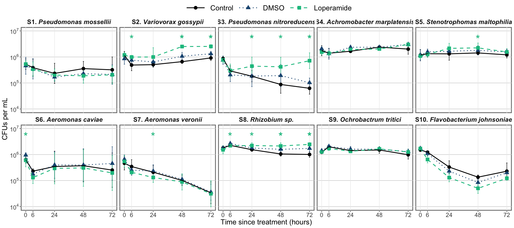

## About the Data

Individual strains survival in water.

20 mL of volvic water with each strain at final OD=0.001 (~10^6^ CFU/mL)\
DMSO at 1:10000, Loperamide at 10 mg/L

### Timepoints

Add loperamide and strains to water.
Sample water at 0 h, 3 h, 6 hours on day 1.
Then, daily until 3 days post inoculation. 24 h, 48 h, 72 h.


### Sample collection & plating

At each timepoint:

Make 0 to -3 dilutions in 96-well plates, in triplicate\
Plate 10 µL microdrops on big square plates.\
2 square plates total per timepoint


Put plates at 28C for 2 days, then count colonies.

### Conditions

**Treatment (Strain)**: Bc1, Bc2, Bc3, Bc4, Bc10, W6, W8, Mz1, Mz8, Fjohn

**Loperamide Treatment**: Control (water only), DMSO, Loperamide 10 mg/L


## Setup

### Load libraries and settings


```r
library(tidyverse)
library(scales)
library(ggpubr)
library(ungeviz)
library(ggtext)
library(rmdformats)

# set global theme
theme_set(theme_minimal()+
theme(panel.grid.major.y = element_line(color="grey80"), strip.text=element_text(size=16),
        strip.text.y = element_text(angle=0), plot.caption = element_text(size=10),
        panel.grid.major.x = element_blank(),legend.position="top",
        plot.background = element_rect(fill="transparent", color="transparent"),
        axis.ticks = element_line(inherit.blank = FALSE),
        panel.background = element_rect(color="grey50", size=2),
        legend.title = element_text(size=18),
        axis.text = element_text(size=15), axis.title = element_text(size=18),
        legend.text = element_text(size=16), plot.title = element_text(hjust=0.5)))

# set global options for code output
knitr::opts_chunk$set(echo=TRUE, warning=FALSE,message=FALSE)
```

### Import data


```r
# import individual strain data from exp 1
datacfus1 <-
   readxl::read_xlsx("LoperamideWaterSurvivalCFUs_sub.xlsx", sheet="Round1") %>%
   drop_na(DF) %>%
   mutate(LoperamideTreatment=factor(LoperamideTreatment,
                                    levels=c("None", "DMSO", "Loperamide 10 mg/L"),
                                    labels=c("Control","DMSO", "Loperamide")),
         Treatment = factor(Treatment, levels=c("Bc1","Bc2","Bc3","Bc4","Bc10"))) %>%
   add_column(Assay=1)

# import individual strain data from exp 2
datacfus2 <-
   readxl::read_xlsx("LoperamideWaterSurvivalCFUs_sub.xlsx", sheet="Round2") %>%
   drop_na(DF) %>%
   mutate(LoperamideTreatment=factor(LoperamideTreatment,
                                    levels=c("None", "DMSO", "Loperamide 10 mg/L"),
                                    labels=c("Control","DMSO", "Loperamide")),
         Treatment = factor(Treatment, levels=c("Bc1","Bc2","Bc3","Bc4","Bc10"))) %>%
   add_column(Assay=2)

# import individual strain data from exp 3
datacfus3 <-
   readxl::read_xlsx("LoperamideWaterSurvivalCFUs_sub.xlsx", sheet="Round3") %>%
   drop_na(DF) %>%
   mutate(LoperamideTreatment=factor(LoperamideTreatment,
                                    levels=c("None", "DMSO", "Loperamide 10 mg/L"),
                                    labels=c("Control","DMSO", "Loperamide")),
         Treatment = factor(Treatment, levels=c("Bc1","Bc2","Bc3","Bc4","Bc10"))) %>%
   add_column(Assay=3)


# import individual strain data from exp 4
datacfus4 <-
   readxl::read_xlsx("LoperamideWaterSurvivalCFUs_sub.xlsx", sheet="Round4") %>%
   drop_na(DF) %>%
   mutate(LoperamideTreatment=factor(LoperamideTreatment,
                                    levels=c("None", "DMSO", "Loperamide 10 mg/L"),
                                    labels=c("Control","DMSO", "Loperamide")),
         Treatment = factor(Treatment, levels=c("W6","W8","Mz8")))

datacfus5 <-
   readxl::read_xlsx("LoperamideWaterSurvivalCFUs_sub.xlsx", sheet="Round5") %>%
   drop_na(DF) %>%
   mutate(LoperamideTreatment=factor(LoperamideTreatment,
                                    levels=c("None", "DMSO", "Loperamide 10 mg/L"),
                                    labels=c("Control","DMSO", "Loperamide")),
         Treatment = factor(Treatment, levels=c("W6","W8","Mz8","Fjohn","Mz1")))


straininfo <- readxl::read_xlsx("../../LoperamideStrainInfo.xlsx") %>%
   mutate(Strain=recode(Strain, "W6t"="W6"))


dataallCFUs <- full_join(datacfus1, datacfus2) %>%
   full_join(datacfus3) %>%
   full_join(datacfus4) %>% full_join(datacfus5) %>%
   left_join(straininfo, by=c("Treatment"="Strain")) %>%
   mutate(CodeName=factor(CodeName, levels=unique(straininfo$CodeName)))
```

------------------------------------------------------------------------


## Stats of all significant comparisons


```r
longdata <- dataallCFUs %>%
  pivot_longer(Rep1:Rep3) %>%
  mutate(RepCFUs=(1000/VolPlated_ul)*DF*value) %>%
  select(Treatment, LoperamideTreatment, Timepoint_hrs, RepCFUs)

statsbydayCFUs <- compare_means(data=longdata,
                            RepCFUs~LoperamideTreatment,
                            group.by = c("Treatment","Timepoint_hrs")) %>%
   left_join(straininfo, by=c("Treatment"="Strain")) %>%
   mutate(CodeName=factor(CodeName, levels=unique(straininfo$CodeName)))
gt::gt(statsbydayCFUs %>% filter(p.format<0.05 & group1=="DMSO"))
```


## All together now

### Timeline for control conditions


```r
dataallCFUs %>% filter(LoperamideTreatment=="Control") %>%
  pivot_longer(Rep1:Rep3) %>%
  mutate(RepCFUs=(1000/VolPlated_ul)*DF*value) %>%
  ggplot(aes(x=Timepoint_hrs, y=RepCFUs,
             color=PaperCode, fill=PaperCode, shape=PaperCode))+
  stat_summary(geom="errorbar", fun.data="mean_sd", width=0.5, show.legend = FALSE)+
  stat_summary(geom="point", fun="mean", size=3) +
  stat_summary(aes(lty=PaperCode), geom="line", fun="mean", lwd=0.8) +
  scale_y_continuous(trans = 'log10', labels = trans_format('log10', math_format(10^.x)))+
  scale_shape_manual(values=c(21,22,23,24,25,21,22,23,24,25))+
  scale_fill_manual(values=c(nationalparkcolors::park_palette("Saguaro", n=6),
                             "grey","navy","lightcoral","deepskyblue"))+
  scale_color_manual(values=c(nationalparkcolors::park_palette("Saguaro", n=6),
                              "grey","navy","lightcoral","deepskyblue"))+
  labs(y="CFUs per mL", x="Time (hours)", color=NULL, shape=NULL, fill=NULL, lty=NULL,
       title="Survival in water, control conditions")+
  theme(legend.key.width = unit(1.33,"cm"), legend.position = "right")
```

<!-- -->


### Timeline for each strain with mean


```r
statsbydayCFUsformat <- statsbydayCFUs %>% filter(p.signif!="ns")

dataallCFUs %>% pivot_longer(Rep1:Rep3) %>%
  mutate(RepCFUs=(1000/VolPlated_ul)*DF*value) %>%
  ggplot(aes(x = Timepoint_hrs, y=RepCFUs,
             color=LoperamideTreatment, shape=LoperamideTreatment))+
  facet_wrap(.~CodeName, ncol=5)+
  stat_summary(geom="errorbar", fun.data="mean_sd", width=1, show.legend = FALSE)+
  stat_summary(geom="point", fun="mean", size=4) +
  stat_summary(aes(lty=LoperamideTreatment), geom="line", fun="mean", lwd=1) +
  geom_text(data=statsbydayCFUsformat, aes(label="*", y=5e6, color=NA, shape=NA),
            size=10, color="#0fc08e",
            show.legend=FALSE)+
  scale_y_continuous(trans = 'log10', limits=c(NA,1e7),
                     labels = trans_format('log10', math_format(10^.x)))+
   scale_x_continuous(breaks=c(0,6,24,48,72))+
  scale_linetype_manual(values=c("solid","dotted","dashed"))+
  scale_color_manual(values=c('#000000', '#1c5580', '#0fc08e'))+
  labs(y="CFUs per mL", x="Time since treatment (hours)",
       color=NULL, shape=NULL, lty=NULL)+
  theme(strip.text = element_markdown(size = 16, face="bold"),
        panel.grid.major.x = element_line(size=0.5),
        panel.grid.minor.x = element_blank(),panel.grid.minor.y = element_blank(),
        legend.text = element_text(size=18), legend.key.width = unit(2,"cm"))
```

<!-- -->

```r
ggsave("Figure3_WaterInVitro_LoperamideCFUs.tiff", bg="transparent", width = 19, height = 9.5)
ggsave("Figure3_WaterInVitro_LoperamideCFUs.pdf", bg="transparent", width = 19, height = 9.5)
```
