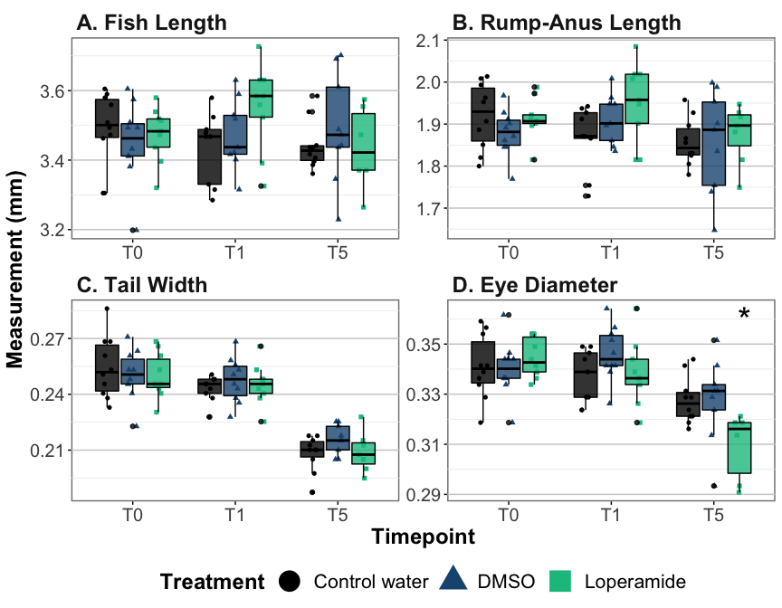

# About the data

By Seb at Zorgl'hub, fish from Trial 53
10 fish per condition

Conventional fish treated with loperamide at 5 dpf for 24 hours.

-   Sample timepoint 1 at 6 dpf (24 hour treatment)
-   Sample timepoint 2 at 7 dpf (24 hour treatment + 24 hour water)
-   Sample timepoint 3 at 11 dpf (24 hour treatment + 5 days water)


# Setup

## Load libraries and settings


## Import data


```r
data <- readxl::read_xlsx("Data ZH1902_240322.xlsx")
```

# Stats of all conditions


```r
data %>% pivot_longer(Length_mm:EyeDiameter_mm) %>% 
   mutate(Parameter=factor(name, levels=c("Length_mm", "RumpAnusLength_mm", "TailWidth_mm", "EyeDiameter_mm"),
                           labels=c("A. Fish Length", "B. Rump-Anus Length", "C. Tail Width", "D. Eye Diameter")),
          Timepoint_Day=factor(Timepoint_Day, levels=c("24h","48h","6d"),
                               labels=c("T0","T1","T5"))) %>% 
   compare_means(data=., value~Treatment, 
                 group.by = c("Parameter","Timepoint_Day")) -> statsbydayGrowth

sigstatsbydayGrowth <- statsbydayGrowth %>% filter(p.format<0.05 & group1=="DMSO")
sigstatsbydayGrowth
```

```
## # A tibble: 1 × 10
##   Parameter     Timepoint_Day .y.   group1 group2      p p.adj p.format p.signif
##   <fct>         <fct>         <chr> <chr>  <chr>   <dbl> <dbl> <chr>    <chr>   
## 1 D. Eye Diame… T5            value DMSO   Loper… 0.0287     1 0.029    *       
## # … with 1 more variable: method <chr>
```


# All together


```r
data %>% pivot_longer(Length_mm:EyeDiameter_mm) %>% 
   mutate(Parameter=factor(name, levels=c("Length_mm", "RumpAnusLength_mm", "TailWidth_mm", "EyeDiameter_mm"),
                           labels=c("A. Fish Length", "B. Rump-Anus Length", "C. Tail Width", "D. Eye Diameter")),
          Timepoint_Day=factor(Timepoint_Day, levels=c("24h","48h","6d"),
                               labels=c("T0","T1","T5"))) %>% 
   ggplot(aes(x=Timepoint_Day, y=value, fill=Treatment,color=Treatment, shape=Treatment))+
   geom_point(position=position_jitterdodge(jitter.width = 0.1,jitter.height = 0))+
   geom_boxplot(alpha=0.8, color="black", show.legend = FALSE)+
   geom_text(data=sigstatsbydayGrowth, aes(label="*", y=0.36, color=NA, shape=NA, x=Timepoint_Day), 
             size=10, color="black", nudge_x = 0.3, show.legend=FALSE, inherit.aes = FALSE)+
   facet_wrap(.~Parameter, scales="free")+
   scale_fill_manual(values=c('#000000', '#1c5580', '#0fc08e'))+
   scale_color_manual(values=c('#000000', '#1c5580', '#0fc08e'))+
   labs(y="Measurement (mm)", x="Timepoint")+
   theme(legend.position = "bottom", title = element_text(size=18, face="bold"),
         strip.text = element_text(size=18, face="bold", hjust=0),
         legend.background = element_blank(),
         plot.background = element_blank(),
         strip.background = element_blank(),
         panel.background = element_rect(size=1, fill="white", color="grey50"))+
   guides(fill=guide_legend(override.aes = list(size=8)))
```

<!-- -->

```r
ggsave("FigureS6_fishgrowth_loperamide.png", bg="transparent", width=10)
ggsave("FigureS6_fishgrowth_loperamide.tiff", bg="transparent", width=10)
ggsave("FigureS6_fishgrowth_loperamide.pdf", bg="transparent", width=10)
```


# Session info


```r
sessionInfo()
```

```
## R version 4.1.3 (2022-03-10)
## Platform: x86_64-apple-darwin17.0 (64-bit)
## Running under: macOS Big Sur/Monterey 10.16
## 
## Matrix products: default
## BLAS:   /Library/Frameworks/R.framework/Versions/4.1/Resources/lib/libRblas.0.dylib
## LAPACK: /Library/Frameworks/R.framework/Versions/4.1/Resources/lib/libRlapack.dylib
## 
## locale:
## [1] en_US.UTF-8/en_US.UTF-8/en_US.UTF-8/C/en_US.UTF-8/en_US.UTF-8
## 
## attached base packages:
## [1] stats     graphics  grDevices utils     datasets  methods   base     
## 
## other attached packages:
##  [1] ggpubr_0.4.0    scales_1.1.1    forcats_0.5.1   stringr_1.4.0  
##  [5] dplyr_1.0.8     purrr_0.3.4     readr_2.1.2     tidyr_1.2.0    
##  [9] tibble_3.1.6    ggplot2_3.3.5   tidyverse_1.3.1
## 
## loaded via a namespace (and not attached):
##  [1] lubridate_1.8.0  assertthat_0.2.1 digest_0.6.29    utf8_1.2.2      
##  [5] R6_2.5.1         cellranger_1.1.0 backports_1.4.1  reprex_2.0.1    
##  [9] evaluate_0.15    highr_0.9        httr_1.4.2       pillar_1.7.0    
## [13] rlang_1.0.2      readxl_1.4.0     rstudioapi_0.13  car_3.0-12      
## [17] jquerylib_0.1.4  rmarkdown_2.13   labeling_0.4.2   munsell_0.5.0   
## [21] broom_0.7.12     compiler_4.1.3   modelr_0.1.8     xfun_0.30       
## [25] pkgconfig_2.0.3  htmltools_0.5.2  tidyselect_1.1.2 fansi_1.0.3     
## [29] crayon_1.5.1     tzdb_0.3.0       dbplyr_2.1.1     withr_2.5.0     
## [33] grid_4.1.3       jsonlite_1.8.0   gtable_0.3.0     lifecycle_1.0.1 
## [37] DBI_1.1.2        magrittr_2.0.3   cli_3.2.0        stringi_1.7.6   
## [41] carData_3.0-5    farver_2.1.0     ggsignif_0.6.3   fs_1.5.2        
## [45] xml2_1.3.3       bslib_0.3.1      ellipsis_0.3.2   generics_0.1.2  
## [49] vctrs_0.4.0      tools_4.1.3      glue_1.6.2       hms_1.1.1       
## [53] abind_1.4-5      fastmap_1.1.0    yaml_2.3.5       colorspace_2.0-3
## [57] rstatix_0.7.0    rvest_1.0.2      knitr_1.38       haven_2.4.3     
## [61] sass_0.4.1
```
