# About the Data

## Timepoints

Treat with loperamide at 5 dpf for 24 hours.

-   Sample timepoint 1 at 6 dpf (24 hour treatment)
-   Sample timepoint 2 at 7 dpf (24 hour treatment + 24 hour water)
-   Sample timepoint 3 at 11 dpf (24 hour treatment + 5 days water)


### Sample collection & plating

At each timepoint:

1.  Wash all fish twice by transferring into sterile volvic in a 6-well plate
2.  Add fish with 500 µL sterile volvic water into a fastprep tube
3.  Homogenize sample at 6.5 for 45 seconds

**For individual strains:**\
Make 0 to -3 dilutions in 96-well plates, in triplicate (8 fish per plate)\
Plate 10 µL microdrops on big square plates.\
8 square plates total per timepoint

Put plates at 28C for 2 days, then count colonies.


# Setup

## Load libraries


## Import data


```r
# import individual strain data
datacfustrial49<-
   readxl::read_xlsx("../Trial49_LoperamideCFUs/Trial49_LoperamideZebrafishWaterCFUs.xlsx", sheet="Fish") %>%
   drop_na(DF) %>%
   mutate(LoperamideTreatment=factor(LoperamideTreatment, 
                                    levels=c("None", "DMSO", "Loperamide 10 mg/L"),
                                    labels=c("Control","DMSO", "Loperamide")),
         Treatment = factor(Treatment,
                            levels=c("Bc1","Bc2","Bc3","Bc4","Bc10","Bc1/Bc2/Bc3/Bc4/Bc10")),
         Timepoint = case_when(TrialDay == "6" ~ "24 hr treatment",
                                      TrialDay == "7" ~ "Treatment +\n24 hr recovery",
                                      TrialDay == "11" ~ "Treatment +\n5 day recovery"),
         Timepoint_day = case_when(TrialDay == "6" ~ "T0",
                                      TrialDay == "7" ~ "T1",
                                      TrialDay == "11" ~ "T5"))


# import individual strain data
datacfustrial56 <-
   readxl::read_xlsx("../Trial56_LoperamideMonoCFUs/Trial56_LoperamideZebrafishMonoCFUs.xlsx", sheet="Fish") %>%
   drop_na(DF) %>%
   mutate(LoperamideTreatment=factor(LoperamideTreatment, 
                                    levels=c("None", "DMSO", "Loperamide 10 mg/L"),
                                    labels=c("Control","DMSO", "Loperamide")),
         Treatment = factor(Treatment,
                            levels=c("W6. Variovorax", "W8. Rhizobium sp.", "Mz8. Ochrobactrum"),
                            labels=c("W6","W8","Mz8")),
         Timepoint = case_when(TrialDay == "6" ~ "24 hr treatment",
                                      TrialDay == "7" ~ "Treatment +\n24 hr recovery",
                                      TrialDay == "11" ~ "Treatment +\n5 day recovery"),
         Timepoint_day = case_when(TrialDay == "6" ~ "T0",
                                      TrialDay == "7" ~ "T1",
                                      TrialDay == "11" ~ "T5"))


# import individual strain data
datacfustrial57 <-
   readxl::read_xlsx("../Trial57_LoperamideMonoMixCFUs/Trial57_LoperamideZebrafishMixMonoCFUs.xlsx", sheet="FishMono") %>%
   drop_na(DF) %>%
   mutate(LoperamideTreatment=factor(LoperamideTreatment, 
                                    levels=c("None", "DMSO", "Loperamide 10 mg/L"),
                                    labels=c("Control","DMSO", "Loperamide")),
         Treatment = factor(Treatment,
                            levels=c("Mz1. Achromobacter","F. johnsoniae"),
                            labels=c("Mz1","Fjohn")),
         Timepoint = case_when(TrialDay == "6" ~ "24 hr treatment",
                                      TrialDay == "7" ~ "Treatment +\n24 hr recovery",
                                      TrialDay == "11" ~ "Treatment +\n5 day recovery"),
         Timepoint_day = case_when(TrialDay == "6" ~ "T0",
                                      TrialDay == "7" ~ "T1",
                                      TrialDay == "11" ~ "T5"))


straininfo <- readxl::read_xlsx("../../LoperamideStrainInfo.xlsx") %>% 
   mutate(Strain=recode(Strain, "W6t"="W6"))

dataall <- full_join(datacfustrial49,datacfustrial56) %>% full_join(datacfustrial57) %>% 
   left_join(straininfo, by=c("Treatment"="Strain")) %>% 
   mutate(CodeName=factor(CodeName, levels=unique(straininfo$CodeName)))
```

------------------------------------------------------------------------

# Fish CFUs per individual strain, all timepoints together

## Stats of all significant comparisons


```{=html}
<div id="zgihwidobz" style="overflow-x:auto;overflow-y:auto;width:auto;height:auto;">
<style>html {
  font-family: -apple-system, BlinkMacSystemFont, 'Segoe UI', Roboto, Oxygen, Ubuntu, Cantarell, 'Helvetica Neue', 'Fira Sans', 'Droid Sans', Arial, sans-serif;
}

#zgihwidobz .gt_table {
  display: table;
  border-collapse: collapse;
  margin-left: auto;
  margin-right: auto;
  color: #333333;
  font-size: 16px;
  font-weight: normal;
  font-style: normal;
  background-color: #FFFFFF;
  width: auto;
  border-top-style: solid;
  border-top-width: 2px;
  border-top-color: #A8A8A8;
  border-right-style: none;
  border-right-width: 2px;
  border-right-color: #D3D3D3;
  border-bottom-style: solid;
  border-bottom-width: 2px;
  border-bottom-color: #A8A8A8;
  border-left-style: none;
  border-left-width: 2px;
  border-left-color: #D3D3D3;
}

#zgihwidobz .gt_heading {
  background-color: #FFFFFF;
  text-align: center;
  border-bottom-color: #FFFFFF;
  border-left-style: none;
  border-left-width: 1px;
  border-left-color: #D3D3D3;
  border-right-style: none;
  border-right-width: 1px;
  border-right-color: #D3D3D3;
}

#zgihwidobz .gt_title {
  color: #333333;
  font-size: 125%;
  font-weight: initial;
  padding-top: 4px;
  padding-bottom: 4px;
  padding-left: 5px;
  padding-right: 5px;
  border-bottom-color: #FFFFFF;
  border-bottom-width: 0;
}

#zgihwidobz .gt_subtitle {
  color: #333333;
  font-size: 85%;
  font-weight: initial;
  padding-top: 0;
  padding-bottom: 6px;
  padding-left: 5px;
  padding-right: 5px;
  border-top-color: #FFFFFF;
  border-top-width: 0;
}

#zgihwidobz .gt_bottom_border {
  border-bottom-style: solid;
  border-bottom-width: 2px;
  border-bottom-color: #D3D3D3;
}

#zgihwidobz .gt_col_headings {
  border-top-style: solid;
  border-top-width: 2px;
  border-top-color: #D3D3D3;
  border-bottom-style: solid;
  border-bottom-width: 2px;
  border-bottom-color: #D3D3D3;
  border-left-style: none;
  border-left-width: 1px;
  border-left-color: #D3D3D3;
  border-right-style: none;
  border-right-width: 1px;
  border-right-color: #D3D3D3;
}

#zgihwidobz .gt_col_heading {
  color: #333333;
  background-color: #FFFFFF;
  font-size: 100%;
  font-weight: normal;
  text-transform: inherit;
  border-left-style: none;
  border-left-width: 1px;
  border-left-color: #D3D3D3;
  border-right-style: none;
  border-right-width: 1px;
  border-right-color: #D3D3D3;
  vertical-align: bottom;
  padding-top: 5px;
  padding-bottom: 6px;
  padding-left: 5px;
  padding-right: 5px;
  overflow-x: hidden;
}

#zgihwidobz .gt_column_spanner_outer {
  color: #333333;
  background-color: #FFFFFF;
  font-size: 100%;
  font-weight: normal;
  text-transform: inherit;
  padding-top: 0;
  padding-bottom: 0;
  padding-left: 4px;
  padding-right: 4px;
}

#zgihwidobz .gt_column_spanner_outer:first-child {
  padding-left: 0;
}

#zgihwidobz .gt_column_spanner_outer:last-child {
  padding-right: 0;
}

#zgihwidobz .gt_column_spanner {
  border-bottom-style: solid;
  border-bottom-width: 2px;
  border-bottom-color: #D3D3D3;
  vertical-align: bottom;
  padding-top: 5px;
  padding-bottom: 5px;
  overflow-x: hidden;
  display: inline-block;
  width: 100%;
}

#zgihwidobz .gt_group_heading {
  padding-top: 8px;
  padding-bottom: 8px;
  padding-left: 5px;
  padding-right: 5px;
  color: #333333;
  background-color: #FFFFFF;
  font-size: 100%;
  font-weight: initial;
  text-transform: inherit;
  border-top-style: solid;
  border-top-width: 2px;
  border-top-color: #D3D3D3;
  border-bottom-style: solid;
  border-bottom-width: 2px;
  border-bottom-color: #D3D3D3;
  border-left-style: none;
  border-left-width: 1px;
  border-left-color: #D3D3D3;
  border-right-style: none;
  border-right-width: 1px;
  border-right-color: #D3D3D3;
  vertical-align: middle;
}

#zgihwidobz .gt_empty_group_heading {
  padding: 0.5px;
  color: #333333;
  background-color: #FFFFFF;
  font-size: 100%;
  font-weight: initial;
  border-top-style: solid;
  border-top-width: 2px;
  border-top-color: #D3D3D3;
  border-bottom-style: solid;
  border-bottom-width: 2px;
  border-bottom-color: #D3D3D3;
  vertical-align: middle;
}

#zgihwidobz .gt_from_md > :first-child {
  margin-top: 0;
}

#zgihwidobz .gt_from_md > :last-child {
  margin-bottom: 0;
}

#zgihwidobz .gt_row {
  padding-top: 8px;
  padding-bottom: 8px;
  padding-left: 5px;
  padding-right: 5px;
  margin: 10px;
  border-top-style: solid;
  border-top-width: 1px;
  border-top-color: #D3D3D3;
  border-left-style: none;
  border-left-width: 1px;
  border-left-color: #D3D3D3;
  border-right-style: none;
  border-right-width: 1px;
  border-right-color: #D3D3D3;
  vertical-align: middle;
  overflow-x: hidden;
}

#zgihwidobz .gt_stub {
  color: #333333;
  background-color: #FFFFFF;
  font-size: 100%;
  font-weight: initial;
  text-transform: inherit;
  border-right-style: solid;
  border-right-width: 2px;
  border-right-color: #D3D3D3;
  padding-left: 5px;
  padding-right: 5px;
}

#zgihwidobz .gt_stub_row_group {
  color: #333333;
  background-color: #FFFFFF;
  font-size: 100%;
  font-weight: initial;
  text-transform: inherit;
  border-right-style: solid;
  border-right-width: 2px;
  border-right-color: #D3D3D3;
  padding-left: 5px;
  padding-right: 5px;
  vertical-align: top;
}

#zgihwidobz .gt_row_group_first td {
  border-top-width: 2px;
}

#zgihwidobz .gt_summary_row {
  color: #333333;
  background-color: #FFFFFF;
  text-transform: inherit;
  padding-top: 8px;
  padding-bottom: 8px;
  padding-left: 5px;
  padding-right: 5px;
}

#zgihwidobz .gt_first_summary_row {
  border-top-style: solid;
  border-top-color: #D3D3D3;
}

#zgihwidobz .gt_first_summary_row.thick {
  border-top-width: 2px;
}

#zgihwidobz .gt_last_summary_row {
  padding-top: 8px;
  padding-bottom: 8px;
  padding-left: 5px;
  padding-right: 5px;
  border-bottom-style: solid;
  border-bottom-width: 2px;
  border-bottom-color: #D3D3D3;
}

#zgihwidobz .gt_grand_summary_row {
  color: #333333;
  background-color: #FFFFFF;
  text-transform: inherit;
  padding-top: 8px;
  padding-bottom: 8px;
  padding-left: 5px;
  padding-right: 5px;
}

#zgihwidobz .gt_first_grand_summary_row {
  padding-top: 8px;
  padding-bottom: 8px;
  padding-left: 5px;
  padding-right: 5px;
  border-top-style: double;
  border-top-width: 6px;
  border-top-color: #D3D3D3;
}

#zgihwidobz .gt_striped {
  background-color: rgba(128, 128, 128, 0.05);
}

#zgihwidobz .gt_table_body {
  border-top-style: solid;
  border-top-width: 2px;
  border-top-color: #D3D3D3;
  border-bottom-style: solid;
  border-bottom-width: 2px;
  border-bottom-color: #D3D3D3;
}

#zgihwidobz .gt_footnotes {
  color: #333333;
  background-color: #FFFFFF;
  border-bottom-style: none;
  border-bottom-width: 2px;
  border-bottom-color: #D3D3D3;
  border-left-style: none;
  border-left-width: 2px;
  border-left-color: #D3D3D3;
  border-right-style: none;
  border-right-width: 2px;
  border-right-color: #D3D3D3;
}

#zgihwidobz .gt_footnote {
  margin: 0px;
  font-size: 90%;
  padding-left: 4px;
  padding-right: 4px;
  padding-left: 5px;
  padding-right: 5px;
}

#zgihwidobz .gt_sourcenotes {
  color: #333333;
  background-color: #FFFFFF;
  border-bottom-style: none;
  border-bottom-width: 2px;
  border-bottom-color: #D3D3D3;
  border-left-style: none;
  border-left-width: 2px;
  border-left-color: #D3D3D3;
  border-right-style: none;
  border-right-width: 2px;
  border-right-color: #D3D3D3;
}

#zgihwidobz .gt_sourcenote {
  font-size: 90%;
  padding-top: 4px;
  padding-bottom: 4px;
  padding-left: 5px;
  padding-right: 5px;
}

#zgihwidobz .gt_left {
  text-align: left;
}

#zgihwidobz .gt_center {
  text-align: center;
}

#zgihwidobz .gt_right {
  text-align: right;
  font-variant-numeric: tabular-nums;
}

#zgihwidobz .gt_font_normal {
  font-weight: normal;
}

#zgihwidobz .gt_font_bold {
  font-weight: bold;
}

#zgihwidobz .gt_font_italic {
  font-style: italic;
}

#zgihwidobz .gt_super {
  font-size: 65%;
}

#zgihwidobz .gt_footnote_marks {
  font-style: italic;
  font-weight: normal;
  font-size: 75%;
  vertical-align: 0.4em;
}

#zgihwidobz .gt_asterisk {
  font-size: 100%;
  vertical-align: 0;
}

#zgihwidobz .gt_slash_mark {
  font-size: 0.7em;
  line-height: 0.7em;
  vertical-align: 0.15em;
}

#zgihwidobz .gt_fraction_numerator {
  font-size: 0.6em;
  line-height: 0.6em;
  vertical-align: 0.45em;
}

#zgihwidobz .gt_fraction_denominator {
  font-size: 0.6em;
  line-height: 0.6em;
  vertical-align: -0.05em;
}
</style>
<table class="gt_table">
  
  <thead class="gt_col_headings">
    <tr>
      <th class="gt_col_heading gt_columns_bottom_border gt_left" rowspan="1" colspan="1">Treatment</th>
      <th class="gt_col_heading gt_columns_bottom_border gt_left" rowspan="1" colspan="1">Timepoint</th>
      <th class="gt_col_heading gt_columns_bottom_border gt_left" rowspan="1" colspan="1">Timepoint_day</th>
      <th class="gt_col_heading gt_columns_bottom_border gt_center" rowspan="1" colspan="1">CodeName</th>
      <th class="gt_col_heading gt_columns_bottom_border gt_left" rowspan="1" colspan="1">.y.</th>
      <th class="gt_col_heading gt_columns_bottom_border gt_left" rowspan="1" colspan="1">group1</th>
      <th class="gt_col_heading gt_columns_bottom_border gt_left" rowspan="1" colspan="1">group2</th>
      <th class="gt_col_heading gt_columns_bottom_border gt_right" rowspan="1" colspan="1">p</th>
      <th class="gt_col_heading gt_columns_bottom_border gt_right" rowspan="1" colspan="1">p.adj</th>
      <th class="gt_col_heading gt_columns_bottom_border gt_left" rowspan="1" colspan="1">p.format</th>
      <th class="gt_col_heading gt_columns_bottom_border gt_left" rowspan="1" colspan="1">p.signif</th>
      <th class="gt_col_heading gt_columns_bottom_border gt_left" rowspan="1" colspan="1">method</th>
    </tr>
  </thead>
  <tbody class="gt_table_body">
    <tr><td class="gt_row gt_left">Bc1</td>
<td class="gt_row gt_left">24 hr treatment</td>
<td class="gt_row gt_left">T0</td>
<td class="gt_row gt_center">S7. *Aeromonas veronii 1*</td>
<td class="gt_row gt_left">CFUs_perFish</td>
<td class="gt_row gt_left">DMSO</td>
<td class="gt_row gt_left">Loperamide</td>
<td class="gt_row gt_right">0.04206641</td>
<td class="gt_row gt_right">1</td>
<td class="gt_row gt_left">0.042</td>
<td class="gt_row gt_left">*</td>
<td class="gt_row gt_left">Wilcoxon</td></tr>
    <tr><td class="gt_row gt_left">Bc2</td>
<td class="gt_row gt_left">24 hr treatment</td>
<td class="gt_row gt_left">T0</td>
<td class="gt_row gt_center">S1. *Pseudomonas mossellii*</td>
<td class="gt_row gt_left">CFUs_perFish</td>
<td class="gt_row gt_left">DMSO</td>
<td class="gt_row gt_left">Loperamide</td>
<td class="gt_row gt_right">0.02857143</td>
<td class="gt_row gt_right">1</td>
<td class="gt_row gt_left">0.029</td>
<td class="gt_row gt_left">*</td>
<td class="gt_row gt_left">Wilcoxon</td></tr>
    <tr><td class="gt_row gt_left">Bc2</td>
<td class="gt_row gt_left">Treatment +
24 hr recovery</td>
<td class="gt_row gt_left">T1</td>
<td class="gt_row gt_center">S1. *Pseudomonas mossellii*</td>
<td class="gt_row gt_left">CFUs_perFish</td>
<td class="gt_row gt_left">DMSO</td>
<td class="gt_row gt_left">Loperamide</td>
<td class="gt_row gt_right">0.02857143</td>
<td class="gt_row gt_right">1</td>
<td class="gt_row gt_left">0.029</td>
<td class="gt_row gt_left">*</td>
<td class="gt_row gt_left">Wilcoxon</td></tr>
    <tr><td class="gt_row gt_left">Bc1</td>
<td class="gt_row gt_left">Treatment +
5 day recovery</td>
<td class="gt_row gt_left">T5</td>
<td class="gt_row gt_center">S7. *Aeromonas veronii 1*</td>
<td class="gt_row gt_left">CFUs_perFish</td>
<td class="gt_row gt_left">DMSO</td>
<td class="gt_row gt_left">Loperamide</td>
<td class="gt_row gt_right">0.02940105</td>
<td class="gt_row gt_right">1</td>
<td class="gt_row gt_left">0.029</td>
<td class="gt_row gt_left">*</td>
<td class="gt_row gt_left">Wilcoxon</td></tr>
    <tr><td class="gt_row gt_left">Mz8</td>
<td class="gt_row gt_left">24 hr treatment</td>
<td class="gt_row gt_left">T0</td>
<td class="gt_row gt_center">S9. *Ochrobactrum tritici*</td>
<td class="gt_row gt_left">CFUs_perFish</td>
<td class="gt_row gt_left">DMSO</td>
<td class="gt_row gt_left">Loperamide</td>
<td class="gt_row gt_right">0.02857143</td>
<td class="gt_row gt_right">1</td>
<td class="gt_row gt_left">0.029</td>
<td class="gt_row gt_left">*</td>
<td class="gt_row gt_left">Wilcoxon</td></tr>
    <tr><td class="gt_row gt_left">W8</td>
<td class="gt_row gt_left">Treatment +
5 day recovery</td>
<td class="gt_row gt_left">T5</td>
<td class="gt_row gt_center">S8. *Rhizobium sp.*</td>
<td class="gt_row gt_left">CFUs_perFish</td>
<td class="gt_row gt_left">DMSO</td>
<td class="gt_row gt_left">Loperamide</td>
<td class="gt_row gt_right">0.02857143</td>
<td class="gt_row gt_right">1</td>
<td class="gt_row gt_left">0.029</td>
<td class="gt_row gt_left">*</td>
<td class="gt_row gt_left">Wilcoxon</td></tr>
    <tr><td class="gt_row gt_left">Fjohn</td>
<td class="gt_row gt_left">24 hr treatment</td>
<td class="gt_row gt_left">T0</td>
<td class="gt_row gt_center">S10. *Flavobacterium johnsoniae*</td>
<td class="gt_row gt_left">CFUs_perFish</td>
<td class="gt_row gt_left">DMSO</td>
<td class="gt_row gt_left">Loperamide</td>
<td class="gt_row gt_right">0.02842954</td>
<td class="gt_row gt_right">1</td>
<td class="gt_row gt_left">0.028</td>
<td class="gt_row gt_left">*</td>
<td class="gt_row gt_left">Wilcoxon</td></tr>
    <tr><td class="gt_row gt_left">Fjohn</td>
<td class="gt_row gt_left">Treatment +
24 hr recovery</td>
<td class="gt_row gt_left">T1</td>
<td class="gt_row gt_center">S10. *Flavobacterium johnsoniae*</td>
<td class="gt_row gt_left">CFUs_perFish</td>
<td class="gt_row gt_left">DMSO</td>
<td class="gt_row gt_left">Loperamide</td>
<td class="gt_row gt_right">0.02940105</td>
<td class="gt_row gt_right">1</td>
<td class="gt_row gt_left">0.029</td>
<td class="gt_row gt_left">*</td>
<td class="gt_row gt_left">Wilcoxon</td></tr>
  </tbody>
  
  
</table>
</div>
```

## First timepoint, total CFUs per Fish

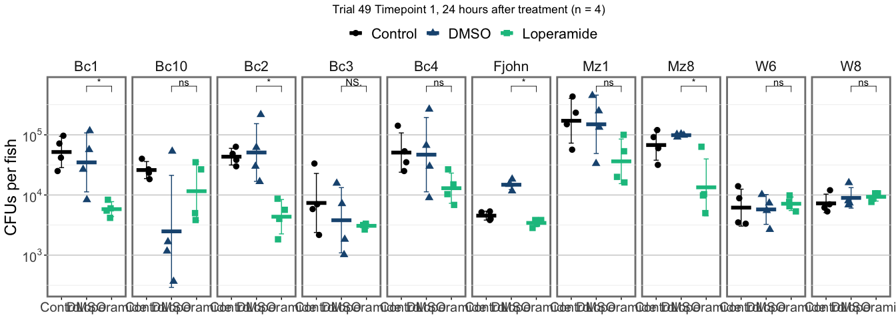<!-- -->

## Faceted by Strain, with means shown. 

Stats are relative to DMSO

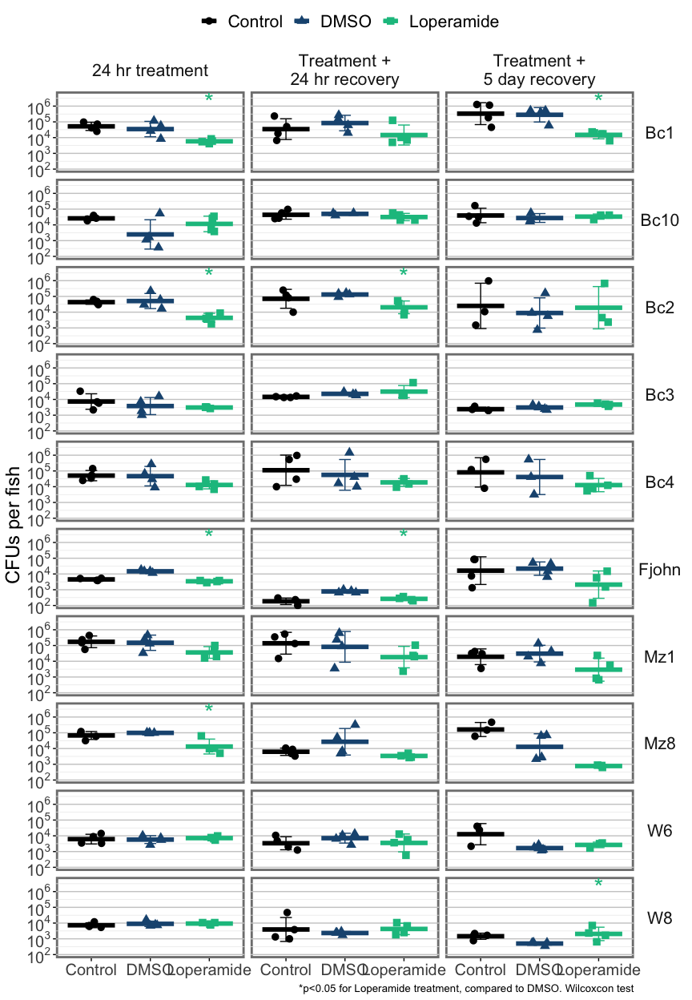<!-- -->

## Timeline for each strain with mean

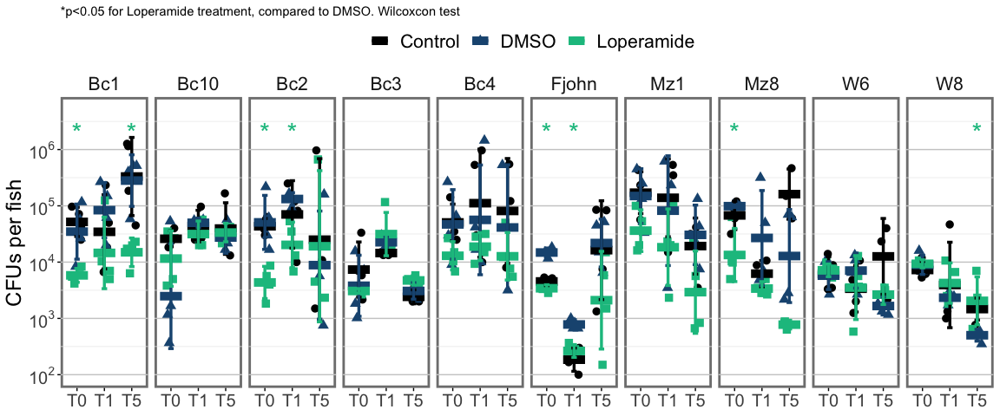<!-- -->

## Timeline for each strain with boxplots

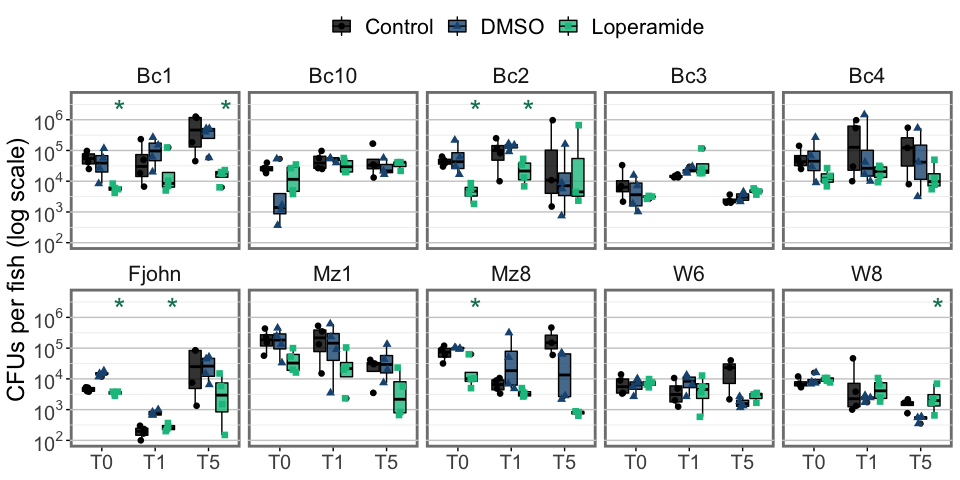<!-- -->


## Timeline for each strain with boxplots - formatted

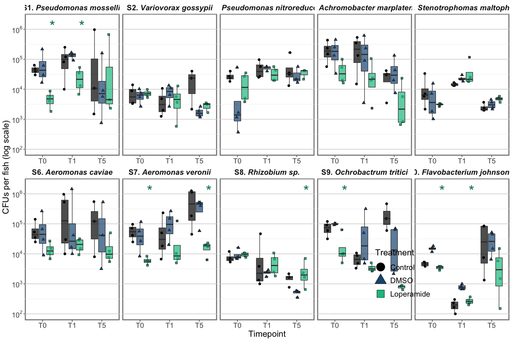<!-- -->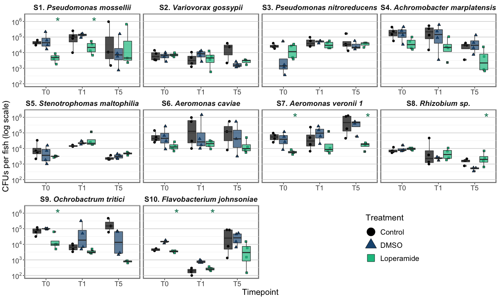<!-- -->

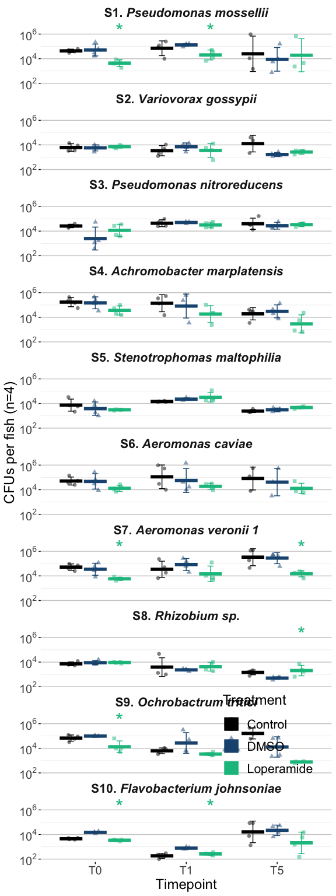<!-- -->


## Timeline for control conditions

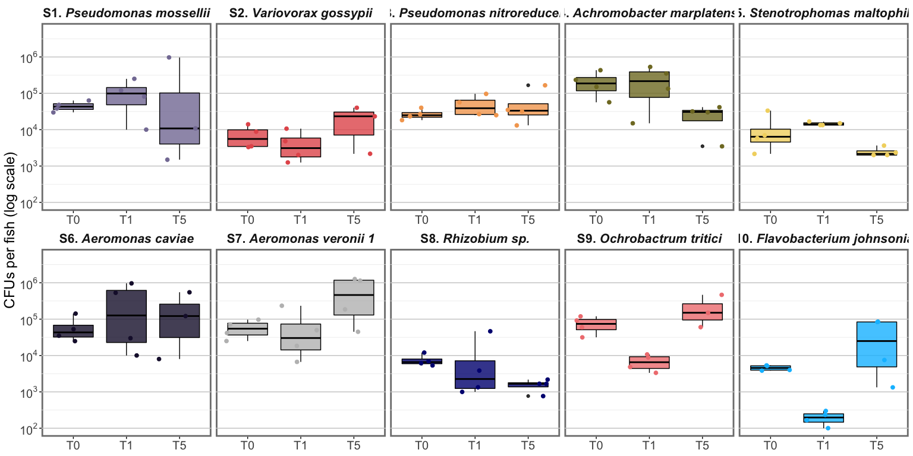<!-- -->

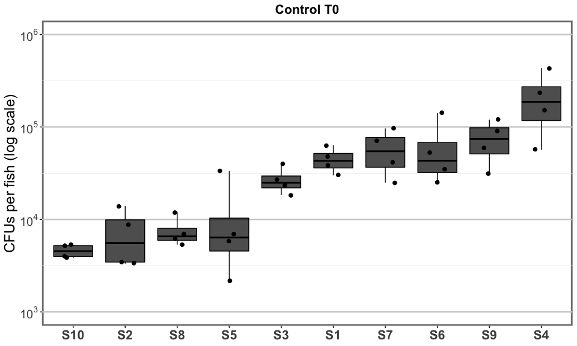<!-- -->

### Summary figure


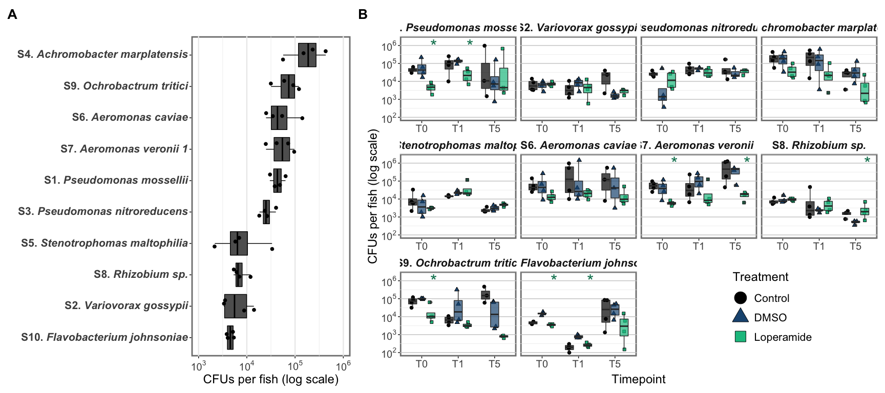<!-- --><!-- -->


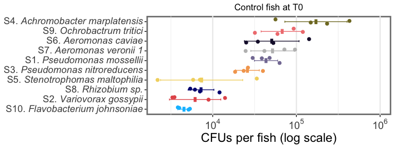<!-- -->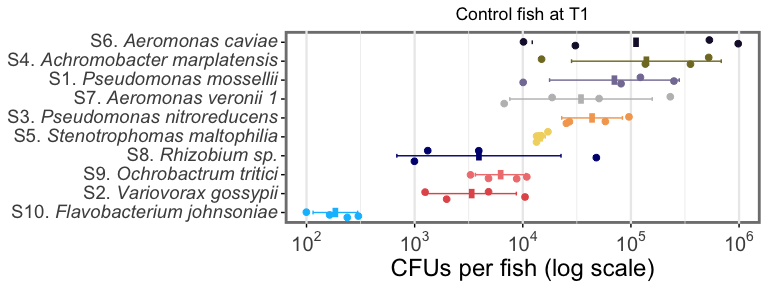<!-- -->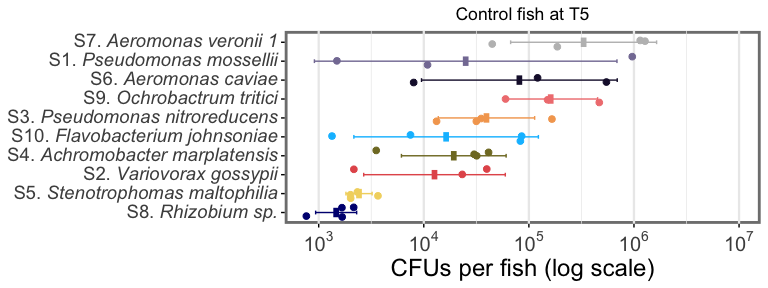<!-- -->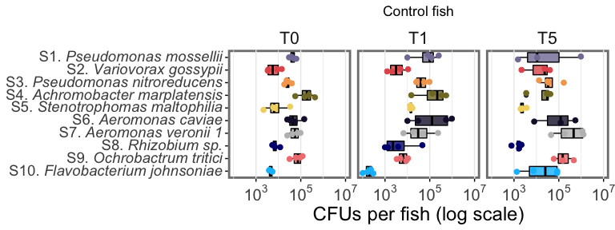<!-- -->


# Compare with Water CFUs


------------------------------------------------------------------------

