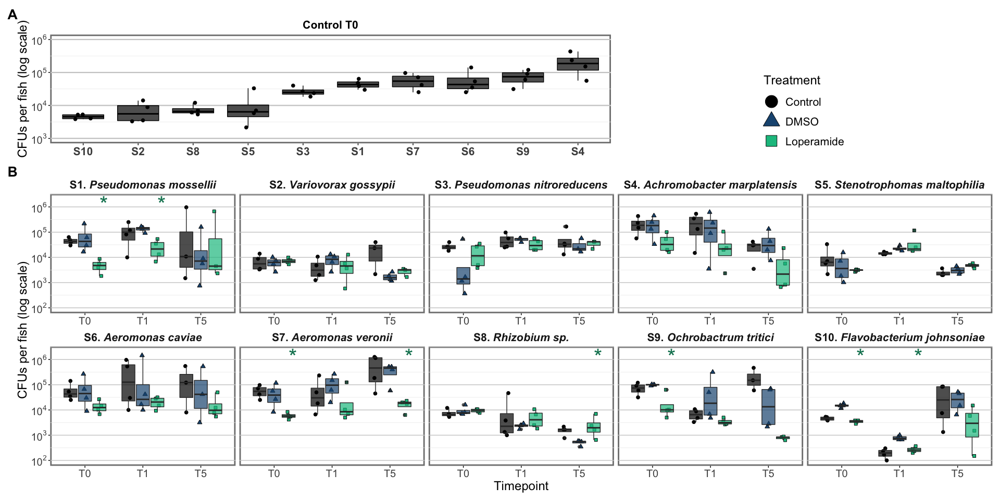
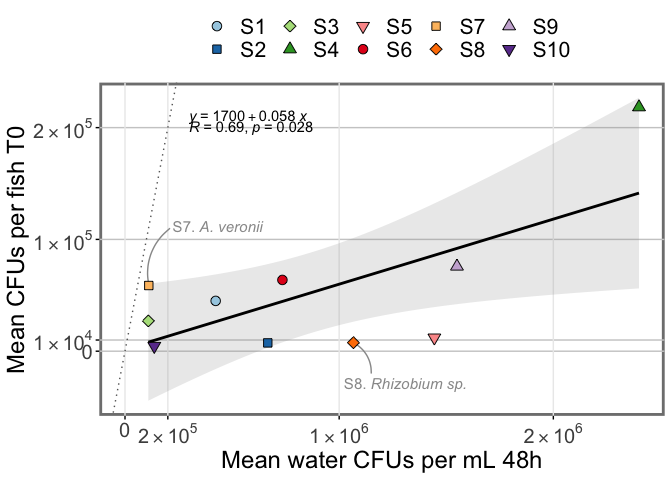
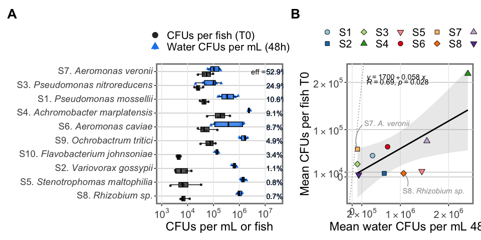

# About the Data

## Timepoints

Treat with loperamide at 5 dpf for 24 hours.

-   Sample timepoint 1 at 6 dpf (24 hour treatment)
-   Sample timepoint 2 at 7 dpf (24 hour treatment + 24 hour water)
-   Sample timepoint 3 at 11 dpf (24 hour treatment + 5 days water)


### Sample collection & plating

At each timepoint:

1.  Wash all fish twice by transferring into sterile volvic in a 6-well plate
2.  Add fish with 500 µL sterile volvic water into a fastprep tube
3.  Homogenize sample at 6.5 for 45 seconds

**For individual strains:**\
Make 0 to -3 dilutions in 96-well plates, in triplicate (8 fish per plate)\
Plate 10 µL microdrops on big square plates.\
8 square plates total per timepoint

Put plates at 28C for 2 days, then count colonies.


# Setup

## Load libraries


## Import data


```r
datacfustrial49<-
   readxl::read_xlsx("MonoCFUs_LoperamideZebrafish.xlsx", sheet="Trial49") %>%
   drop_na(DF) %>%
   mutate(LoperamideTreatment=factor(LoperamideTreatment, 
                                    levels=c("None", "DMSO", "Loperamide 10 mg/L"),
                                    labels=c("Control","DMSO", "Loperamide")),
         Treatment = factor(Treatment,
                            levels=c("Bc1","Bc2","Bc3","Bc4","Bc10")))

datacfustrial56 <-
   readxl::read_xlsx("MonoCFUs_LoperamideZebrafish.xlsx", sheet="Trial56") %>%
   drop_na(DF) %>%
   mutate(LoperamideTreatment=factor(LoperamideTreatment, 
                                    levels=c("None", "DMSO", "Loperamide 10 mg/L"),
                                    labels=c("Control","DMSO", "Loperamide")),
         Treatment = factor(Treatment,
                            levels=c("W6. Variovorax", "W8. Rhizobium sp.", "Mz8. Ochrobactrum"),
                            labels=c("W6","W8","Mz8")))

datacfustrial57 <-
   readxl::read_xlsx("MonoCFUs_LoperamideZebrafish.xlsx", sheet="Trial57") %>%
   drop_na(DF) %>%
   mutate(LoperamideTreatment=factor(LoperamideTreatment, 
                                    levels=c("None", "DMSO", "Loperamide 10 mg/L"),
                                    labels=c("Control","DMSO", "Loperamide")),
         Treatment = factor(Treatment,
                            levels=c("Mz1. Achromobacter","F. johnsoniae"),
                            labels=c("Mz1","Fjohn")))

straininfo <- readxl::read_xlsx("../../LoperamideStrainInfo.xlsx")

dataall <- full_join(datacfustrial49,datacfustrial56) %>% full_join(datacfustrial57) %>% 
   left_join(straininfo, by=c("Treatment"="Strain")) %>% 
   mutate(CodeName=factor(CodeName, levels=unique(straininfo$CodeName)))
```

------------------------------------------------------------------------

# Fish CFUs per strain

## Stats of all significant comparisons


```r
statsbyday <- compare_means(data=dataall, CFUs_perFish~LoperamideTreatment, 
                            group.by = c("Treatment","Timepoint", "CodeName"))
statsdatastrains <- statsbyday %>% filter(p.format<0.05 & group1=="DMSO") %>% 
  mutate(CFUs_perFish=2.5e6, LoperamideTreatment="Loperamide")
```


## Timeline for each strain


```r
monoboxall<- dataall  %>% 
   ggplot(aes(x = Timepoint, y=CFUs_perFish, 
             fill=LoperamideTreatment, shape=LoperamideTreatment))+
   facet_wrap(.~CodeName, nrow=2, scales="free_x")+
   geom_point(size=2, position=position_jitterdodge(jitter.width=0.2)) +
   geom_boxplot(alpha=0.7, show.legend = FALSE)+
   geom_text(data=statsdatastrains, aes(label=p.signif, y=1.3e6), size=11, color="#0C8160",
            show.legend=FALSE, nudge_x = 0.33)+
   scale_fill_manual(values=c('#000000', '#1c5580', '#0fc08e'))+
   scale_shape_manual(values=c(21,24,22))+
   scale_y_continuous(trans = 'log10', limits=c(NA,2e6), 
                     labels = trans_format('log10', math_format(10^.x)))+
   theme(strip.text = element_markdown(size = 16, face="bold"),
         legend.text = element_text(size=16),legend.key.height = unit(1,"cm"),
         legend.position=c(0.78,0.15))+
   guides(fill=guide_legend(override.aes = list(size=8)))+
   labs(y="CFUs per fish (log scale)", x="Timepoint", fill="Treatment", color="Treatment", shape="Treatment")

monoboxall
```

<!-- -->


## T0 for control conditions


```r
controlbox <- dataall %>% 
   filter(LoperamideTreatment=="Control" & Timepoint=="T0") %>% 
   ggplot(aes(x = reorder(PaperCode,CFUs_perFish), y=CFUs_perFish))+
   geom_boxplot(color="black", alpha=0.7, show.legend = FALSE, fill="#000000")+
   geom_jitter(size=2, width=0.2) +
   scale_y_continuous(trans = 'log10', limits=c(1e3,1e6), 
                     labels = trans_format('log10', math_format(10^.x)))+
   theme(axis.text.x = element_markdown(size = 16, face="bold"), legend.position="none",
         plot.title = element_markdown(size = 16, face="bold"),
         panel.grid.major.x = element_blank(), panel.grid.major.y = element_line(size=0.8))+
   labs(y="CFUs per fish (log scale)", x=NULL, fill=NULL, color=NULL, shape=NULL,
        title="Control T0")

controlbox
```

<!-- -->


## Summary figure


```r
((controlbox+guide_area())+plot_layout(widths=c(3,2))) / 
   (monoboxall+theme(legend.position = c(0.8, 1.3)))+
   plot_layout(heights=c(1,2.5), nrow=2)+
   plot_annotation(tag_levels = "A") & theme(plot.tag = element_text(face = "bold", size=20))
```

<!-- -->

```r
ggsave("Figure4_LoperamideMonoColonization_withControl.png", width=20, height=14)
ggsave("Figure4_LoperamideMonoColonization_withControl.pdf", width=20, height=14)
ggsave("Figure4_LoperamideMonoColonization_withControl.tiff", width=20, height=14)
```


# Compare with Water CFUs

## Import water survival

Get `dataallCFUs` from ../../inVitroAnalysis/WaterSurvival/WaterSurvivalCFUs_loperamide_figure3.Rmd


```r
# import individual strain data from exp 1
datacfus1 <-
   readxl::read_xlsx("../../inVitroAnalysis/WaterSurvival/LoperamideWaterSurvivalCFUs_sub.xlsx", sheet="Round1") %>%
   drop_na(DF) %>%
   mutate(LoperamideTreatment=factor(LoperamideTreatment,
                                    levels=c("None", "DMSO", "Loperamide 10 mg/L"),
                                    labels=c("Control","DMSO", "Loperamide")),
         Treatment = factor(Treatment, levels=c("Bc1","Bc2","Bc3","Bc4","Bc10"))) %>%
   add_column(Assay=1)

# import individual strain data from exp 2
datacfus2 <-
   readxl::read_xlsx("../../inVitroAnalysis/WaterSurvival/LoperamideWaterSurvivalCFUs_sub.xlsx", sheet="Round2") %>%
   drop_na(DF) %>%
   mutate(LoperamideTreatment=factor(LoperamideTreatment,
                                    levels=c("None", "DMSO", "Loperamide 10 mg/L"),
                                    labels=c("Control","DMSO", "Loperamide")),
         Treatment = factor(Treatment, levels=c("Bc1","Bc2","Bc3","Bc4","Bc10"))) %>%
   add_column(Assay=2)

# import individual strain data from exp 3
datacfus3 <-
   readxl::read_xlsx("../../inVitroAnalysis/WaterSurvival/LoperamideWaterSurvivalCFUs_sub.xlsx", sheet="Round3") %>%
   drop_na(DF) %>%
   mutate(LoperamideTreatment=factor(LoperamideTreatment,
                                    levels=c("None", "DMSO", "Loperamide 10 mg/L"),
                                    labels=c("Control","DMSO", "Loperamide")),
         Treatment = factor(Treatment, levels=c("Bc1","Bc2","Bc3","Bc4","Bc10"))) %>%
   add_column(Assay=3)


# import individual strain data from exp 4
datacfus4 <-
   readxl::read_xlsx("../../inVitroAnalysis/WaterSurvival/LoperamideWaterSurvivalCFUs_sub.xlsx", sheet="Round4") %>%
   drop_na(DF) %>%
   mutate(LoperamideTreatment=factor(LoperamideTreatment,
                                    levels=c("None", "DMSO", "Loperamide 10 mg/L"),
                                    labels=c("Control","DMSO", "Loperamide")),
         Treatment = factor(Treatment, levels=c("W6","W8","Mz8")))

# import individual strain data from exp 5
datacfus5 <-
   readxl::read_xlsx("../../inVitroAnalysis/WaterSurvival/LoperamideWaterSurvivalCFUs_sub.xlsx", sheet="Round5") %>%
   drop_na(DF) %>%
   mutate(LoperamideTreatment=factor(LoperamideTreatment,
                                    levels=c("None", "DMSO", "Loperamide 10 mg/L"),
                                    labels=c("Control","DMSO", "Loperamide")),
         Treatment = factor(Treatment, levels=c("W6","W8","Mz8","Fjohn","Mz1")))


straininfo <- readxl::read_xlsx("../../LoperamideStrainInfo.xlsx")

dataallCFUs <- full_join(datacfus1, datacfus2) %>%
   full_join(datacfus3) %>%
   full_join(datacfus4) %>% full_join(datacfus5) %>%
   left_join(straininfo, by=c("Treatment"="Strain")) %>%
   mutate(CodeName=factor(CodeName, levels=unique(straininfo$CodeName)))

waterCFUs24h <- dataallCFUs %>% 
   pivot_longer(Rep1:Rep3) %>% 
   filter(Timepoint_hrs==48 & LoperamideTreatment=="Control") %>% 
   mutate(RepCFUs=(1000/VolPlated_ul)*DF*value) %>% 
   group_by(CodeName, PaperCode) %>% summarise(meanCFUspermL = mean(RepCFUs, na.rm=TRUE))
```


## Plot mono reconv and water survival


```r
waterfishboxplot <- 
   dataall %>% filter(LoperamideTreatment=="Control" & Timepoint=="T0") %>% 
   select(CodeName, PaperCode, CFUs_perFish) %>% distinct() %>% 
   left_join((dataallCFUs %>% pivot_longer(Rep1:Rep3) %>% 
                 filter(Timepoint_hrs==48 & LoperamideTreatment=="Control") %>% 
                 mutate(CFUs_permL=(1000/VolPlated_ul)*DF*value) %>% 
                 group_by(Assay, CodeName, PaperCode) %>% 
                 select(CodeName, PaperCode, CFUs_permL))) %>% 
   group_by(PaperCode, CodeName) %>% 
   mutate(FishCFUsStrain = mean(CFUs_perFish), WaterCFUsStrain = mean(CFUs_permL),
          efficiency = FishCFUsStrain/WaterCFUsStrain*100) %>% 
   pivot_longer(c(CFUs_perFish, CFUs_permL)) %>% 
   distinct(PaperCode, CodeName, name, value, efficiency) %>%
   mutate(name=factor(name, levels=c("CFUs_perFish","CFUs_permL"),
                      labels=c("CFUs per fish (T0)", "Water CFUs per mL (48h)"))) %>% 
   ggplot(aes(y = reorder(CodeName, efficiency), x = value, fill=name, color=name, shape=name))+
   geom_point(size=1.5, height=0.2, position=position_jitterdodge()) +
   geom_boxplot(color="black", alpha=0.8, show.legend = FALSE)+
   geom_text(aes(label=paste0(round(efficiency,1),"%"), x=1.1e7), hjust=0)+
   annotate("text", label = "eff = ", x=6e6, y=10)+
   scale_x_continuous(trans = 'log10', labels = trans_format('log10', math_format(10^.x)), limits=c(1e3, 3e7))+
   scale_color_manual(values=c("grey20","dodgerblue2"))+
   scale_fill_manual(values=c("grey20","dodgerblue2"))+
   scale_shape_manual(values=c(16,17))+
   theme(axis.text.y = element_markdown(size = 14), 
         legend.position = "top", legend.direction = "vertical",
         panel.grid.minor.y = element_blank(), panel.grid.minor.x = element_blank(), 
         panel.grid.major.x = element_line(inherit.blank = FALSE))+
   labs(y=NULL, x="CFUs per mL or fish", fill=NULL, color=NULL, shape=NULL)+ 
   guides(colour = guide_legend(override.aes = list(size=4)))

waterfishboxplot
```

<!-- -->

## Plot mono reconv versus water survival


```r
corrdata <- dataall %>% filter(LoperamideTreatment=="Control" & Timepoint=="T0") %>% 
   group_by(CodeName, PaperCode) %>% summarise(meanCFUsperFish = mean(CFUs_perFish, na.rm=TRUE)) %>% 
   full_join(waterCFUs24h) %>% 
   mutate(PaperCode = factor(PaperCode, levels = unique(waterCFUs24h$PaperCode))) %>% ungroup()

scientific_10 <- function(x) {ifelse(x==0, "0", parse(text=gsub("[+]", "", gsub("e", " %*% 10^", scientific_format()(x)))))}

waterfishcorrplot <- 
   corrdata %>% 
   ggplot(aes(x = meanCFUspermL, y = meanCFUsperFish))+
   geom_abline(aes(slope=1, intercept=0), color="grey40", lty="dotted")+
   # add regression line
   geom_smooth(method="lm", alpha=0.2, color="black")+
   # show regression equation, R2 and p-value
   stat_regline_equation(label.x = 300000, label.y=210000, show.legend = FALSE) + 
   stat_cor(label.x=300000, label.y=200000, show.legend = FALSE)+  
   # add label and arrow for S7
   annotate(geom = "richtext", x = 2e5, y = 1e5, label = "S7. *A. veronii*", 
              hjust = 0, vjust = 0, lineheight = 0.8, colour = "gray60", label.size = NA, size = 4, fill=NA)+
   annotate(geom="curve", x = 2.1e5, y = 1.1e5, xend = 111111, yend = 58750, colour = "gray60", size=0.5, curvature = 0.3)+
   # add label and arrow for S8
   annotate(geom = "richtext", x = 1e6, y = -30000, label = "S8. *Rhizobium sp.*", 
              hjust = 0, vjust = 0.5, lineheight = 0.8, colour = "gray60", label.size = NA, size = 4, fill=NA)+
   annotate(geom="curve", x = 1.15e6, y = -20000, xend = 1066666.7, yend = 7625, colour = "gray60", size=0.5, curvature = 0.3)+
   geom_point(aes(fill=PaperCode, shape=PaperCode), size=3)+
   scale_shape_manual(values=c(21,22,23,24,25,21,22,23,24,25))+
   scale_fill_manual(values=c('#a6cee3','#1f78b4','#b2df8a','#33a02c','#fb9a99','#e31a1c','#fdbf6f','#ff7f00','#cab2d6','#6a3d9a'))+
   scale_y_continuous(breaks=c(0,1e4,1e5, 2e5), labels=scientific_10)+
   scale_x_continuous(labels=scientific_10, limits=c(0,NA), breaks=c(0, 2e5, 1e6, 2e6))+
   theme(panel.grid.minor.y = element_blank(), panel.grid.minor.x = element_blank(), 
         panel.grid.major.x = element_line(inherit.blank = FALSE))+
   labs(x="Mean water CFUs per mL 48h", y="Mean CFUs per fish T0", fill=NULL, color=NULL, shape=NULL)
waterfishcorrplot
```

<!-- -->

## Summary figure


```r
waterfishboxplot + waterfishcorrplot + plot_annotation(tag_levels = "A") &
   theme(plot.tag = element_text(face = "bold", size=20))
```

<!-- -->

```r
ggsave("FigureS8_WaterSurvivalFishMono.png", width=13, height=6.5, dpi=400)
ggsave("FigureS8_WaterSurvivalFishMono.pdf", width=13, height=6.5)
ggsave("FigureS8_WaterSurvivalFishMono.tiff", width=13, height=6.5)
```


```r
sessionInfo()
```

```
## R version 4.1.3 (2022-03-10)
## Platform: x86_64-apple-darwin17.0 (64-bit)
## Running under: macOS Big Sur/Monterey 10.16
## 
## Matrix products: default
## BLAS:   /Library/Frameworks/R.framework/Versions/4.1/Resources/lib/libRblas.0.dylib
## LAPACK: /Library/Frameworks/R.framework/Versions/4.1/Resources/lib/libRlapack.dylib
## 
## locale:
## [1] en_US.UTF-8/en_US.UTF-8/en_US.UTF-8/C/en_US.UTF-8/en_US.UTF-8
## 
## attached base packages:
## [1] stats     graphics  grDevices utils     datasets  methods   base     
## 
## other attached packages:
##  [1] ggtext_0.1.1     patchwork_1.1.1  vegan_2.5-7      lattice_0.20-45 
##  [5] permute_0.9-7    rmdformats_1.0.3 ungeviz_0.1.0    ggpubr_0.4.0    
##  [9] scales_1.1.1     forcats_0.5.1    stringr_1.4.0    dplyr_1.0.8     
## [13] purrr_0.3.4      readr_2.1.2      tidyr_1.2.0      tibble_3.1.6    
## [17] ggplot2_3.3.5    tidyverse_1.3.1 
## 
## loaded via a namespace (and not attached):
##  [1] nlme_3.1-157        fs_1.5.2            lubridate_1.8.0    
##  [4] httr_1.4.2          tools_4.1.3         backports_1.4.1    
##  [7] bslib_0.3.1         utf8_1.2.2          R6_2.5.1           
## [10] DBI_1.1.2           mgcv_1.8-39         colorspace_2.0-3   
## [13] withr_2.5.0         tidyselect_1.1.2    compiler_4.1.3     
## [16] cli_3.2.0           rvest_1.0.2         xml2_1.3.3         
## [19] bookdown_0.25       sass_0.4.1          digest_0.6.29      
## [22] rmarkdown_2.13      strapgod_0.0.4.9000 pkgconfig_2.0.3    
## [25] htmltools_0.5.2     dbplyr_2.1.1        fastmap_1.1.0      
## [28] highr_0.9           rlang_1.0.2         readxl_1.4.0       
## [31] rstudioapi_0.13     jquerylib_0.1.4     generics_0.1.2     
## [34] farver_2.1.0        jsonlite_1.8.0      car_3.0-12         
## [37] magrittr_2.0.3      polynom_1.4-0       Matrix_1.4-1       
## [40] Rcpp_1.0.8.3        munsell_0.5.0       fansi_1.0.3        
## [43] abind_1.4-5         lifecycle_1.0.1     stringi_1.7.6      
## [46] yaml_2.3.5          carData_3.0-5       MASS_7.3-56        
## [49] grid_4.1.3          parallel_4.1.3      crayon_1.5.1       
## [52] haven_2.4.3         splines_4.1.3       gridtext_0.1.4     
## [55] hms_1.1.1           knitr_1.38          pillar_1.7.0       
## [58] markdown_1.1        ggsignif_0.6.3      reprex_2.0.1       
## [61] glue_1.6.2          evaluate_0.15       modelr_0.1.8       
## [64] vctrs_0.4.0         tzdb_0.3.0          cellranger_1.1.0   
## [67] gtable_0.3.0        assertthat_0.2.1    xfun_0.30          
## [70] broom_0.7.12        rstatix_0.7.0       cluster_2.1.3      
## [73] ellipsis_0.3.2
```


